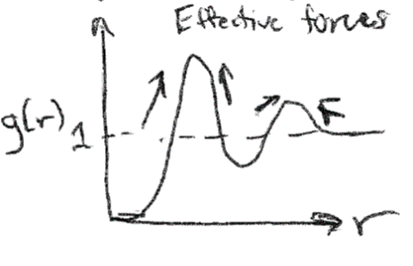
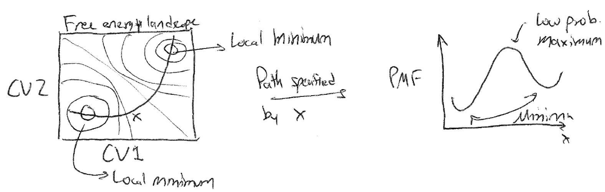

# The Potential of Mean Force

## Recommended textbooks

, Frenkel and Smit Ch. 7

## Topics in this lecture

-   Reversible work theorem

-   Potential of mean force

-   Umbrella sampling

## Calculating $g(r)$

In the last lecture, we discussed the radial distribution function but
ran out of time before presenting an algorithm for calculating it. In
principle, $g(r)$ is a continuous quantity, but we can calculate $g(r)$
by populating a histogram of pairwise distances and normalizing
appropriately. We divide the distance, $r$, into a set of bins of width
$dr$ that discretizes the distance coordinate. We can number the bins
such that bin $i$ refers to the set of distances between $dr \times i$
and $dr \times (i+1)$. Each bin then refers to a volume of space given
by $\frac{4\pi}{3}dr^3[(i+1)^3 - (i^3)]$.

Recalling that our definition of $g(r)$ is the average density of
particles a given distance $r$ apart divided by the overall density, we
can write the following algorithm:

1.  During a converged simulation, periodically iterate over all
    particles. For each particle, calculate the distance $r$ to every
    other particle.

2.  For each distance, calculate the corresponding index of the bin in
    the histogram; that is, calculate $r/dr$ and round to an integer (or
    round down, depending on how you define your bins). Increase the
    value of this bin by 1.

3.  Repeat steps 1 and 2 a number of times during a simulation (i.e.,
    every time you save the energy after convergence).

4.  Normalize the histogram at the end of the simulation. This requires
    dividing each bin by the number of samples (to time average), the
    number of particles in the system (since we iterate over all
    particles each timestep), and the volume of the bin (to get a
    density). Finally, divide all bins by the bulk density ($N/V$) to
    get $g(r)$.

Symbolically, this procedure can be written as:

$$g(r) =  \frac{\tilde{p}(\textbf{r}_1=0, r)}{\rho} = \frac{1}{\rho} \frac{1}{N} \frac{1}{V(r)} \left \langle \sum_i^N \sum_{j\ne i}^N \delta (r-r_{ij}) \right \rangle$$

The function $\delta(r-r_{ij})$ is a delta function that returns 1 if
the distance is within the small binwidth of $dr$ around the desired
distance $r$; this is captured by incrementing bins in our histogram.
The ensemble-average of this sum is equal to averaging over the number
of samples (i.e., time-averaging). The term $1/V(r)$ normalizes each bin
by its volume to get an average density per bin. The term $1/N$
normalizes the sum by the number of particles, since we iterate over all
particles each time we sample. Finally, $1/\rho$ normalizes $g(r)$ by
the bulk density as desired. Calculating this for each value of $r$
would yield a complete $g(r)$ curve.

## The Reversible Work Theorem

The radial distribution function provides unique structural information
regarding the preferred distribution of particles in a system (*i.e.*,
it provides information on fluid structure). Since this structure
emerges from the interplay of energetic interactions between particles
and the entropy associated with particular particle configurations, it
would be expected that the fluid structure contains information about
the underlying system thermodynamics. Indeed, it can be shown that the
radial distribution function itself can be related directly to the
average, or mean, force experienced by particles that give rise to this
structure. Conceptually, you can consider the case of an ideal gas, for
which $g(r) = 1$ for all values of $r$. For this system, we expect that
all values of $r$ are equally probable and the mean force experienced by
a particle is the same everywhere. For a liquid, however, $g(r) > 1$ for
some values of $r$, implying that on average particles will experience
forces that drive them toward certain values of $r$ that are preferred.
In the following, we will use the tools of statistical mechanics to draw
a direct correspondence between $g(r)$ and the mean force experienced by
each particle, which we can then relate to fundamental thermodynamic
quantities. The main takeaway is that characterizing fluid structure
alone yields insight into the thermodynamics of the system which emerges
from our simulation approach.

{width="40%"}

Let us consider the force acting between a pair of particles separated
by a distance $r$, which is defined as the negative derivative of the
potential energy of the entire system with respect to the distance
between the two particles, $-dE(\textbf{r}^N)/dr$. In a fluid, this
force will depend not just on the direct interactions between the pair
of particles, but also on the positions of all other particles due to
interactions with the intervening medium; for example, the electrostatic
force between two charged particles depends on all other particles that
influence the dielectric constant. To compute the mean force between the
pair of particles, we can thus calculate the ensemble-average force that
arises if the two specific particles are fixed at positions
$\textbf{r}_1$ and $\textbf{r}_2$, corresponding to a distance $r$, and
we integrate over all configurations of the other fluid particles
(assuming a homogeneous, isotropic system) in a similar manner as we did
last lecture when computing the reduced configurational distribution. We
can write this ensemble as:

$$\begin{aligned}
-\left \langle \frac{d E(\textbf{r}^N)}{dr} \right \rangle_{r} &= - \int d\textbf{r}_3 \dots \int d\textbf{r}_N \frac{d E(\textbf{r}^N)}{dr} p_r(\textbf{r}^N)
\end{aligned}$$

This is the typical expression for an ensemble average in the continuum
limit, but we use the subscript $r$ on the ensemble-average force to
emphasize that it is computed for a specific distance $r$ between
particles $1$ and $2$. Similarly, the probability has a subscript $r$ to
indicate that it refers to the probability of a given state assuming
that the distance $r$ between particles $1$ and $2$ is fixed. This
probability is then given as:

$$\begin{aligned}
p_r(\textbf{r}^N) = \frac{e^{-\beta E(\textbf{r}^N)}}{\int d\textbf{r}_3 \dots \int d\textbf{r}_N \exp \left [-\beta E(\textbf{r}^N)\right]}
\end{aligned}$$

where the denominator is effectively a reduced partition function in
which we fix the positions of particles 1 and 2. We can now simplify the
expression for the ensemble-average force as follows:

$$\begin{aligned}
-\left \langle \frac{d E(\textbf{r}^N)}{dr} \right \rangle_{r} &= -\frac{\int d\textbf{r}_3 \dots \int d\textbf{r}_N   \frac{d E(\textbf{r}^N)}{d r} \exp \left [-\beta E(\textbf{r}^N)\right]}{\int d\textbf{r}_3 \dots \int d\textbf{r}_N \exp \left [-\beta E(\textbf{r}^N)\right]} \\\label{13.28}
&=\frac{k_BT \left [ \frac{d }{d r} \int d\textbf{r}_3 \dots \int d\textbf{r}_N  \exp \left [-\beta E(\textbf{r}^N)\right] \right ]}{\int d\textbf{r}_3 \dots \int d\textbf{r}_N \exp \left [-\beta E(\textbf{r}^N)\right]} \\
&= k_B T \frac{d }{d r} \ln \int d\textbf{r}_3 \dots \int d\textbf{r}_N \exp \left [-\beta E(\textbf{r}^N)\right] 
\end{aligned}$$

These three equations are essentially just the chain rule in reverse.
Next, we recognize that we can add arbitrary constants that are not a
function of $r$ to this logarithm, since upon differentiation they will
be 0. In this case, the partition function ($Z$), number of particles
($N$), and system number density ($\rho$) are constant with respect to
variations in the distance between the two tagged particles. We can
write:

$$\begin{aligned}
-\left \langle \frac{d E(\textbf{r}^N)}{dr} \right \rangle_{r} &=  k_BT \frac{d}{dr} \ln \frac{N(N-1)}{\rho^2 Z} + k_B T \frac{d }{d r} \ln \int d\textbf{r}_3 \dots \int d\textbf{r}_N \exp \left [-\beta E(\textbf{r}^N)\right] \\
&= k_B T \frac{d }{d r} \ln \frac{N(N-1)}{\rho^2 Z}\int d\textbf{r}_3 \dots \int d\textbf{r}_N \exp \left [-\beta E(\textbf{r}^N)\right] \\
&= k_BT \frac{d }{d r} \ln g(r) 
\end{aligned}$$

Therefore, we find that the derivative with respect to the distance of
$k_BT \ln g(r)$ gives the ensemble-average force acting between
particles 1 and 2 computed across the equilibrium distribution of all
other particles, or the **mean force**. As expected, this implies that
the radial distribution function contains information regarding the
effective forces that arise between particles in condensed, fluid
phases, that would not arise due to pair interactions alone!

Another interesting relationship can be obtained if we further relate
the mean force to the work done during a process involving a change in
$r$. Recalling back to thermodynamics (Lecture 1), we can in general
define any change in work as:

$$\begin{aligned}
W &= \int f dx 
\end{aligned}$$

where $W$ is the work, $f$ is the generalized force, and $x$ is the
generalized displacement. Let's consider now the work done by bringing
two particles, for which $g(r)$ is known, from some initial finite
distance $r$ to infinite separation. Since the ensemble-average mean
force is equivalent to the thermodynamically defined force by
ergodicity, the work done during this process is:

$$\begin{aligned}
W(r) &= \int_r^{\infty} -\left \langle \frac{d E(\textbf{r}^N)}{dr} \right \rangle_{r}  dr  
\end{aligned}$$

Here, we write $W(r)$ to indicate that it is the work for separating
particles from an initial distance $r$. Because we are assuming the
system is at constant $NVT$, we can relate this work directly to the
change in the Helmholtz free energy - recall that the Helmholtz free
energy is defined by:

$$\begin{aligned}
F &= E - TS \\
dF &= -SdT + dW 
\end{aligned}$$

where I have left $dW$ as the generalized work term rather than using
$-PdV$ work. At constant temperature, $-SdT = 0$ and $dF = dW$. We can
thus write:

$$\begin{aligned}
\Delta F(r) &= \int_r^{\infty} -\left \langle \frac{d E(\textbf{r}^N)}{dr} \right \rangle_{r}  dr
\end{aligned}$$

In other words, we can directly relate the ensemble-average force
computed between particles to the change in the free energy of the
system as we move those particles relative to each other. Evaluating the
integral yields:

$$\begin{aligned}
\Delta F(r) &= \int_r^{\infty} -\left \langle \frac{d E(\textbf{r}^N)}{dr} \right \rangle_{r}  dr \\
&= k_B T  \int^{\infty}_{r}  \frac{d }{d r} \ln g(r)  dr \\
&= k_B T \ln g(\infty) - k_B T \ln g(r) \\
&= - k_BT \ln g(r) \\
\therefore g(r) &= e^{-\beta \Delta F(r)}
\end{aligned}$$

The integral is simplified by the fact that $g(\infty)$ is normalized
to 1. The final result relates the radial distribution function directly
to the change in the Helmholtz free energy associated with moving two
particles from a fixed distance $r$ to infinite separation - this
relationship is also called the **reversible work theorem** to recognize
that the change in the free energy during a process is equal to the
reversible work during that process. We also could have integrated
between any two other limits of integration to find the change in the
free energy between two particular values of $r$ from $g(r)$. This
relationship is the first approach we have presented that can be used to
compute a free energy change, as opposed to an energy change or change
in other observables, from a molecular simulation. Given that
$\Delta F(r)$ is a thermodynamic potential that is related to the
average (or mean) force exerted on particles 1 and 2 due to all other
solvent configurations, this quantity is also called a **potential of
mean force** and generally tells us the free energy change associated
with some process; in this specific case, the potential of mean force is
the free energy change associated with bringing the two particles to
some distance $r$ from initial positions at infinity.

In practice, the most common use of the reversible work theorem is in
the parameterization of new coarse-grained potentials from atomistic
input. For example, the procedure of *Boltzmann inversion* involves
calculating a pairwise radial distribution function between two atoms in
an isotropic system, using the radial distribution function to calculate
a potential of mean force that averages over all other particle
coordinates, then reproducing this potential of mean force at
coarse-grained resolution using an effective potential, allowing all
other particles to be removed from the simulation. Such an approach is
reasonable, although one has to be careful to recognize that the
derivation above is only exact in a completely isotropic system, while
most systems with multiple types of atoms will require more specialized
techniques. It is also possible to use the reversible work theorem
directly to calculate free energy surfaces for a system, but the
challenge is in sampling low-probability states; we will illustrate how
to solve this challenge in the next lecture.

## The potential of mean force for an arbitrary process

The reversible work theorem is the first approach that we have defined
so far that allows us to compute actual free energies, which is useful
because the free energy is what is typically minimized at equilibrium.
We specifically computed the potential of mean force, or the change in
the system free energy associated with a particular process - in this
case, the process was moving two particles relative to each other.
However, we can generalize this concept to calculate the potential of
mean force (i.e., free energy change) associated with any choice of
molecular process, even though we still have no means of actually
computing the partition function, $Z$. In the following two lectures, we
will give brief overviews of methods that yield the change in the free
energy associated with a specific process that are commonly used in the
simulation literature.

First, we need a means of defining a process. To do so, we will define a
particular **collective variable**, $x(\mathbf{r}^N )$, as the
**reaction coordinate** describing the process of interest. A collective
variable is a function of multiple particle coordinates; example
collective variables of interest might be the surface area of a bilayer,
the pressure of the system, the relative position of two molecules, etc.
The reaction coordinate is the particular collective variable which
changes during the process we are interested in - for example, the
reaction coordinate for particle association described above would be
defined as the distance between the two particles. Note that many
possible microstates of the system will correspond to the same value of
the reaction coordinate, since two particles can be at the same relative
distance from each other for many possible positions of all other
particles. We can now ask what the likelihood of obtaining a particular
value of the reaction coordinate is.

At equilibrium in a canonical ensemble, the probability of finding the
system assuming a configuration with a particular value of the reaction
coordinate $x(\mathbf{r}^N )= x'$ is:

$$\label{app_a_partition_function_eq}
p(x') = \frac{\int d\mathbf{r}^N \exp \left [ -\beta  E(\mathbf{r}^N)\right  ]  \delta(x(\mathbf{r}^N) - x')}{Z}$$

Here, the integral in the numerator runs over all possible
configurations of the system and the delta function selects states for
which $x(\mathbf{r}^N) = x'$. That is, all degrees of freedom are
integrated out except for configurations with the desired value of the
reaction coordinate, which is again similar in spirit to how we
integrated out degrees of freedom of all particle positions when
calculating the radial distribution function. We can recognize that the
form of the numerator in eq.
[\[app_a_partition_function_eq\]](#app_a_partition_function_eq){reference-type="eqref"
reference="app_a_partition_function_eq"} effectively defines a new
partition function that describes the statistical properties of the
system for $x(\mathbf{r}^N) = x'$, or the subset of the full phase space
consistent with one particular value of the reaction coordinate. We can
thus write:

$$\label{app_a_pmf_partition_function}
p(x') = \frac{Z(x')}{Z}$$

In other words, the numerator of eq.
[\[app_a_partition_function_eq\]](#app_a_partition_function_eq){reference-type="eqref"
reference="app_a_partition_function_eq"} is a new partition function,
$Z(x')$, describing the projection of the total phase space onto a
region that is restricted to one particular value of the reaction
coordinate (again, similar to the denominator in the definition of $p_r$
in the discussion of the reversible work theorem above). Now we can
calculate the Helmholtz free energy, $F(x')$, associated with the new
partition function:

$$F(x') = -k_BT \ln Z(x') = -k_B T \ln \left [ p(x')  \right ] - k_B T \ln Z$$

Although we do not know the value of $Z$, as long as we only take
*differences* in the free energy for different values of the reaction
coordinate, the second term will drop out - the partition function of
the entire system is constant independent of what region of phase space
(specified by $x'$) we study. The difference in the free energy as a
function of the reaction coordinate is exactly equal to the potential of
mean force (PMF) defined from the reversible work theorem, but now
generalized to any reaction corodinate of interest. We can write the
difference in the PMF between any two arbitrary states as:

$$F(x_1) - F(x_0) = -kT \ln \left [ \frac{p(x_1)}{p(x_0)} \right ]$$

where $x_0$ and $x_1$ are two values of the reaction coordinate of
interest and the PMF is the free energy change associated with moving
the system from a region of phase space associated with $x_0$ to one
associated with $x_1$. So, note some important conceptual items here:

-   We can think of free energy changes in terms of relative
    probabilities associated with subsets of microstates.

-   We can describe a **free energy landscape** for a system based on
    the relative probabilities that certain microstates (those specified
    by low free energy values of a reaction coordinate) will be
    obtained.

-   The potential of mean force is the projection of a free energy
    landscape onto a particular reaction coordinate.

{width="100%"}

These unifying concepts are often used to describe various phenomena.
For example, this language is often used to describe reaction
equilibria, or the likelihood of observing reactants, transition states,
and products in a reacting system. We can also use similar language to
describe biological processes - for example, protein folding is
described as a system reaching a local free energy minimum, or in other
words a set of highly probable configurations consistent with a folded
state.

## Umbrella sampling

The PMF is a very useful quantity for calculating equilibrium free
energy changes associated with processes that involve a well-defined
reaction coordinate. To calculate the PMF, however, the probability
associated with a specific value of the reaction coordinate, $p(x')$,
must be determined. In principle, this probability distribution could be
calculated by simply generating system configurations within the entire
accessible phase space (using either standard molecular dynamics with
correct thermostatting or via Monte Carlo sampling, for example) and
calculating how frequently the desired values of the reaction coordinate
are observed. However, this brute force approach is very unlikely to
sample states efficiently, as the vast majority of simulation time would
be spent computing configurations for the high-probability values of
$x'$. Worse, if any value of the reaction coordinate exists in a region
of phase space that is nearly inaccessible (*i.e.*, the reaction
coordinate sits at the top of a free energy barrier), then it is likely
that the value may never be determined via a brute force approach, and
therefore the free energy cannot be accurately sampled.

{width="100%"}

One solution to overcome the sampling problem and facilitate the
calculation of the probability densities of interest (and thus the PMF)
is to apply a **bias** to the system dynamics - that is, apply
unphysical forces that will enforce sampling of desired values of
reaction coordinate. In one popular technique, known as **umbrella
sampling**, a set of weight functions are defined and added to the
system potential energy function. Typically, each function is
implemented in an independent simulation. We define
$w_i(x) \equiv w_i[x(\mathbf{r}^N)]$ as the weight function applied in
the $i$th simulation; conventionally, the weight function is harmonic
(although other functional forms are reasonable) such that the $i$th
function is defined by:

$$\begin{aligned}
w_i(x) &= \frac{1}{2} k (x - x_i)^2
\end{aligned}$$

where $k$ is the spring constant and $x_i$ is the value about which the
system is restrained. The potential energy function of the system is
then given by $E(\mathbf{r}^N) + w_i(x)$, such that the weight function
significantly increases the energy of any configurations with values of
the reaction coordinate that differ significantly from the restrained
value $x_i$. In other words, we effectively add a fictitious force (a
spring force) that is not meant to model a physical force in the system,
but rather is added solely to force the system to sample a particular
value of the reaction coordinate. Conceptually, the idea behind this is
to effectively "flatten" the free energy landscape by forcing the system
to explore a local region near $x_i$, thus allowing the sampling of
values of $x_i$ that would not be explored in an unbiased simulation.

{width="100%"}

We can now write the **biased** probability of finding the system at a
particular value of the reaction coordinate $x(\mathbf{r}^n) = x'$ for
the $i$th simulation using the modified potential energy function:

$$p_{\textrm{bias},i}(x') = \frac{\int d \mathbf{r}^N e^{ -\beta [E(\mathbf{r}^N)+w_i(x)]} \delta(x(\mathbf{r}^N) - x')}{\int d \mathbf{r}^N  e^{ -\beta [E(\mathbf{r}^N)+w_i(x)]} }$$

The delta function selects only values of $x(\mathbf{r}^N) = x'$, so if
$x' \approx x_i$, then $p_{\textrm{bias},i}(x')$ will be large;
otherwise, the weight function will lead to large values of the total
energy and thus negligible values of $p_{\textrm{bias},i}(x')$. We can
sample this probability distribution directly in a simulation by adding
the weight function to the system dynamics (*i.e.*, adding a spring
force to relevant particles) to increase sampling of the value $x'=x_i$.
However, we need to sample the **unbiased** probability to calculate the
potential of mean force, so we need to relate $p_{\textrm{bias},i}(x')$
to $p(x')$. Relating the biased probability distribution to the unbiased
probability distribution will be the focus of the next lecture.
