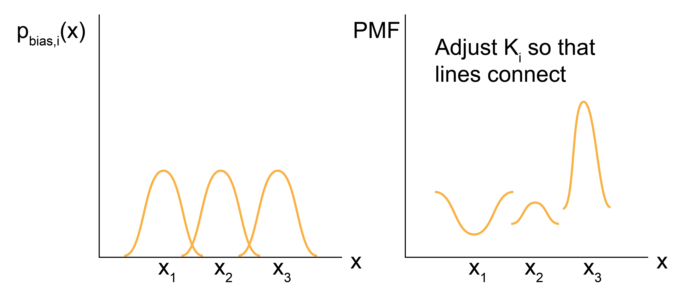

# Umbrella Sampling

## Additional Readings for the Enthusiast

- {cite:ts}`frenkel_understanding_2002`, Ch. 7.4

## Goals for Today's Lecture
- Understand how to bias simulations towards coordinates of interest
- Relate biased probability distributions to unbiased ones

## [Umbrella sampling](https://en.wikipedia.org/wiki/Umbrella_sampling)

The PMF is a very useful quantity for calculating equilibrium free
energy changes associated with processes that involve a well-defined
reaction coordinate. To calculate the PMF, however, the probability
associated with a specific value of the reaction coordinate, $p(x')$,
must be determined.


In principle, this probability distribution could be
calculated by simply generating system configurations within the entire
accessible phase space (using either standard molecular dynamics with
correct thermostatting or via Monte Carlo sampling, for example) and
calculating how frequently the desired values of the reaction coordinate
are observed.

```{admonition} What are some drawbacks of stochastically sampling the phase space to analyze reaction coordinates?
<details><summary> Click for answer </summary>

1. This brute force approach is very unlikely to
sample states efficiently, as the vast majority of simulation time would
be spent computing configurations for the high-probability values of
$x'$.
2. If any value of the reaction coordinate exists in a region
of phase space that is nearly inaccessible (*i.e.*, the reaction
coordinate sits at the top of a free energy barrier), then it is likely
that the value may never be determined via a brute force approach, and
therefore the free energy cannot be accurately sampled.


</details>
```


One solution to overcome the sampling problem and facilitate the
calculation of the probability densities of interest (and thus the PMF)
is to apply a **bias** to the system dynamics - that is, apply
unphysical forces that will enforce sampling of desired values of
reaction coordinate. In one popular technique, known as

```{glossary}
umbrella sampling
    an advanced sampling technique where a set of weight functions are defined and added to the
    system potential energy function.
```

Consider the case where we want to sample a system near $x$. For an
independent simulation $i$, we define
$w_i(x) \equiv w_i[x(\mathbf{r}^N)]$ as the weight function about x;
conventionally, the weight function is harmonic
(although other functional forms are reasonable) such that :

$$\begin{aligned}
w_i(x) &= \frac{1}{2} k (x - x_i)^2
\end{aligned}$$

where $k$ is the spring constant and $x_i$ is the value about which the
system is restrained. The potential energy function of the system is
then given by $E(\mathbf{r}^N) + w_i(x)$, such that the weight function
significantly increases the energy of any configurations with values of
the reaction coordinate that differ significantly from the restrained
value $x_i$.

In other words, we effectively add a fictitious force (a
spring force) that is not meant to model a physical force in the system,
but rather is added solely to force the system to sample a particular
value of the reaction coordinate. Conceptually, the idea behind this is
to effectively "flatten" the free energy landscape by forcing the system
to explore a local region near $x_i$, thus allowing the sampling of
values of $x_i$ that would not be explored in an unbiased simulation.

We can now write the **biased** probability of finding the system at a
particular value of the reaction coordinate $x(\mathbf{r}^n) = x'$ for
the $i$th simulation using the modified potential energy function:

$$p_{\textrm{bias},i}(x') = \frac{\int d \mathbf{r}^N e^{ -\beta [E(\mathbf{r}^N)+w_i(x)]} \delta(x(\mathbf{r}^N) - x')}{\int d \mathbf{r}^N  e^{ -\beta [E(\mathbf{r}^N)+w_i(x)]} }$$

The delta function selects only values of $x(\mathbf{r}^N) = x'$, so if
$x' \approx x_i$, then $p_{\textrm{bias},i}(x')$ will be large;
otherwise, the weight function will lead to large values of the total
energy and thus negligible values of $p_{\textrm{bias},i}(x')$. We can
sample this probability distribution directly in a simulation by adding
the weight function to the system dynamics (*i.e.*, adding a spring
force to relevant particles) to increase sampling of the value $x'=x_i$.
However, we need to sample the **unbiased** probability to calculate the
potential of mean force, so we need to relate $p_{\textrm{bias},i}(x')$
to $p(x')$. Relating the biased probability distribution to the unbiased
probability distribution will be the focus of the [next lecture](Lecture15).


## Relating the biased probability distribution to the unbiased one

We showed how to write the **biased** probability of finding the system at a
particular value of the reaction coordinate $x(\mathbf{r}^N) = x'$ for
the $i$th simulation using the modified potential energy function:

$$p_{\textrm{bias},i}(x') = \frac{\int d \mathbf{r}^N e^{ -\beta [E(\mathbf{r}^N)+w_i(x)]} \delta(x(\mathbf{r}^N) - x')}{\int d \mathbf{r}^N  e^{ -\beta [E(\mathbf{r}^N)+w_i(x)]} }$$

The delta function selects only values of $x(\mathbf{r}^N) = x'$, so if
$x' \approx x_i$, then $p_{\textrm{bias},i}(x')$ will be large;
otherwise, the weight function will lead to large values of the total
energy and thus negligible values of $p_{\textrm{bias},i}(x')$. We can
sample this probability distribution directly in a simulation by adding
the weight function to the system dynamics (*i.e.*, adding a spring
force to relevant particles) to increase sampling of the value $x'=x_i$.
However, we need to sample the **unbiased** probability to calculate the
potential of mean force, so we need to relate $p_{\textrm{bias},i}(x')$
to $p(x')$. To do so, we can first rewrite the biased probability
distribution as:

$$\begin{aligned}
p_{\textrm{bias},i}(x') &= \frac{\int d \mathbf{r}^N e^{ -\beta [E(\mathbf{r}^N)]}e^{-\beta w_i(x)} \delta(x(\mathbf{r}^N) - x')}{\int d \mathbf{r}^N  e^{ -\beta [E(\mathbf{r}^N)]}e^{-\beta w_i(x)} } \\
&= \frac{\int d \mathbf{r}^N e^{ -\beta [E(\mathbf{r}^N)]}e^{-\beta w_i(x)} \delta(x(\mathbf{r}^N) - x')}{Z} \frac{Z} {\int d \mathbf{r}^N  e^{ -\beta [E(\mathbf{r}^N)]}e^{-\beta w_i(x)} }
\end{aligned}$$

By inspecting the second term we see that it is an integral over all
phase space of $e^{-\beta w_i(x)}$ multiplied by a Boltzmann weight;
this is exactly the expression for the ensemble average
$\langle e^{-\beta w_i(x)} \rangle$, so we simplify to:

$$\begin{aligned}
p_{\textrm{bias},i}(x') &= \frac{\int d \mathbf{r}^N e^{ -\beta [E(\mathbf{r}^N)]}e^{-\beta w_i(x)} \delta(x(\mathbf{r}^N) - x')}{Z} \langle e^{-\beta w_i(x)} \rangle^{-1}
\end{aligned}$$

Next, we can recognize that the delta function in the integral selects
only those states for which $x(\mathbf{r}^N) = x'$ (unlike the previous
ensemble average, where the integral includes all values of
$\mathbf{r}^N$ and thus all values of $x(\mathbf{r}^N)$). As a result,
the value of the weight function can set to $e^{-\beta w_i(x')}$ and
removed from the integral, yielding:

$$\begin{aligned}
p_{\textrm{bias},i}(x') &= \frac{e^{-\beta w_i(x')}\int d \mathbf{r}^N e^{ -\beta [E(\mathbf{r}^N)]} \delta(x(\mathbf{r}^N) - x')}{Z} \langle e^{-\beta w_i(x)} \rangle^{-1}\\
&= e^{-\beta w_i(x')} p(x') \langle e^{-\beta w_i(x)} \rangle^{-1}
\end{aligned}$$

Note that we are being careful to distinguish between the value of the
weight function for a specific value of the reaction coordinate,
$e^{-\beta w_i(x')}$, which is analytically defined, and the
ensemble-average value of the weight function for all possible values of
the reaction coordinate, $\langle e^{-\beta w_i(x)} \rangle$, which will
depend on the entire phase space. We can then rearrange this expression
for the unbiased probability to write:

$$\label{app_a_us_unbiased_prob}
p(x') = e^{\beta w_i(x')} p_{\textrm{bias}, i}(x') \langle e^{-\beta w_i(x)} \rangle$$

This expression thus relates the biased probability distribution from
the $i$th biased simulation to the unbiased probability distribution. We
can then write the value of the PMF, $F_i(x')$ associated with $x'$
based on the $i$th simulation (i.e., the simulation with a bias applied
to $x_i$) as:

```{math}
:label: app_a_us_nofi_eq

F_i(x') &= -k_BT \ln \left [ p(x') \right ] - k_BT \ln Z \\ 
&= -k_BT \ln \left [   e^{\beta w_i(x')} p_{\textrm{bias}, i}(x') \langle e^{-\beta w_i(x)} \rangle \right ] - k_BT \ln Z\\
&= \textcolor{red}{-k_BT \ln \left [p_{\textrm{bias}, i}(x') \right ]} -
\textcolor{orange}{w_i(x')}
\textcolor{green}{-k_BT \ln \langle \exp \left [ -\beta w_i(x) \right ] \rangle}
\textcolor{blue}{-k_BT \ln Z}
```

Let's consider each of these terms in turn.

The first term,
$\textcolor{red}{-k_BT \ln \left [p_{\textrm{bias}, i}(x') \right ]}$, can be estimated
directly from the $i$th biased molecular simulation for which the weight
function will restrain the simulation to sample configurations with
$x(\mathbf{r}^N) \approx x_i'$, allowing $p_{\textrm{bias}, i}(x')$ to
be calculated even if $x'$ is normally not sampled in an unbiased
simulation.
The second term, $\textcolor{orange}{w_i(x')}$, is calculated analytically since
the expression for the weight function is specified.
The fourth term,
$\textcolor{blue}{-k_BT \ln Z}$, is a constant that does not depend on $x'$ and can be
eliminated by only consider differences in the PMF.
The third
term, $\textcolor{green}{- k_BT \ln \langle \exp \left [ -\beta w_i(x) \right ] \rangle}$
is the ensemble average of the exponential weight function for $x'$
sampled from the unbiased ensemble. As we will show below, this term is
equal to the free energy cost associated with introducing the weight
function.

We can define this term as $\textcolor{green}{K_i=- k_BT \ln \langle \exp \left [ -\beta w_i(x) \right ] \rangle}$ to write our final expression
as:

$$\label{app_a_pmf_final_eq}
F_i(x') = -k_BT \ln \left [p_{\textrm{bias}, i}(x') \right ] - w_i(x') +     K_i  - k_BT \ln Z$$

This final expression is a powerful approach for computing values of the
PMF as follows. We first define a set of harmonic weight functions, each
centered on some value $x_i$ such that the total set of restrained
values spans the values of $x$ that are of interest. An independent
simulation is then performed for each value of $x_i$ and
$p_{\textrm{bias}, i}(x')$ is estimated for all $x'$ (typically by
histogramming). The unbiased PMF for $x'$ is then computed from the
$i$th simulation using the expression above. By only considering
differences in the PMF, the $- k_BT \ln Z$ term drops out, leaving only
the set of $K_i$ to be determined for the entire PMF to be specified.
However, we can compute the set of $K_i$ by recognizing that the value
of the unbiased PMF, $F_i(x')$, should be independent of the value of
$x_i$ that is biased. Thus, we can compute $F_i(x')$ for the same $x'$
from several different biased simulations (i.e. different biased values
of $x_i$) and adjust the values of $K_i$ such that the estimate for
$F(x')$ matches across all biased windows. This approach requires that
the biased simulations **overlap** - that is, that there is a
non-negligible value of $p_{\textrm{bias}, i}(x')$ for the same value of
$x'$ sampled in each of the overlapping windows. In practice, this means
that the harmonic weight function must allow the system to sample
configurations slightly different from $x_i$ to ensure that $x'$ can be
sampled in multiple different biased simulations.



So, to recap: umbrella sampling allows us to calculate the PMF (i.e. the
change in the free energy) associated with any arbitrary process by
sampling configurations associated with different values of a reaction
coordinate associated with the process. The key advantage of the
umbrella sampling approach is that any value of the reaction coordiante
can be sampled by applying weight functions, thus enabling the estimate
of the PMF even for very low probability (high free energy) states. From
a computational standpoint, this method requires a series of independent
simulations to be performed and then free energies to be determined by
matching estimates of the PMF from overlapping biased simulations. The
requirement of overlap renders this technique inefficient
computationally, although more efficient methods (such as the Weighted
Histogram Analysis Method) have been developed to compute the set of
$K_i$. These techniques are outside the scope of this discussion.
Umbrella sampling is very commonly used to compute PMFs for processes
with large energy barriers, such that the processes cannot be directly
observed in unbiased simulations. For example, one could apply umbrella
sampling to calculate the free energy change associated with adsorbing a
molecule to a surface by defining the distance to the surface as the
reaction coordinate, choosing multiple values of this distance, then
performing multiple independent simulations in which the molecule of
interest is restrained to each value of the reaction coordinate using a
harmonic spring.


## [Link to Shared Notes](https://docs.google.com/document/d/1G7nxHKyv8UlBFkqbUdrUbfERmWQ9XRh8/edit?usp=drive_link&ouid=113272049620170441297&rtpof=true&sd=true)
