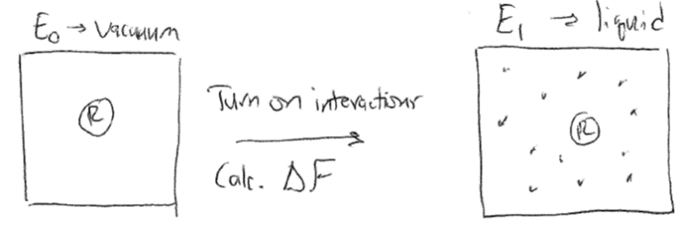

# Free energy perturbation

## Recommended textbooks

Frenkel and Smit Ch. 7

## Topics in this lecture

-   Umbrella sampling

-   Free energy perturbation

-   Thermodynamic integration

## Umbrella sampling

In the last lecture, we introduced the concept of the potential of mean
force, or the change in the Helmholtz free energy of the system as a
function of a reaction coordinate, $x(\mathbf{r}^N)$, that describes a
process of interest. The value of the PMF for some specific value of the
reaction coordinate, $x'$, is defined as:

$$F(x') = -k_BT \ln Z(x') = -k_B T \ln \left [ p(x')  \right ] - k_B T \ln Z$$

Here, $Z$ is the partition function of the entire system, which is
unknown, while $p(x')$ is the unbiased probability that the system
obtains a configuration for which the reaction coordinate has a value
$x'$. We can write this probability distribution as:

$$\label{app_a_partition_function_eq}
p(x') = \frac{\int d\mathbf{r}^N \exp \left [ -\beta  E(\mathbf{r}^N)\right  ]  \delta(x(\mathbf{r}^N) - x')}{Z}$$

The PMF is a very useful quantity for calculating equilibrium free
energy changes associated with processes that involve a well-defined
reaction coordinate. To calculate the PMF, however, the probability
associated with a specific value of the reaction coordinate, $p(x')$,
must be determined, which might be challenging for a system where
certain values of the reaction coordinate are observed with very low
probability. As a result, we began to describe an approach called
**umbrella sampling**, in which we apply some bias to the system
potential energy function that enforces sampling of particular values of
$x$. Then, we can relate the corresponding biased probability
distribution to the unbiased probability distribution to compute the
PMF. We specifically defined a weight function
$w_i(x) \equiv w_i[x(\textbf{r}^N)]$ as the weight function that
restrains the system near some value of the reaction coordinate $x_i$.
Typically, this is defined as a harmonic potential of the form:

$$\begin{aligned}
w_i(x) = \frac{1}{2} k(x-x_i)^2
\end{aligned}$$

The potential energy function of the system is then given by
$E(\mathbf{r}^N) + w_i(x)$, such that the weight function significantly
increases the energy of any configurations with values of the reaction
coordinate that differ significantly from the restrained value $x_i$. In
other words, we add a fictitious force (a spring force) that is not
meant to model a physical force in the system, but rather is added
solely to force the system to sample a particular value of the reaction
coordinate. Conceptually, the idea behind this is to effectively
"flatten" the free energy landscape by forcing the system to explore a
local region near $x_i$, thus allowing the sampling of values of $x_i$
that would not be explored in an unbiased simulation.

{width="100%"}

We can now write the **biased** probability of finding the system at a
particular value of the reaction coordinate $x(\mathbf{r}^N) = x'$ for
the $i$th simulation using the modified potential energy function:

$$p_{\textrm{bias},i}(x') = \frac{\int d \mathbf{r}^N e^{ -\beta [E(\mathbf{r}^N)+w_i(x)]} \delta(x(\mathbf{r}^N) - x')}{\int d \mathbf{r}^N  e^{ -\beta [E(\mathbf{r}^N)+w_i(x)]} }$$

The delta function selects only values of $x(\mathbf{r}^N) = x'$, so if
$x' \approx x_i$, then $p_{\textrm{bias},i}(x')$ will be large;
otherwise, the weight function will lead to large values of the total
energy and thus negligible values of $p_{\textrm{bias},i}(x')$. We can
sample this probability distribution directly in a simulation by adding
the weight function to the system dynamics (*i.e.*, adding a spring
force to relevant particles) to increase sampling of the value $x'=x_i$.
However, we need to sample the **unbiased** probability to calculate the
potential of mean force, so we need to relate $p_{\textrm{bias},i}(x')$
to $p(x')$. To do so, we can first rewrite the biased probability
distribution as:

$$\begin{aligned}
p_{\textrm{bias},i}(x') &= \frac{\int d \mathbf{r}^N e^{ -\beta [E(\mathbf{r}^N)]}e^{-\beta w_i(x)} \delta(x(\mathbf{r}^N) - x')}{\int d \mathbf{r}^N  e^{ -\beta [E(\mathbf{r}^N)]}e^{-\beta w_i(x)} } \\
&= \frac{\int d \mathbf{r}^N e^{ -\beta [E(\mathbf{r}^N)]}e^{-\beta w_i(x)} \delta(x(\mathbf{r}^N) - x')}{Z} \frac{Z} {\int d \mathbf{r}^N  e^{ -\beta [E(\mathbf{r}^N)]}e^{-\beta w_i(x)} }
\end{aligned}$$

By inspecting the second term we see that it is an integral over all
phase space of $e^{-\beta w_i(x)}$ multiplied by a Boltzmann weight;
this is exactly the expression for the ensemble average
$\langle e^{-\beta w_i(x)} \rangle$, so we simplify to:

$$\begin{aligned}
p_{\textrm{bias},i}(x') &= \frac{\int d \mathbf{r}^N e^{ -\beta [E(\mathbf{r}^N)]}e^{-\beta w_i(x)} \delta(x(\mathbf{r}^N) - x')}{Z} \langle e^{-\beta w_i(x)} \rangle^{-1}
\end{aligned}$$

Next, we can recognize that the delta function in the integral selects
only those states for which $x(\mathbf{r}^N) = x'$ (unlike the previous
ensemble average, where the integral includes all values of
$\mathbf{r}^N$ and thus all values of $x(\mathbf{r}^N)$). As a result,
the value of the weight function can be computed analytically and
removed from the integral, yielding:

$$\begin{aligned}
p_{\textrm{bias},i}(x') &= \frac{e^{-\beta w_i(x')}\int d \mathbf{r}^N e^{ -\beta [E(\mathbf{r}^N)]} \delta(x(\mathbf{r}^N) - x')}{Z} \langle e^{-\beta w_i(x)} \rangle^{-1}\\
&= e^{-\beta w_i(x')} p(x') \langle e^{-\beta w_i(x)} \rangle^{-1}
\end{aligned}$$

Note that we are being careful to distinguish between the value of the
weight function for a specific value of the reaction coordinate,
$e^{-\beta w_i(x')}$, which is analytically defined, and the
ensemble-average value of the weight function for all possible values of
the reaction coordinate, $\langle e^{-\beta w_i(x)} \rangle$, which will
depend on the entire phase space. We can then rearrange this expression
for the unbiased probability to write:

$$\label{app_a_us_unbiased_prob}
p(x') = e^{\beta w_i(x')} p_{\textrm{bias}, i}(x') \langle e^{-\beta w_i(x)} \rangle$$

This expression thus relates the biased probability distribution from
the $i$th biased simulation to the unbiased probability distribution. We
can then write the value of the PMF, $F_i(x')$ associated with $x'$
based on the $i$th simulation (i.e., the simulation with a bias applied
to $x_i$) as:

$$\begin{aligned}
F_i(x') &= -k_BT \ln \left [ p(x') \right ] - k_BT \ln Z \\ 
&= -k_BT \ln \left [   e^{\beta w_i(x')} p_{\textrm{bias}, i}(x') \langle e^{-\beta w_i(x)} \rangle \right ] - k_BT \ln Z\\
&= -k_BT \ln \left [p_{\textrm{bias}, i}(x') \right ] - w_i(x') - k_BT \ln \langle \exp \left [ -\beta w_i(x) \right ] \rangle  - k_BT \ln Z \label{app_a_us_nofi_eq}
\end{aligned}$$

Let's consider each of these terms in turn. The first term,
$-k_BT \ln \left [p_{\textrm{bias}, i}(x') \right ]$, can be estimated
directly from the $i$th biased molecular simulation for which the weight
function will restrain the simulation to sample configurations with
$x(\mathbf{r}^N) \approx x_i'$, allowing $p_{\textrm{bias}, i}(x')$ to
be calculated even if $x'$ is normally not sampled in an unbiased
simulation. The second term, $w_i(x')$, is calculated analytically since
the expression for the weight function is specified. The fourth term,
$-k_BT \ln Z$, is a constant that does not depend on $x'$ and can be
eliminated by only consider differences in the PMF. Finally, the third
term, $- k_BT \ln \langle \exp \left [ -\beta w_i(x) \right ] \rangle$
is the ensemble average of the exponential weight function for $x'$
sampled from the unbiased ensemble. As we will show below, this term is
equal to the free energy cost associated with introducing the weight
function. We can define this term as $K_i$ to write our final expression
as:

$$\label{app_a_pmf_final_eq}
F_i(x') = -k_BT \ln \left [p_{\textrm{bias}, i}(x') \right ] - w_i(x') +     K_i  - k_BT \ln Z$$

This final expression is a powerful approach for computing values of the
PMF as follows. We first define a set of harmonic weight functions, each
centered on some value $x_i$ such that the total set of restrained
values spans the values of $x$ that are of interest. An independent
simulation is then performed for each value of $x_i$ and
$p_{\textrm{bias}, i}(x')$ is estimated for all $x'$ (typically by
histogramming). The unbiased PMF for $x'$ is then computed from the
$i$th simulation using the expression above. By only considering
differences in the PMF, the $- k_BT \ln Z$ term drops out, leaving only
the set of $K_i$ to be determined for the entire PMF to be specified.
However, we can compute the set of $K_i$ by recognizing that the value
of the unbiased PMF, $F_i(x')$, should be independent of the value of
$x_i$ that is biased. Thus, we can compute $F_i(x')$ for the same $x'$
from several different biased simulations (i.e. different biased values
of $x_i$) and adjust the values of $K_i$ such that the estimate for
$F(x')$ matches across all biased windows. This approach requires that
the biased simulations **overlap** - that is, that there is a
non-negligible value of $p_{\textrm{bias}, i}(x')$ for the same value of
$x'$ sampled in each of the overlapping windows. In practice, this means
that the harmonic weight function must allow the system to sample
configurations slightly different from $x_i$ to ensure that $x'$ can be
sampled in multiple different biased simulations.

{width="100%"}

So, to recap: umbrella sampling allows us to calculate the PMF (i.e. the
change in the free energy) associated with any arbitrary process by
sampling configurations associated with different values of a reaction
coordinate associated with the process. The key advantage of the
umbrella sampling approach is that any value of the reaction coordiante
can be sampled by applying weight functions, thus enabling the estimate
of the PMF even for very low probability (high free energy) states. From
a computational standpoint, this method requires a series of independent
simulations to be performed and then free energies to be determined by
matching estimates of the PMF from overlapping biased simulations. The
requirement of overlap renders this technique inefficient
computationally, although more efficient methods (such as the Weighted
Histogram Analysis Method) have been developed to compute the set of
$K_i$. These techniques are outside the scope of this discussion.
Umbrella sampling is very commonly used to compute PMFs for processes
with large energy barriers, such that the processes cannot be directly
observed in unbiased simulations. For example, one could apply umbrella
sampling to calculate the free energy change associated with adsorbing a
molecule to a surface by defining the distance to the surface as the
reaction coordinate, choosing multiple values of this distance, then
performing multiple independent simulations in which the molecule of
interest is restrained to each value of the reaction coordinate using a
harmonic spring.

## Free energy perturbation

So far, we have defined the potential of mean force as the change in the
free energy of a system during a process in which particle coordinates
follow some predefined reaction coordinate, and hence the overall system
potential energy function is unchanged. Computing the potential of mean
force associated with different regions of phase space is useful for
calculating the magnitude of energy barriers and identifying local
minima. However, we might also ask how to calculate the change in free
energy between two systems with different potential energy functions
entirely. Finding an algorithm to accomplish this would also be useful
in applications other than calculating a PMF along a reaction
coordinate, such as calculating the free energy change associated with
mutating the chemical identities of molecules in a simulation. We can
compute the free energy difference between two systems with different
partition functions using a technique called **free energy
perturbation**.

For this calculation, we will first define two partition functions,
$Z_0$ and $Z_1$, corresponding to two different systems with potential
energy functions $E_0(\mathbf{r}^N)$ and $E_1(\mathbf{r}^N)$. Note that
while the potential energy functions are different, we assume that the
set of possible values of $\mathbf{r}^N$ are the same (*i.e.*, both
systems access the same phase space). For example, one could imagine
computing the free energy difference between an ideal gas and a
non-ideal gas with the same number of particles, with the interactions
associated with the non-ideal gas leading to a different potential
energy function. The Helmholtz free energy change for transforming from
system 0 to 1 is then:

$$\begin{aligned}
\Delta F &= F_1 - F_0  \\ 
&= -k_BT \ln Z_1/Z_0 \\
&= -k_BT \ln \left [ \frac{\int d\mathbf{r}^N \exp \left [ -\beta  E_1(\mathbf{r}^N)\right ]}{\int d\mathbf{r}^N \exp \left [ -\beta  E_0(\mathbf{r}^N)\right ]} \right ]
\end{aligned}$$

Next, we define $p_1(\Delta E')$ as the probability distribution for the
energy difference
$\Delta E(\textbf{r}^N) = E_1(\mathbf{r}^N) - E_0(\mathbf{r}^N)$ with
configurations sampled using $E_1$. In other words, we can imagine
generating a large number of configurations using the potential energy
function for system 1, calculating the energy of those configurations
according to both $E_1$ and $E_0$, then finding the probability of
identifying a particular energy difference $\Delta E'$. Similarly,
$p_0(\Delta E')$ is the probability density for the same energy
difference with configurations sampled using $E_0$. We then write:

$$\begin{aligned}
p_1(\Delta E') &= \frac{\int d\mathbf{r}^N \exp \left [ -\beta E_1(\mathbf{r}^N) \right ] \delta(\Delta E(\textbf{r}^N) - \Delta E')}{Z_1}  \\
&= \frac{\int d\mathbf{r}^N \exp \left [ -\beta (E_0(\mathbf{r}^N) + \Delta E') \right ] \delta(\Delta E(\textbf{r}^N) - \Delta E')}{Z_1}  \\
&= \frac{\int d\mathbf{r}^N \exp \left [ -\beta E_0(\mathbf{r}^N) \right ] \exp \left [ -\beta \Delta E' \right ] \delta(\Delta E(\textbf{r}^N) - \Delta E')}{Z_1}
\end{aligned}$$

Here, $\Delta E'$ is a fixed value that is not a function of
$\mathbf{r}^N$ and the delta function eliminates all other possible
values of $\Delta E(\textbf{r}^N)$, so in the second line we can define
$E_1(\textbf{r}^N) = E_0(\textbf{r}^N) + \Delta E'$ and in the third
line $\exp \left [ -\beta \Delta E' \right ]$ can be removed from the
integral. We can now multiply the numerator and demoninator by $Z_0$ to
obtain:

$$\begin{aligned}
p_1(\Delta E') &= \exp \left [ -\beta \Delta E' \right ] \frac{\int d\mathbf{r}^N \exp \left [ -\beta E_0(\mathbf{r}^N) \right ]  \delta(\Delta E(\textbf{r}^N) - \Delta E')}{Z_1}   \\
&= \frac{Z_0}{Z_1} \exp \left [ -\beta \Delta E' \right ] \frac{\int d\mathbf{r}^N \exp \left [ -\beta E_0(\mathbf{r}^N) \right ]  \delta(\Delta E(\textbf{r}^N) - \Delta E')}{Z_0}   \\
&= \frac{Z_0}{Z_1} \exp \left [ -\beta \Delta E' \right ] p_0(\Delta E')
\end{aligned}$$

We can take the log of both sides to estimate the free energy difference
using $\Delta F = -kT \ln Z_1/Z_0$:

$$\begin{aligned}
\ln p_1(\Delta E') &= \ln \left [ Z_0 / Z_1 \right ] - \beta \Delta E' + \ln p_0 (\Delta E')   \\
&= \beta \Delta F - \beta \Delta E' + \ln p_0 (\Delta E') \\
&= \beta (\Delta F - \Delta E') + \ln p_0 (\Delta E') \\
\therefore p_1(\Delta E')&= p_0 (\Delta E') \exp \left [\beta \left ( \Delta F - \Delta E'\right )\right ]
\end{aligned}$$

From this equation alone we can see that calculating the two probability
densities from simulations in both ensembles would allow for the
calculation of the free energy change $\Delta F$. Finally, we can
integrate both sides over all possible values of $\Delta E'$ to yield a
more concise expression:

$$\begin{aligned}
\int_{-\infty}^{\infty} d\Delta E' p_1(\Delta E') &= \exp (\beta \Delta F)\int_{-\infty}^{\infty} d\Delta E' p_0(\Delta E') \exp (-\beta \Delta E')\\
1 &= \exp (\beta \Delta F) \langle \exp \left [ - \beta \Delta E \right ] \rangle_0\\
\exp \left [ -\beta \Delta F \right ]  &= \langle \exp \left [ - \beta \Delta E \right ] \rangle_0 \label{app_a_fep_eq}
\end{aligned}$$

Here, we integrate the probability distribution for $\Delta E'$ over all
possible energy differences sampled in system 1; since the probability
distributions is normalized, this just equals 1. The value $\Delta F$ is
independent of $\Delta E'$ so it can be removed from the integral on the
right hand side, which then is equal to the ensemble average value of
the exponential of $\Delta E'$, yielding the final expression. Note
again that this ensemble average is sampled using the energy function of
system 0.

The final free energy perturbation expression relates the free energy
change for transforming from system 0 to system 1 to the ensemble
average of the energy change for this transformation for configurations
sampled from $Z_0$. Free energy perturbation can be used directly in
molecular simulations by defining system 0 and 1, generating
configurations according to the potential energy function of system 0,
calculating the energy of the same configuration calculated using both
$E_1$ and $E_0$, then averaging $E_1 - E_0$ to get $\Delta F$ according
to eq. [\[app_a_fep_eq\]](#app_a_fep_eq){reference-type="eqref"
reference="app_a_fep_eq"}. Note that there are *no* constraints on what
the potential energy functions of system $0$ and $1$ can be, so it is
possible to use this approach to completely change the chemical identify
of molecules during a simulation and measure the corresponding free
energy change. Such transformations are called *alchemical free energy
calculations*.

Alchemical free energy calculations are often used to compute the free
energy difference between two states that have no clear reaction
coordinate connecting them, and for which only differences in energy
(and not complete free energy pathways) are necessary. A typical example
is in the design of drug inhibitors to bind proteins - free energy
perturbation can be used to calculate the free energy change between a
molecule bound to a receptor and a slightly different molecule bound to
the same receptor to quantify relative binding affinities.
Alternatively, the same technique could be used to calculate the
absolute free energy of binding by defining a difference in free energy
between the bound drug molecule and a drug molecule free in solution.

{width="100%"}
