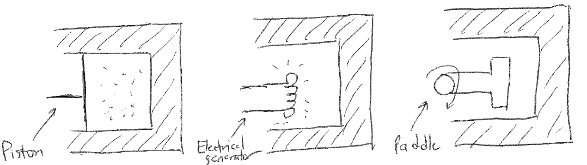

# Postulates of thermodynamics

## Recommended textbooks

Tester and Modell, Ch. 2 and 3

## Topics in this lecture

-   Four postulates

-   First Law for open systems

## Announcements

-   Simulation project due November 7

## Thermodynamic integration

In the last lecture, we discussed umbrella sampling and free energy
perturbation as techniques to compute free energies from either Monte
Carlo or Molecular Dynamics simulations. We will discuss one final
method to close our discussion of molecular simulations. The final
technique we will discuss is similar in spirit to free energy
perturbation, in that it involves the calculation of the change in free
energy between two systems with distinct potential energy functions. In
the case of thermodynamic integration, we will explicitly define a
linear interpolation between the potential energy functions for the two
systems via a coupling parameter, $\lambda$. We write:

$$\begin{aligned}
E_\lambda(\textbf{r}^N) &= (1-\lambda)E_0(\textbf{r}^N) + \lambda E_1(\textbf{r}^N) \\
&= E_0(\textbf{r}^N) + \lambda[E_1(\textbf{r}^N) - E_0(\textbf{r}^N]
\end{aligned}$$

Here, $E_0(\textbf{r}^N)$ and $E_1(\textbf{r}^N)$ refer to the two
reference states, and the value of $\lambda$ interpolates the system
potential energy function between that of $E_0$ for $\lambda = 0$ and
$E_1$ for $\lambda = 1$. We can now write the derivative of the
Helmholtz free energy with respect to $\lambda$ as follows:

$$\begin{aligned}
\left ( \frac{\partial F(\lambda)}{\partial \lambda}\right ) &=-k_BT \frac{\partial }{\partial \lambda} \ln Z(\lambda) \\
&= -\frac{k_B T}{Z(\lambda)} \frac{\partial Z(\lambda)}{\partial \lambda} \\
&= -\frac{k_BT}{Z(\lambda)} \frac{\partial }{\partial \lambda} \int d\textbf{r}^N \exp \left [ -\beta E_\lambda(\textbf{r}^N) \right ] \\
&= \frac{\int d\textbf{r}^N \left ( \partial E_\lambda(\textbf{r}^N) / \partial \lambda \right ) \exp \left [ -\beta E_\lambda(\textbf{r}^N) \right ] }{Z(\lambda)} \\
&= \left \langle \frac{\partial E_\lambda(\textbf{r}^N)}{\partial \lambda}\right \rangle_\lambda
\end{aligned}$$

This expression shows that we can relate the change in the free energy
of the system with respect to the coupling parameter to an ensemble
average of that derivative sampled from an ensemble at a particular
value of $\lambda$, as indicated by the subscript in the angular
brackets. We can then calculate the complete free energy difference
between system 0 and 1 by:

$$\begin{aligned}
F(\lambda = 1) - F(\lambda = 0) = \int_{\lambda = 0}^{\lambda = 1} \left \langle \frac{\partial E_\lambda(\textbf{r}^N)}{\partial \lambda}\right \rangle_\lambda d\lambda
\end{aligned}$$

This final integral is why the technique is called *thermodynamic
integration*. In practice, this integral is evaluated by choosing
several discrete values of $\lambda$, sampling particle configurations
according to the potential energy function $E_\lambda$, and for each
sampled configuration calculating the energy using
$E_{\lambda \pm d\lambda}$ where $d\lambda$ is some small interval. The
derivative is approximated from a finite difference between these three
values and used to calculate the ensemble average. The integral is then
evaluated by quadrature. This approach does not necessarily require a
linear coupling parameter, although in practice this is a simple method
that is commonly used. It should be noted that the coupling parameter
approach, and the division of the thermodynamic integral into multiple
discrete values of $\lambda$, can also be used with free energy
perturbation to improve convergence.

Given the similarities to free energy perturbation, thermodynamic
integration is often used for similar systems. It has been used
extensively in calculating the phase behavior of self-assembled
mixtures, in part because thermodynamic integration can be used to
calculate the free energy between two phases that differ in their
thermodynamic properties, such as temperature, via appropriate selection
of a coupling parameter (as opposed to biasing their potential
energies).

## Summary of molecular simulations

We have now concluded our discussion of molecular simulations. Starting
from the first postulate of statistical mechanics (ergodicity), we
defined two simulation techniques: Monte Carlo simulations, which seek
to directly sample ensemble-average properties by generating possible
system configurations; and molecular dynamics simulations, which seek to
model the underlying equations of motion of a system to generate
time-averaged properties mirroring experimental values. With respect to
the latter approach, we further discussed the definition of the
simulation temperature and mechanisms for maintaining a constant
temperature in order to sample the canonical ensemble. We then defined
various methods for computing free energies, rather than just potential
energies, so that we could determine the likelihood of processes
occurring at equilibrium. We of course are only scratching the surface
of molecular simulations - other topics of interest include methods for
maintaining a constant pressure in simulation, methods for sampling
systems in the grand canonical ensemble, alternative free energy
calculations that do not rely on predefined reaction coordinates, etc.
The Frenkel and Smit textbook does continue with several of these topics
if you wish to pursue them on your own.

## The four postulates of classical thermodynamics

In this lecture, we will begin our study of classical thermodynamics
following a postulatory approach: we will define only four postulates
that we accept as fact, and then find that from these postulates alone
we can define the entire thermodynamic framework that we have already
been using in our study of statistical mechanics. Hopefully through
these derivations you will see the beauty of this approach and recognize
the logic and consistency that underlies these studies. I encourage you
to review the Notation handout that is uploaded to the Canvas website to
ensure that you can follow along with the terminology that we will use.
We will start by defining the postulates of thermodynamics and begin
exploring their implications. Please note that these postulates may be
stated in various ways (and their numbering scheme may vary as well) -
we follow the postulates as defined in the Tester and Modell textbook
*Thermodynamics and its Applications*.

As a "Postulate 0," we assume that we have an experimental apparatus
capable of measuring system properties and of manipulating the values of
system variables as well.

**Postulate 1:** *For closed simple systems with given internal
restraints, there exist stable equilibrium states which can be
characterized completely by two independently variable properties in
addition to the masses of the particular chemical species initially
charged.*

This postulate defines the concept of equilibrium states in a system as
the states of interest that we will consider throughout our studies,
just as we did in statistical mechanics. The postulate defines
equilibrium states as stable, meaning that their properties are not
time-dependent once equilibrium is reached (if no event perturbs the
system). An internal restraint refers to a barrier (that need not be
physical) to particular processes within the system - for example, an
activation energy might exist that prevents the chemical transformation
of system components. The statement that the system is completely
characterized by two independently variable properties means that one of
these properties can be varied while the other is held constant to
completely determine the behavior and state of a system. For example, if
you were to know the amount of material (i.e., the amount initially
charged in the system) in a simple, closed system containing a pure
liquid in equilibrium with its vapor, the properties of the system could
be completely determined if the volume of the system and its temperature
were known as these two properties are independently variable. However,
for this system the pressure and temperature are not independently
variable (we'll learn why explicitly later, but this is a consequence of
the phase equilibrium between the vapor and liquid), so specifying these
two variables is insufficient to determine the properties of the system.

This postulate implies that we will need to find relationships between
thermodynamic properties to determine what properties can be
independently varied and to understand how to determine the values of
other system properties based on these variations. Developing these
relations will be a major focus of our studies. If we know these
relationships, we can also use them to test for the presence of
restraints in the system. We will present examples of these
relationships as we proceed.

**Postulate 2:** *In processes for which there is no net effect on the
environment, all systems (simple and composite) with given internal
restraints will change in such a way as to approach one and only one
stable equilibrium state for each simple subsystem. In the limiting
condition, the entire system is said to be at equilibrium.*

Postulate 2 then tells us that equilibrium states are reached if a
system is observed for a sufficiently long amount of time - that is,
each simple system (or simple subsystems in a composite system) evolves
toward a unique equilibrium state. Postulate 2 is only defined for an
isolated system with a given set of internal restraints. Changing the
internal restraints (*i.e.*, removing the activation barrier in the
previous example) will change the unique equilibrium state of the system
in a predictable way (*i.e.*, the system components may undergo a
reaction). This observation underscores the importance of understanding
and identifying internal restraints in the system. Finally, note that in
composite systems, the equilibrium state of the entire system cannot be
specified by only two independent variables, but each simple subsystem
can be defined by two independent variables. The properties of the
composite system are thus defined by the collected properties of the
subsystems.

Since Postulate 1 and 2 together introduce the concept of stable
equilibrium states that are reached after the time-evolution of a
system, we now must introduce the concept of a thermodynamic
**process**. A process defines the changes in the thermodynamic
properties of a system that occur when a system has an interaction with
the environment or internal restraints are removed or altered. The
process includes a description of the two equilibrium end states, prior
to and after the process, the interactions occurring at the boundaries
of the system, and the set of states through which the system evolves,
also known as the **path**. A path can be quasi-static, meaning that all
intermediate states in a process are equilibrium states that can be
described with two independently variable parameters. Processes that
involve non-quasi-static paths pass through non-equilibrium states that
may require additional properties to be specified, and thus do not obey
Postulate 1. Various types of processes can be defined. For example, an
isothermal process is one in which the temperature is constant. More
examples will be provided as we continue our studies. Postulate 2
specifies that the time evolution of a system to an equilibrium state
must occur with no effect on the environment, implying that the system
is isolated. However, processes can also consist of a series of steps,
with individual steps affecting the environment; the net effect across
multiple steps must just be zero.

**Postulate 3:** *For any states, (1) and (2), in which a closed system
is at equilibrium, the change of state represented by (1) $\rightarrow$
(2) and/or the reverse change (2) $\rightarrow$ (1) can occur by at
least one adiabatic process, and the adiabatic work interaction between
this system and its surroundings is determined uniquely by specifying
the end states (1) and (2).*

This postulate defines several important pieces of terminology that
require some investigation. First, we formally define the concept of
**work**, which we have already used repeatedly in our study of
statistical mechanics. Following typical mechanical definitions, the
work, $W$, is defined as the product of a generalized force, $f$,
multiplied by a generalized displacement, $\Delta x$:

$$\begin{aligned}
W &= f \Delta x  \\
dW &= f dx \\
W &= \int_{x_1}^{x_2} f dx
\end{aligned}$$

In its most general form, the product of the force and displacement
would be a vector product between a force vector $\vec{f}$ and a vector
displacement; we drop this notation for simplicity.

As in statistical mechanics, we will define the sign convention such
that the work is positive if work is done *on* the system by the
environment. In general, for all work interactions, the work done on a
system by the environment is equal to the work done on the environment
by the system; this is a consequence of Newton's 3rd law and reflects
the conservation of energy.

Next, we will define an **adiabatic work interaction** as an interaction
between two closed systems that does not involve a transfer of heat to
the environment. Since we have not yet formally defined heat, we can
define adiabatic work interactions in terms of an observable
experiment - namely, adiabatic work interactions can be performed by the
rise and fall of weights in an external gravitational field connected by
a frictionless pulley, which we know to be a system described entirely
by the work due to gravity. Examples of adiabatic work interactions
include compressing a gas with a piston on a frictionless surface, which
could be accomplished by raising or lowering a weight attached to the
piston, or resistively heating a liquid by doing electrical work, which
could be accomplished by tying a rope attached to a weight around a
motor and using the motor to send current through a resistor that is
inserted in a fluid. In each case, the gas/liquid container is a closed
system on which work is done.

{width="100%"}

With these definitions, let us now consider the meaning of Postulate 3.
The postulate states that while it may not always be possible to go from
state (1) to state (2) solely via adiabatic work interactions - i.e.,
via an adiabatic process - it will always be possible to either go from
state (1) to (2) via an adiabatic process or from state (2) to (1) by an
adiabatic process. For example, consider a gas in state (1) specified by
$P_1, T_1$ and state (2) specified by $P_2, T_2$. Suppose that the gas
is in a closed system with a piston that controls the system volume. If
the gas is expanded adiabatically, the pressure drops from
$P_1 \rightarrow P_2$ and we would observe that the temperature changes
(this is due to the relationship between energy and temperature for an
ideal gas) To obtain a temperature $T_2$, we could add an electric
generator to the system that is powered by a weight; assuming
frictionless wires, this allows us to heat the system to temperature
$T_2$ with the piston fixed such that the pressure is maintained at
$P_2$. This is thus a multistep adiabatic process from state (1) to (2)
since the walls and each step is adiabatic. Moreover, the inverse
process is not possible, since we cannot cool the system adiabatically
by returning heat to the electric generator.

{width="100%"}

Since an adiabatic process is possible between any two states, Postulate
3 then defines the **internal energy** of the system, $\underline{U}$,
as a **derived parameter** (i.e. one that is not directly measurable)
equal to the work done during an adiabatic process, since the adiabatic
work is only a function of the end states:

$$\underline{U}_2 - \underline{U}_1 = \underline{W}_{1\rightarrow 2, \textrm{adiabatic}}$$

Technically, this expression defines the change in the *total* energy of
the system, including the kinetic energy associated with center-of-mass
motion in a system, potential energy associated with body forces (i.e.
gravity), and the internal energy associated with molecular motions
(i.e. translational degrees of freedom, vibrations, rotations),
intramolecular effects (electron spin), and intermolecular interactions.
We will ignore the first two effects and treat the total energy as the
internal energy due to usage of this nomenclature throughout our study
of statistical mechanics.

So, in total, Postulate 3 defines the internal energy as a derived
parameter that is a function of the states of two stable equilibrium
systems. We refer to such a parameter as a **state function**. Note that
only changes in energy are meaningful; we could assign an energy to each
state, but only the energy change will matter.

While Postulate 3 states that two states can be connected by an
adiabatic process, in principle we can define any process, adiabatic or
non-adiabatic, between the two states and the change in total energy
will be unchanged (since it is uniquely defined as the work done along
the adiabatic path). This observation leads to our definition of heat:
heat is the *difference* in the total energy change during a particular
process and the actual work performed. We can write this as:

$$\begin{aligned}
\delta Q &= \left(\underline{U}_\textrm{2} - \underline{U}_\textrm{1} \right)- \delta \underline{W} \\
&= \underline{W}_{\textrm{adiabatic}} - \underline{W}_{\textrm{non-adiabatic}}\\
\Delta \underline{U} &= \delta \underline{Q} + \delta \underline{W}
\end{aligned}$$

This relation is referred to as the **first law of thermodynamics** -
the change in the energy of a system is always the sum of the heat
(which is positive if heat is added to the system) and the work (which
is positive if work is done on the system by the surroundings) during a
process. Here we use the symbol $\delta$ to indicate that the associated
parameter is **path-dependent**; while the energy change is a fixed
function of the initial and final state, the amount of heat and work
transferred depends on the path between the two states. Note that we
will use the phrase "transfer heat" but this just means that energy is
transferred via a heat interaction - there is no heat that is intrinsic
to a state that is transferred. For a system to undergo a heat
interaction, there must be at least one non-adiabatic or diathermal
wall, but having a diathermal wall does not imply that a system will
necessarily undergo a heat interaction.

**Postulate 4:** *If the sets of systems $A$, $B$ and $A$, $C$ each have
no heat interaction when connected across nonadiabatic walls, then there
will be no heat interaction if systems $B$ and $C$ are also so
connected.*

This postulate effectively defines the concept of thermal equilibrium -
systems connected across non-adiabatic walls that do not have a heat
interaction are at thermal equilibrium, and thus any two systems that
are connected to a third system that all experience no heat flow must
have the same temperature (which we have not strictly defined; suffice
to say it is the quantity that its equivalent for systems for which
there is no heat transfer). This postulate thus requires the definition
of the **temperature** as an intensive parameter that is equal for two
systems connected by nonadiabatic walls that undergo no heat
interaction.
