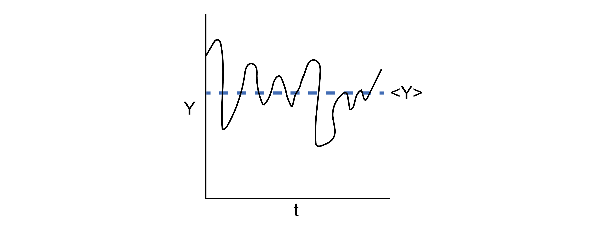

# Postulates of statistical mechanics

## Additional Readings for the Enthusiast

{cite:ts}`mcquarrie_statistical_2000`, Chapter 1, Chapter 2.1

{cite:ts}`chandler_introduction_1987`, Chapter 3.1 - 3.2

## Goals for today's lecture
- What is a macrostate? A microstate? An ensemble?
- Why would the degeneracy of an ensemble be important?
- What are important conditions to ensure the time-average is equivalent to the ensemble-average?
- How does the definition of entropy we discuss differ from the classic "entropy is disorder" description?

## Macrostates and Microstates

Recall that our goal in statistical mechanics is to develop a
mathematical framework that allows us to calculate the macroscopic,
thermodynamic properties of a system from a description of the
properties of individual molecules. For example, we might try to derive
the value of a given thermodynamic property such as the temperature or
pressure from the knowledge of the quantum mechanical energy levels
available to a system with $N$ particles. We will take the first steps
toward accomplishing that goal in this lecture.

Imagine a system composed of a single-component gas enclosed within a
sealed, rigid, insulated container. The walls of the container therefore
prevent a change in the number of particles ($N$), the volume ($V$), or
the energy ($E$) of the gas; the system is **isolated**.
Equivalently,
we could describe the system in terms of what macroscopic thermodynamic
parameters are constant - this gas is defined as having constant $NVE$,
where these particular variables are constant due to the constraints
imposed by the walls, as opposed to being constant due to a condition of
equilibrium.

At the macroscale, these three parameters define the system - if I were
to characterize the gas with no knowledge of the existence of individual
gas particles, I would characterize it strictly in terms of the values
of $N$, $V$, and $E$. We therefore define the

```{glossary}
macrostate
    the meta-state of a system corresponding to a specific value of
    all non-fixed paramters
```

where here, our macrostate corresponds to particular values of $NVE$
that describe the current state of the gas. However, we
know that at the microscale there are an enormous number of particle
configurations that can fulfill these requirements. For example, assume
that the gas is ideal and therefore the only contribution to the
internal energy is the kinetic energy of each particle. Even if the
total internal energy (i.e., the sum of the kinetic energy of each
particle) is a constant value, there are an enormous number of ways that
we could arrange particle positions in space that would still have the
same internal energy, since the kinetic energy does not depend on
particle positions.

If we were to take a snapshot of the gas at a particular instant in time
and record the positions of all $N$ particles, we would define a

```{glossary}
microstate
    one particular configuration out
    of the enormous set of configurations of particle positions that have
    the same macroscopic values of $N$, $V$, and $E$
```

**There are thus many,
many microstates that are compatible with a given macrostate**.
Oftentimes, authors will interchangably use the term "state" to mean
"microstate," which can be a bit confusing, but should be apparent from
context.


Given this definition of a microstate, we can then define the concept of
an **ensemble** of microstates. An ensemble is a mental collection of
all possible unique microstates that are consistent with a specific
macrostate; each member of the ensemble is considered identical
macroscopically, but unique microscopically.

We will discuss four primary ensembles in this course that are given names reflecting the
choice of thermodynamic variables that are held constant.

```{glossary}
microcanonical ensemble
    The ensemble for which all microstates have a fixed number of particles, volume, and
    internal energy. Also known as the $$NVE$$ ensemble.

canonical ensemble
    The ensemble for which all microstates have a fixed number of particles, volume, and
    temperature. Also known as the $$NVT$$ ensemble.

grand canonical ensemble
    The ensemble for which all microstates have a fixed chemical potential, volume, and temperature.
    Also known as the $$\mu VT$$ ensemble.

isothermal-isobaric ensemble
    The ensemble for which all microstates have a fixed number of particles,
    pressure, and temperature.
    Also known as the $$NPT$$ ensemble.
```

Many more ensembles are possible based on different thermodynamic
constraints. There are a couple of caveats to note. First, note that
each microstate of an ensemble will also have thermodynamic parameters
that are not fixed, and can vary with each microstate. For example, we
can define an instantaneous energy, $E_i$, for the $i$th microstate in
the canonical ensemble, and this energy will generally vary between
microstates. Also note that in several of these ensembles parameters are
fixed not due to the walls of the system but rather due to conditions of
equilibrium, a point that we will return to in the next lecture.

```{glossary}
degeneracy
    the number of microstates in an ensemble
    written as $\Omega(N,V,E)$
```

In the degeneracy, the parentheses indicate the fixed variables in the
corresponding ensemble, so this is the degeneracy of a microcanonical
ensemble; the degeneracy of a canonical ensemble would be written as
$\Omega(N,V,T)$.

Here, we
assume that the energy of a system is a discrete quantity such that the
number of states can be counted explicitly. Systems for which the energy
is nearly continuous are better described by a related concept called the

```{glossary}
density of states
    the number of states with an energy within a small interval $E+dE$,
    written as $\omega(N,V,E)$
```

We will largely
deal with the degeneracy as our chosen quantity for most of this class.
Other terms are often used to describe the degeneracy of an ensemble -
for example, the microstates in an ensemble are often called the "phase
space" of a system so that the degeneracy would be the "extent of phase
space."

Having defined an ensemble of microstates as a collection of
thermodynamically identical but microscopically distinct configurations
of a system, we can now define two fundamental postulates of statistical
mechanics.

## Postulate 1: The time-average value of a thermodynamic parameter, Y, of a system is equal to the ensemble-average value of Y.

```{glossary}
ensemble average
    the value of a parameter averaged
    across all microstates of a statistical ensemble, weighted by the
    probability that the system is in each microstate
```



We can formulate the
first postulate mathematically by defining the time average:

```{math}
:label: timeavg
Y_{time} \equiv \frac{1}{\tau} \int_0^{\tau} Y(t) dt 
```

and the ensemble average

```{math}
:label: ensembleavg
Y_{ens} \equiv \sum_{\text{microstate}~i} p_i Y_i  dt 
```

and noting that our observed quantity
$
Y_\textrm{obs} = \langle Y \rangle \equiv Y_{time} \equiv Y_{ens}.
$

Equation {eq}`timeavg` defines the time-average value of $Y$, where this is the value of $Y_\textrm{obs}$
that I would observe if I were to measure the parameter experimentally
(assuming a typical macroscopic measurement); in other words, this would
be the volume/pressure/etc. of the **macrostate**. Equation
{eq}`ensembleavg` defines the ensemble-average value of $Y$,
written as $\langle Y \rangle$. The sum runs over the entire ensemble of
microstates where $Y_i$ is the value of $Y$ in microstate $i$, and $p_i$
is the probability that the system is in microstate $i$ (such that
$\sum_i^\textrm{microstates} p_i = 1$). This postulate is the
foundation of statistical mechanics!

This postulate, also called the **ergodic hypothesis**, illustrates the
connection between statistical mechanics and thermodynamics by linking
the macroscopic (observed) value of a thermodynamic variable to an
average across a large number of particle configurations.

We can picture this connection by again imagining a gas. Assume that the gas were
allowed to exchange energy with the environment, such that it maintains
a constant temperature but its energy can fluctuate. If we were to
observe this gas for a long period of time and periodically take
snapshots of molecular configurations, each snapshot by definition would
be a microstate in the canonical ($NVT$) ensemble, and we could
calculate the value of some non-fixed thermodynamic variable $Y$ for
each microstate (e.g., the energy or the pressure).

As time progresses,
we record more and more configurations of the system - we say that the
system **samples microstates**. Some microstates may be sampled more
often than others, and therefore we could record identical values of $Y$
multiple times. If we waited a sufficiently long amount of time, the
system would sample each microstate $i$ according to the corresponding
probability $p_i$. Therefore, the time-average value of $Y$ would be
equivalent to taking the average of all the values I recorded - that is,
the time-average value would be equivalent to the ensemble-average value
according to the ergodic hypothesis.

### The Caveats
There are two critical aspects of this postulate that relate to the
observation time, $\tau$.

First, the properties of the system cannot
change with time during the period of observation; that is, the system
must be at equilibrium.

Second, the observation time, $\tau$, must be
very long so that the system properly samples a representative number of
microstates. "Very long" is obviously a qualitative statement; the
relevant timescale to compare to is the [autocorrelation time](https://en.wikipedia.org/wiki/Autocorrelation) of the
observable of interest. If we imagine placing the system in a single
microstate and then observe the positions and energies of all particles
as a function of time, the relevant autocorrelation time would be the
time necessary for the system to reach a new microstate such that
particle positions/energies are not correlated with the previously
recorded positions/energies (we will return to this point in Unit 2 of
this class). Autocorrelation times are generally very small - for
example, the autocorrelation time for particle positions in a gas is on
the order of picoseconds, so any macroscopic observation time will be
sufficiently long to observe a representative set of microstates from
the ensemble. However, some systems may have long autocorrelation times
(e.g., glasses) and therefore may not sample a representative number of
states during an expermient; such systems would then be **non-ergodic**.

Because the ergodic hypothesis tells us that ensemble averages can be
related to macroscopic thermodynamic parameters, all of the rules of
thermodynamics that you have learned and that we covered in the
preceding lecture can be applied to ensemble-average parameters. For
example, from the fundamental relation in the energy representation we
can show:

$$\begin{aligned}
\left ( \frac{\partial E}{\partial S}\right)_V = T
\end{aligned}$$

These rules have been derived assuming some macrostate with values $E$,
$S$, $V$, and $T$. However, the ergodic hypothesis now tells us that we
can relate macroscopic parameters to microscopic parameters. For
example, for an ensemble in which $V$ and $T$ are fixed and $E$ is
allowed to vary, I could equivalently write:

$$\begin{aligned}
\left ( \frac{\partial \langle E \rangle }{\partial S}\right)_V = T
\end{aligned}$$

Note that I have not commented on the entropy, $S$, which we will return
to in Postulate 2.

Equation {eq}`ensembleavg` writes the ensemble average in terms of a
summation over discrete microstates, with each microstate occurring in
the ensemble with probability $p_i$. In principle, however, we do not
know the values of $p_i$. The second postulate addresses this point.

## Postulate 2: In the microcanonical ensemble, all microstates are equally probable.

This postulate, also referred to as **the principle of equal *a priori*
probabilities**, states that each value of $p_i$ is equivalent in
Equation {eq}`ensembleavg` for microstates in the microcanonical ensemble,
as there is no *a priori* reason to assign different probabilities.
Using the definition of the degeneracy, $\Omega(N,V,E)$, from earlier,
this postulate defines

$$\begin{aligned}
p_i &= \frac{1}{\Omega (N,V,E)} \\
\langle Y \rangle &= \sum_i^\textrm{microstates} p_i Y_i = \frac{1}{\Omega (N,V,E)} \sum_1^{\Omega (N,V,E)} Y_i 
\end{aligned}$$

Note that we can define a degeneracy for *any* ensemble (e.g.,
$\Omega(N,V,T)$ as the degeneracy of the canonical ensemble), but
Postulate 2 only applies to the microcanonical ensemble.

In combination, the two postulates state that if an isolated system is
observed for a long period of time, all possible microstates of the
system will be visited with equal probability and the time-average value
of a thermodynamic property will be equivalent to the average of that
quantity across all microstates. As an aside, it is likely that there
will always be some uncertainty in the measurement of $E$ due to the
quantum properties of a system (i.e., due to the Heisenberg uncertainty
principle); however, this small uncertainty is effectively
inconsequential.

## "Postulate 3": The Boltzmann entropy

We will close this discussion of the microcanonical ensemble with a
third "postulate" that will be stated here (although it can be derived
from future results). Specifically, we define the **entropy** for the
microcanonical ensemble, $S$, as:

$$\label{boltzmann_entropy}
S = k_B \ln \Omega(N,V,E)$$

where $k_B = 1.381 \times 10^{-23}$ J/K is Boltzmann's constant. This
definition is also referred to as the [**Boltzmann entropy**](https://en.m.wikipedia.org/wiki/Boltzmann's_entropy_formula) to
distinguish from an alternative (but equivalent) definition given by
Gibbs that will be discussed later.

The entropy as defined is an
extensive variable, as we know from thermodynamics, because in general
the degeneracy of an ensemble will increase with system size.

The
entropy is also a property of the ensemble itself, unlike other
thermodynamic variables such as the pressure which can be given a
specific value for each microstate - in other words, we cannot write
$S_i$ as the entropy of a particular state.

Conceptually, this microscopic definition of the entropy agrees with the
concept of entropy as a measure of the "uncertainty" of a system, as is
often described in thermodynamics. Here, we quantify uncertainty using the
number of equivalent microstates - we can imagine that for a gas, there
are a much larger number of ways of repositioning particles to yield
equivalent macroscopic properties than for a solid,
so it's harder to guess which one we're really looking at. Alternatively, we
can think of the entropy as quantifying the volume of the phase space
accessible to a system. Regardless of how you think of it, this
definition of entropy provides another connection between the
microscopic features of a system (i.e., the degeneracy or number of
accessible microstates) and macroscopic thermodynamic parameters.