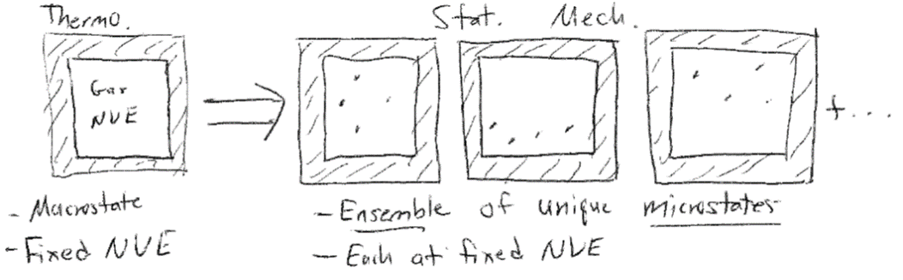
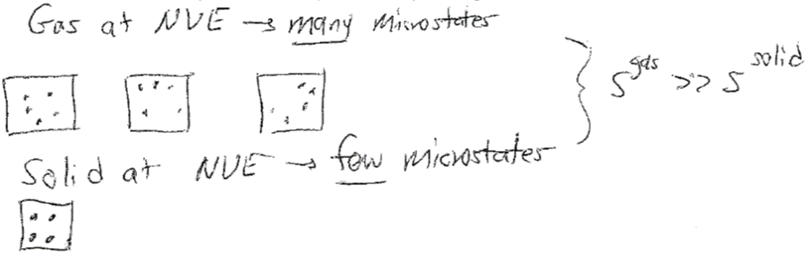

# The Microcanonical Ensemble

## Additional Readings for the Enthusiast

{cite:ts}`mcquarrie_statistical_2000`, Chapter 1, Chapter 2.1

{cite:ts}`chandler_introduction_1987`, Chapter 3.1 - 3.2

## Thermodynamics review

### The fundamental relation of thermodynamics

We ended the last lecture by discussing the combined first and second
law of thermodynamics (assuming a one-component system), which we write
as:

```{math}
    dE = TdS - PdV \label{combo_first_second}
```

This expression is also called the **fundamental relation** of
thermodynamics in the **energy representation**. We can write an
equivalent expression in terms of the entropy:

```{math}
    dS = \frac{1}{T} dE + \frac{P}{T} dV
```

This is called the fundamental relation in the entropy representation.
Each pair of variables that appear in this expression is called a pair
of **conjugate variables**, consisting of an intensive prefactor and
extensive differential. The four most common sets of conjugate pairs
that we will discuss are:

-   Temperature ($T$, intensive) and entropy ($S$, extensive)

-   Temperature ($T$, intensive) and energy ($E$, extensive; from
    entropy representation of fundamental relation)

-   Pressure ($P$, intensive) and volume ($V$, extensive)

-   Chemical potential ($\mu$, intensive) and number of particles ($N$,
    extensive)

Because the energy is a state function, we can also write an **exact
differential** of $dE$ to obtain expressions for intensive variables:

$$dE = \left( \frac{\partial E}{\partial S}\right)_V dS + \left( \frac{\partial E}{\partial V}\right)_S dV$$

The subscripts indicate that the partial derivative is taken with the
subscripted variable held constant. We can think of the exact
differential as essentially saying that the change in energy as a
function of $S$ and $V$ (obtained by integrating this expression) can be
obtained by computing the energy change along a two-part path consisting
of a constant $V$ path in which $S$ varies (corresponding to the first
term) and a constant $S$ path in which $V$ varies. We could similarly
write an exact differential for $E$ in terms of any variables
thermodynamic variables. However, this particular exact differential is
useful because we can compare it to the fundamental relation in the
energy representation to obtain:

$$\begin{aligned}
\label{de_ds}
    \left( \frac{\partial E}{\partial S}\right)_V &= T \\
    \left( \frac{\partial E}{\partial V}\right)_S &= -P
\end{aligned}$$

In other words, the temperature is defined as the partial derivative of
the internal energy with respect to entropy at constant volume. Using
these relations, we find that for each pair of conjugate variables that
appears in the fundamental relation, the variable that is always
intensive can be expressed as a partial derivative of either the energy
or the entropy with respect to its conjugate extensive variable and with
all other extensive variables held constant.

### Natural variables

We can extend the fundamental relation to include additional work terms
(*i.e.*, additional conjugate pairs) by writing:

$$dE = TdS - PdV + \mu dN + \text{other work terms}$$

We will typically omit work terms other than pressure-volume and
chemical work unless required to include them by a specific problem.
Note again that each intensive variables ($T, -P, \mu$) can be written
as a partial derivative of the internal energy with respect to its
conjugate extensive variable. As a result, we could integrate the
fundamental relation to obtain a function that is only a function of the
extensive variables - that is, a function of the form $E(N, V, S)$ since
each intensive variable is fully specified in terms of these variables.
$N$, $V$, and $S$ are called the **natural variables** of the internal
energy. Similarly, $N$, $V$, and $E$ are the natural variables of the
entropy, $S(N, V, E)$, based on the fundamental relation in the entropy
representation. By inspection of the fundamental relation, we see that
$dE = 0$ for any process in which $N$, $V$, and $S$ are held constant
(such that $dN = dV = dS = 0$) and therefore $E(N, V, S)$ is at an
extremum. If we were to control the natural variables via suitable
experimental manipulation, or by imposing the appropriate boundaries on
a system, we could then predict that the corresponding thermodynamic
potential would go to an extreme. We will take advantage of this
behavior later.

### Equilibrium

A system is said to be **at equilibrium** when there is no driving force
to change intensive variables in the system and the system's properties
do not change as a function of time. A system that is at equilibrium is
described as being in an **equilibrium state** which is fully specified
by the values of the thermodynamic parameters described above. The three
most relevant conditions of equilibrium that we will discuss are:

-   **Thermal equilibrium:** if a system has diathermal walls, at
    equilibrium the temperature of the system will be equivalent to the
    temperature of the surroundings, or
    $T^\textrm{sys} = T^\textrm{surr}$.

-   **Mechanical equilibrium:** if a system has movable walls, at
    equilibrium the pressure of the system will be equivalent to the
    pressure of the surroundings, or $P^\textrm{sys} = P^\textrm{surr}$.

-   **Chemical equilibrium:** if a system has open walls, at equilibrium
    the chemical potential of each component of the system will be
    equivalent to the chemical potential of each component in the
    surroundings, or $\mu_i^\textrm{sys} = \mu_i^\textrm{surr}$.

In each case, the system is free to exchange an extensive variable and
the corresponding intensive variable is then constant. These pairs of
variables are again the conjugate pairs mentioned above. A given system
can satisfy multiple conditions of equilibrium simultaneously.

### Additional thermodynamic potentials

It is possible to write other expressions, called **thermodynamic
potentials**, that are equivalent in information content to the
fundamental relation but have a different set of natural variables. In
the third unit of this class, we will show that these relations are
equivalent; here, we will only focus on the method for defining them.
The procedure is as follows:

-   Identify the desired natural variables of the new potential (e.g.,
    $N,V,T$)

-   For any natural variable that is different from the natural
    variables of the internal energy (i.e., $N,V,S$), subtract the
    product of the desired natural variable and its conjugate from the
    internal energy, $E$. The new expression defines the equivalent
    thermodynamic potential.

Examples of this protocol follow for several typical thermodynamic
potentials. First, we define the **enthalpy**, $H$, as the thermodynamic
potential that is a function of the natural variables $N,P,S$. This
differs from the internal energy by the variable $P$, so we subtract the
product of $P$ and its conjugate ($V$) to generate the expression for
the enthalpy. The slight caveat here is that in our sign convention it
is $-P$, not $P$, that is used in the conjugate pair, so we subtract
$-P$ instead:

$$\begin{aligned}
    H &= E - (-PV) \\
    &= E+PV
\end{aligned}$$

We can now write an expression for the total derivative of the enthalpy
and simplify using the fundamental relation to identify what constant
variables lead to an extremum of the enthalpy:

$$\begin{aligned}
    dH &= dE + PdV + VdP \\
    &= TdS - PdV + \mu dN + PdV + VdP \\
    &= TdS  + VdP + \mu dN
\end{aligned}$$

The total derivative clearly illustrates that the natural variables of
the enthalpy are $N$, $P$, and $S$ as desired - if these variables are
constant, the enthalpy reaches an extremum. We can now identify various
relationships for thermodynamic parameters by comparing with the exact
differential of the enthalpy:

$$\begin{aligned}
    dH &= \left ( \frac{\partial H}{\partial S}\right )_{P,N} dS + \left ( \frac{\partial H}{\partial P}\right )_{S,N} dP +  \left ( \frac{\partial H}{\partial N}\right )_{S,P} dN \\
    & \left ( \frac{\partial H}{\partial S}\right )_{P,N} = T \\
    &   \left ( \frac{\partial H}{\partial P}\right )_{S,N}  = V \\
    &\left ( \frac{\partial H}{\partial N}\right )_{S,P} = \mu
\end{aligned}$$

We can repeat this protocol to identify a thermodynamic potential that
is a function of the natural variables $N,V,T$, called the **Helmholtz
free energy**, $F$ (here ignoring the chemical potential term for
simplicity):

$$\begin{aligned}
    F &= E-TS \label{helmholtz}\\
    dF &= dE - TdS - SdT \nonumber\\
    &= (TdS - PdV) - TdS - SdT \nonumber\\
    &= -SdT - PdV \\
    \left( \frac{\partial F}{\partial T}\right)_V &= -S \\
    \left( \frac{\partial F}{\partial S}\right)_T &= -P
\end{aligned}$$

Finally, we can identify a thermodynamic potential that is a function of
natural variables $N,P,T$, called the **Gibbs free energy**, $G$:

$$\begin{aligned}
    G &= E-TS + PV \\
    dG &= dE - TdS - SdT + PdV + VdP \nonumber\\
    &= (TdS - PdV) - TdS - SdT + PdV + VdP \nonumber\\
    &= -SdT + VdP \\
    \left( \frac{\partial G}{\partial T}\right)_P &= -S \\
    \left( \frac{\partial G}{\partial P}\right)_T &= V
\end{aligned}$$

We will return to these expressions repeatedly throughout our discussion
of statistical mechanics, and will discuss thermodynamic relations in
more detail later in the course. If the importance of natural variables
is not clear, you can first see that different thermodynamic potentials
will reach extremum values when different conditions of equilibrium
occur. For example, a system with impermeable, rigid, diathermal walls
that reaches thermal equilibrium with the surroundings will have
constant $N$, $V$, and $T$, and thus the Helmholtz free energy (with
corresponding natural variables) will reach an extremum value. Analysis
of the Helmholtz free energy can then be used to understand how changes
to this system properties affect its equilibrium behavior. We will
further use the natural variables to connect to statistical mechanics as
will be discussed in future lectures. For now, we conclude our review of
thermodynamics.

## Postulates of statistical mechanics

Recall that our goal in statistical mechanics is to develop a
mathematical framework that allows us to calculate the macroscopic,
thermodynamic properties of a system from a description of the
properties of individual molecules. For example, we might try to derive
the value of a given thermodynamic property such as the temperature or
pressure from the knowledge of the quantum mechanical energy levels
available to a system with $N$ particles. We will take the first steps
toward accomplishing that goal in this lecture.

Imagine a system composed of a single-component gas enclosed within a
sealed, rigid, insulated container. The walls of the container therefore
prevent a change in the number of particles ($N$), the volume ($V$), or
the energy ($E$) of the gas; the system is **isolated**. Equivalently,
we could describe the system in terms of what macroscopic thermodynamic
parameters are constant - this gas is defined as having constant $NVE$,
where these particular variables are constant due to the constraints
imposed by the walls, as opposed to being constant due to a condition of
equilibrium.

At the macroscale, these three parameters define the system - if I were
to characterize the gas with no knowledge of the existence of individual
gas particles, I would characterize it strictly in terms of the values
of $N$, $V$, and $E$. We therefore define the **macrostate** of the
system as the particular values of $NVE$ (and any thermodynamic
parameters that are not fixed, such as the pressure or temperature in
this example) that describe the current state of the gas. However, we
know that at the microscale there are an enormous number of particle
configurations that can fulfill these requirements. For example, assume
that the gas is ideal and therefore the only contribution to the
internal energy is the kinetic energy of each particle. Even if the
total internal energy (i.e., the sum of the kinetic energy of each
particle) is a constant value, there are an enormous number of ways that
we could arrange particle positions in space that would still have the
same internal energy, since the kinetic energy does not depend on
particle positions.

If we were to take a snapshot of the gas at a particular instant in time
and record the positions of all $N$ particles, we would define a
**microstate** of the system - that is, one particular configuration out
of the enormous set of configurations of particle positions that have
the same macroscopic values of $N$, $V$, and $E$. **There are thus many,
many microstates that are compatible with a given macrostate**.
Oftentimes, authors will interchangably use the term "state" to mean
"microstate," which can be a bit confusing, but should be apparent from
context.



Given this definition of a microstate, we can then define the concept of
an **ensemble** of microstates. An ensemble is a mental collection of
all possible unique microstates that are consistent with a specific
macrostate; each member of the ensemble is considered identical
macroscopically, but unique microscopically. We will discuss four
primary ensembles in this course that are given names reflecting the
choice of thermodynamic variables that are held constant. The ensemble
for which all microstates have a fixed number of particles, volume, and
internal energy, is called the **microcanonical ensemble**, or the $NVE$
ensemble. The ensemble for which all microstates have a fixed number of
particles, volume, and temperature, is called the **canonical
ensemble**, or $NVT$ ensemble. The ensemble for which all microstates
have a fixed chemical potential, volume, and temperature, is called the
**grand canonical ensemble**, or $\mu VT$ ensemble. Finally, the
ensemble for which all microstates have a fixed number of particles,
pressure, and temperature is called the **isothermal-isobaric
ensemble**, or $NPT$ ensemble.

Many more ensembles are possible based on different thermodynamic
constraints. There are a couple of caveats to note. First, note that
each microstate of an ensemble will also have thermodynamic parameters
that are not fixed, and can vary with each microstate. For example, we
can define an instantaneous energy, $E_i$, for the $i$th microstate in
the canonical ensemble, and this energy will generally vary between
microstates. Also note that in several of these ensembles parameters are
fixed not due to the walls of the system but rather due to conditions of
equilibrium, a point that we will return to in the next lecture.

The number of microstates in an ensemble is an important quantity
referred to as the **degeneracy** of the ensemble, which we write as
$\Omega(N,V,E)$. The parentheses indicate the fixed variables in the
corresponding ensemble, so this is the degeneracy of a microcanonical
ensemble; the degeneracy of a canonical ensemble would be written as
$\Omega(N,V,T)$. For shorthand, I will occasionally refer to the
degeneracy of the microcanonical ensemble as $\Omega(E)$ which is
equivalent to $\Omega(N,V,E)$ unless otherwise specified. Here, we
assume that the energy of a system is a discrete quantity such that the
number of states can be counted explicitly. Systems for which the energy
is nearly continuous are better described by a related concept called
**the density of states**, $\omega(N,V,E)$, which describes the number
of states with an energy within a small interval $E+dE$. We will largely
deal with the degeneracy as our chosen quantity for most of this class.
Other terms are often used to describe the degeneracy of an ensemble -
for example, the microstates in an ensemble are often called the "phase
space" of a system so that the degeneracy would be the "extent of phase
space."

Having defined an ensemble of microstates as a collection of
thermodynamically identical but microscopically distinct configurations
of a system, we can now define two fundamental postulates of statistical
mechanics.

### Postulate 1:

*The time-average value of a thermodynamic parameter, $Y$, of a system
is equal to the ensemble-average value of $Y$*.

The ensemble average is defined as the value of a parameter averaged
across all microstates of a statistical ensemble, weighted by the
probability that the system is in each microstate. We can formulate the
first postulate mathematically as:

$$\begin{aligned}
Y_\textrm{obs} &= \frac{1}{\tau} \int_0^{\tau} Y(t) dt \quad \quad \text{Time average}\label{timeavg}\\ 
\langle Y \rangle &= \sum^\textrm{microstates}_i p_i Y_i \quad \quad \text{Ensemble average}\label{ensembleavg}\\ 
Y_\textrm{obs} &= \langle Y \rangle \label{ergodic}
\end{aligned}$$

Equation [\[timeavg\]](#timeavg){reference-type="ref"
reference="timeavg"} defines the time-average value of $Y$, written as
$Y_\textrm{obs}$. This notation indicates that this is the value of $Y$
that I would observe if I were to measure the parameter experimentally
(assuming a typical macroscopic measurement); in other words, this would
be the volume/pressure/etc. of the **macrostate**. Equation
[\[ensembleavg\]](#ensembleavg){reference-type="ref"
reference="ensembleavg"} defines the ensemble-average value of $Y$,
written as $\langle Y \rangle$. The sum runs over the entire ensemble of
microstates where $Y_i$ is the value of $Y$ in microstate $i$, and $p_i$
is the probability that the system is in microstate $i$ (such that
$\sum_i^\textrm{microstates} p_i = 1$). Equation
[\[ergodic\]](#ergodic){reference-type="ref" reference="ergodic"}
therefore states that the value of a parameter for a macrostate can be
written as the value of that parameter averaged across all microstates
in the corresponding statistical ensemble. This postulate is the
foundation of statistical mechanics!

This postulate, also called the **ergodic hypothesis**, illustrates the
connection between statistical mechanics and thermodynamics by linking
the macroscopic (observed) value of a thermodynamic variable to an
average across a large number of particle configurations. We can picture
this connection by again imagining a gas. Assume that the gas were
allowed to exchange energy with the environment, such that it maintains
a constant temperature but its energy can fluctuate. If we were to
observe this gas for a long period of time and periodically take
snapshots of molecular configurations, each snapshot by definition would
be a microstate in the canonical ($NVT$) ensemble, and we could
calculate the value of some non-fixed thermodynamic variable $Y$ for
each microstate (e.g., the energy or the pressure). As time progresses,
we record more and more configurations of the system - we say that the
system **samples microstates**. Some microstates may be sampled more
often than others, and therefore we could record identical values of $Y$
multiple times. If we waited a sufficiently long amount of time, the
system would sample each microstate $i$ according to the corresponding
probability $p_i$. Therefore, the time-average value of $Y$ would be
equivalent to taking the average of all the values I recorded - that is,
the time-average value would be equivalent to the ensemble-average value
according to the ergodic hypothesis.


There are two critical aspects of this postulate that relate to the
observation time, $\tau$. First, the properties of the system cannot
change with time during the period of observation; that is, the system
must be at equilibrium. Second, the observation time, $\tau$, must be
very long so that the system properly samples a representative number of
microstates. "Very long" is obviously a qualitative statement; the
relevant timescale to compare to is the **autocorrelation time** of the
observable of interest. If we imagine placing the system in a single
microstate and then observe the positions and energies of all particles
as a function of time, the relevant autocorrelation time would be the
time necessary for the system to reach a new microstate such that
particle positions/energies are not correlated with the previously
recorded positions/energies (we will return to this point in Unit 2 of
this class). Autocorrelation times are generally very small - for
example, the autocorrelation time for particle positions in a gas is on
the order of picoseconds, so any macroscopic observation time will be
sufficiently long to observe a representative set of microstates from
the ensemble. However, some systems may have long autocorrelation times
(e.g., glasses) and therefore may not sample a representative number of
states during an expermient; such systems would then be **non-ergodic**.

Because the ergodic hypothesis tells us that ensemble averages can be
related to macroscopic thermodynamic parameters, all of the rules of
thermodynamics that you have learned and that we covered in the
preceding lecture can be applied to ensemble-average parameters. For
example, from the fundamental relation in the energy representation we
can show:

$$\begin{aligned}
\left ( \frac{\partial E}{\partial S}\right)_V = T
\end{aligned}$$

These rules have been derived assuming some macrostate with values $E$,
$S$, $V$, and $T$. However, the ergodic hypothesis now tells us that we
can relate macroscopic parameters to microscopic parameters. For
example, for an ensemble in which $V$ and $T$ are fixed and $E$ is
allowed to vary, I could equivalently write:

$$\begin{aligned}
\left ( \frac{\partial \langle E \rangle }{\partial S}\right)_V = T
\end{aligned}$$

Note that I have not commented on the entropy, $S$, which we will return
to in Postulate 2.

Equation [\[ensembleavg\]](#ensembleavg){reference-type="ref"
reference="ensembleavg"} writes the ensemble average in terms of a
summation over discrete microstates, with each microstate occurring in
the ensemble with probability $p_i$. In principle, however, we do not
know the values of $p_i$. The second postulate addresses this point.

### Postulate 2:

*In the microcanonical ensemble, all microstates are equally probable.*

This postulate, also referred to as **the principle of equal *a priori*
probabilities**, states that each value of $p_i$ is equivalent in
Equation [\[ensembleavg\]](#ensembleavg){reference-type="ref"
reference="ensembleavg"} for microstates in the microcanonical ensemble,
as there is no *a priori* reason to assign different probabilities.
Using the definition of the degeneracy, $\Omega(N,V,E)$, from earlier,
this postulate defines

$$\begin{aligned}
p_i &= \frac{1}{\Omega (N,V,E)} \\
\langle Y \rangle &= \sum_i^\textrm{microstates} p_i Y_i = \frac{1}{\Omega (N,V,E)} \sum_1^{\Omega (N,V,E)} Y_i 
\end{aligned}$$

Note that we can define a degeneracy for *any* ensemble (e.g.,
$\Omega(N,V,T)$ as the degeneracy of the canonical ensemble), but
Postulate 2 only applies to the microcanonical ensemble.

In combination, the two postulates state that if an isolated system is
observed for a long period of time, all possible microstates of the
system will be visited with equal probability and the time-average value
of a thermodynamic property will be equivalent to the average of that
quantity across all microstates. As an aside, it is likely that there
will always be some uncertainty in the measurement of $E$ due to the
quantum properties of a system (i.e., due to the Heisenberg uncertainty
principle); however, this small uncertainty is effectively
inconsequential.

### The Boltzmann entropy

We will close this discussion of the microcanonical ensemble with a
third "postulate" that will be stated here (although it can be derived
from future results). Specifically, we define the **entropy** for the
microcanonical ensemble, $S$, as:

$$\label{boltzmann_entropy}
S = k_B \ln \Omega(N,V,E)$$

where $k_B = 1.381 \times 10^{-23}$ J/K is Boltzmann's constant. This
definition is also referred to as the **Boltzmann entropy** to
distinguish from an alternative (but equivalent) definition given by
Gibbs that will be discussed later. The entropy as defined is an
extensive variable, as we know from thermodynamics, because in general
the degeneracy of an ensemble will increase with system size. The
entropy is also a property of the ensemble itself, unlike other
thermodynamic variables such as the pressure which can be given a
specific value for each microstate - in other words, we cannot write
$S_i$ as the entropy of a particular state.

Conceptually, this microscopic definition of the entropy agrees with the
concept of entropy as a measure of the "disorder" of a system, as is
often described in thermodynamics. Here, we quantify disorder as the
number of equivalent microstates - we can imagine that for a gas, there
are a much larger number of ways of repositioning particles to yield
equivalent macroscopic properties than for a solid. Alternatively, we
can think of the entropy as quantifying the volume of the phase space
accessible to a system. Regardless of how you think of it, this
definition of entropy provides another connection between the
microscopic features of a system (i.e., the degeneracy or number of
accessible microstates) and macroscopic thermodynamic parameters.



```{bibliography}
:style: plain
```