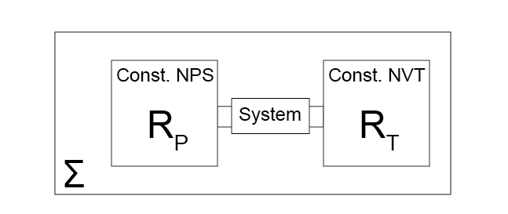

# Conditions of equilibrium

## Additional Readings for the Enthusiast

{cite:ts}`tester_thermodynamics_1997`, Ch. 5.3, 5.5, 6.2-6.4, Appendix A, Appendix C

## Goals for Today's Lecture
- Understand the behavior of arbitrary thermodynamic potentials at equilibrium
- Define the path of a state variable between two states given an arbitrary set of variables
- Relate derivatives of thermodynamic potentials using Maxwell relations
- Apply the Euler theorem to obtain the [Gibbs-Duhem equation](https://en.wikipedia.org/wiki/Gibbs%E2%80%93Duhem_equation)

## Behavior of new thermodynamic potentials at equilibrium

In the last lecture, we introduced the Legendre transform which
expresses a function in terms of its tangent lines and their intercepts.
The Legendre transform of a function in which $k$ variables are
transformed is given by {eq}`legendre_transform`:

$$y^{(k)} = y^{(0)} - \sum_i^k q_i x_i$$

Here, $q_i$ is a first-order partial derivative of $y^{(0)}$ and $x_i$
is its conjugate independent variable. We used Legendre transforms of
the fundamental relation to derive expressions for new thermodynamic
potentials (free energies) that are a function of experimentally
accessible independent variables. For example, the Gibbs free energy is
the second Legendre transform of the fundamental relation in the energy
representation for which the independent variables $\underline{S}$ and
$\underline{V}$ are replaced by the conjugate variables $T$ and $-P$,
which are the slopes of tangent lines to the surface specified by the
fundamental relation. We wrote:

$$\begin{aligned}
y^{(0)} &= \underline{U} = f_U(x_1, x_2, x_3, x_4, \dots) \\
&= f_U(\underline{S}, \underline{V}, N_1, N_2, \dots) \\
y^{(2)} &= y^{(0)} - \sum_i^2 q_i x_i \\
&= \underline{U} - T\underline{S} + P\underline{V} \\
&\equiv \underline{G}
\end{aligned}$$

This manipulation is useful in part because it allows us to define new
behavior of these potentials at equilibrium under conditions where the
independent variables are constant. We refer to the independent
variables of a thermodynamic potential as {term}`natural variables`.
Therefore, the natural variables of $\underline{U}$ are
$\underline{S}, \underline{V}, N_1, N_2,\dots$, the natural variables of
$\underline{G}$ are $T, P, N_1, N_2,\dots$, etc. Previously, we showed
that for a system with $\underline{U}, \underline{V}, N$ as natural
variables, the entropy is at a maximum, while for a system with
$\underline{S}, \underline{V}, N$ as natural variables, the energy is at
a minimum. Now we ask what the criterion of equilibrium is for
transformed systems with different natural variables.

Let us consider a system that is connected to two reservoirs: a thermal
reservoir, denoted by $R_T$, and a work reservoir, denoted by $R_P$.
Connecting the system to the thermal reservoir allows it to be held at
constant temperature, since heat will exchange to maintain constant
system temperature that is equal to the temperature of the thermal
reservoir when the system is at equilibrium (from {term}`Postulate 2` and
{term}`Postulate 4`).



Connecting the system to the work reservoir allows it to
be held at constant pressure since the system will exchange volume with
the work reservoir to maintain a constant pressure when the system is at
equilibrium (we have not yet proven that this occurs, but will do so in
[a future lecture](Lecture23)). We assume that the connection to each reservoir is
controllable (i.e. interactions can be turned on or off), the thermal
reservoir is held at constant $\underline{V}$ and $N$, the work
reservoir is held at constant $\underline{S}$ and $N$, and that changes
to one reservoir do not affect the other.

Finally, we place the entire
connected system in isolation, such that if we consider the system and
both reservoirs the total entropy, volume, and number of particles is
fixed. Referring to the global system as $\Sigma$, we thus hold the
system at constant
$\underline{S}^\Sigma, \underline{V}^\Sigma, N^\Sigma$. We allow the
system to come to a global equilibrium, and then consider the effect of
small perturbations from this equilibrium as we did previously in
determining the condition of equilibrium for the energy and entropy.

[Two lectures ago](Lecture19), we concluded that any perturbations to a system at
equilibrium that is held at constant entropy necessarily increases the
internal energy. We can thus write for the total isolated system:

$$\Delta\underline{U}^\Sigma = \Delta\underline{U} + \Delta\underline{U}^{R_T} + \Delta\underline{U}^{R_P}  > 0$$

where $\underline{U}$ is the energy of the system, $\underline{U}^{R_T}$
is the energy of the thermal reservoir, and $\underline{U}^{R_P}$ is the
energy of the work reservoir. The entropy of the global system is
constant and the work reservoir has adiabatic walls, but heat can
exchange between the system and thermal reservoir so the entropy in
these two systems can change. We can also write:

$$\begin{aligned}
\Delta\underline{S}^\Sigma &= \Delta \underline{S} + \Delta\underline{S}^{R_T}  = 0 \\
\Delta  \underline{S}^{R_P} &= 0
\end{aligned}$$

Similarly, the volume of the thermal reservoir is fixed, the volume of
the global system is fixed, but the system under study can exchange
volume with the work reservoir:

$$\begin{aligned}
\Delta\underline{V}^\Sigma &= \Delta  \underline{V} + \Delta\underline{V}^{R_P}   = 0 \\
\Delta  \underline{V}^{R_T} &= 0
\end{aligned}$$

Finally, the number of particles is fixed in each subsystem:

$$\Delta N^\Sigma = \Delta N = \Delta N^{R_T}   = \Delta N^{R_P} = 0$$

Now we can consider variations of the system that allow us to consider
the behavior of different thermodynamic potentials.

```{admonition} **Case 1**: When there are interactions with the work reservoir and no interactions with the thermal reservoir, show that the enthalpy $H$ is minimized at equilibrium.

<details><summary>Click for answer</summary>

In this case, we assume that the thermal reservoir is not
part of the system so that $\Delta \underline{S}^{R_T} = 0$ and thus
$\Delta \underline{S} = 0$. However, the pressure is kept constant due
to contact with the work reservoir; the system is at constant
$\underline{S}$, $P$, and $N$. Now, we consider a perturbation to the
system such that $\Delta \underline{U}^{\Sigma} > 0$.

First, we write the energy change of the work reservoir using the first law as:

$$\Delta \underline{U}^{R_P} = -P \Delta \underline{V}^{R_P}$$

From the volume constraint ($\underline{V}^{R_P}=-\underline{V}$), this is equivalent to:

$$\Delta \underline{U}^{R_P} = P\Delta\underline{V}$$

Substituting into the system energy, with
$\Delta \underline{U}^{R_T} = 0$ since there is no work interaction with
the thermal reservoir, we get:

$$\begin{aligned}
\Delta \underline{U}^{\Sigma} &= \Delta  \underline{U} + \Delta\underline{U}^{R_T} + \Delta\underline{U}^{R_P}  > 0 \\
&= \Delta \underline{U} + P\Delta \underline{V}  > 0 \\
\therefore \Delta \underline{H} &> 0
\end{aligned}$$

Here, $H$ is the enthalpy of the enthalpy, which we can see is a
Legendre transform of the energy ($H = U + PV$). Therefore, any change
in the system held at constant $\underline{S}, \underline{P}, N$
increases the enthalpy; *the enthalpy is minimized for a system with
constant $\underline{S}, \underline{P}, N$ at equilibrium*.

```

```{admonition} **Case 2**: When there is no interaction with the work reservoir and interactions with the thermal reservoir, show that the Helmholtz free energy $F$ is minimized at equilibrium.

<details><summary>Click for answer</summary>

Similar idea as above. The system of interest is now held
at constant $\underline{V}, T, N$ since interactions with the work
reservoir are not allowed, but heat can be exchanged with the thermal
reservoir to maintain constant temperature. Following the same logic as
above, we can use the first law (with $\Delta \underline{V}^{R_T} = 0$)
to write:

$$\begin{aligned}
\Delta \underline{U}^{R_T} &= T \Delta \underline{S}^{R_T} = -T\Delta\underline{S}
\end{aligned}$$

Substituting into the change in energy of the global system (with again
$\Delta \underline{U}^{R_P} = 0$ since there is no interaction with the
work reservoir) yields:

$$\begin{aligned}
\Delta \underline{U}^{\Sigma} &= \Delta \underline{U} + \Delta\underline{U}^{R_T} + \Delta\underline{U}^{R_P} > 0 \\
&= \Delta \underline{U} - T\Delta \underline{S} \\
\therefore \Delta \underline{F} > 0
\end{aligned}$$

Hence, *the Helmholtz free energy is minimized for a system with
constant $T, \underline{V}, N$ at equilibrium.*
```

```{admonition} **Case 3**: When there are interactions with both the work reservoir and thermal reservoir, show that the Gibbs free energy $G$ is minimized at equilibrium.

<details><summary>Click for answer</summary>

Finally, we consider a case in which both reservoirs interact with the
system, so the system is at constant $T, P, N$. We can combine the logic
from the two cases above to write:

$$\begin{aligned}
\Delta \underline{U}^{R_P} &= P\Delta\underline{V} \\
\Delta \underline{U}^{R_T} &= -T\Delta\underline{S} \\
\Delta \underline{U}^{\Sigma} &= \Delta  \underline{U} + \Delta \underline{U}^{R_T} + \Delta \underline{U}^{R_P} > 0 \\
&= \Delta  \underline{U} - T\Delta \underline{S} + P\Delta\underline{V}  \\
\therefore \Delta \underline{G} > 0
\end{aligned}$$

*The Gibbs free energy is minimized for a system with constant $T, P, N$
at equilibrium.*
```

## Relationship between partial derivatives

The introduction of new thermodynamic potentials gives rise to a series
of new partial derivatives that tend to appear in thermodynamic
relationships.

Remember, we can relate known thermodynamic variables to
the exact differentials of thermodynamic potentials
with respect to their natural variables.
In other cases, we might also define an exact differential of a thermodynamic
potential in terms of arbitrary parameters that are not the natural
variables of the potential, in which case we need methods to relate
partial derivatives to measurable quantities. Here, we briefly review
several rules for helping simplify partial derivatives, as this will be
an important aspect of solving problems when confronted with derivatives
that are not easily measurable experimentally.

```{glossary}
[Inversion of derivatives](https://en.wikipedia.org/wiki/Inverse_function_rule)
    $$\left ( \frac{\partial f}{\partial y}\right )_x = \left ( \frac{\partial y}{\partial f}\right )_x^{-1}$$

    For example:
    $\left ( \frac{\partial S}{\partial P}\right )_T = \left ( \frac{\partial P}{\partial S}\right )_T^{-1}$

```
```{glossary}
[Triple product rule](https://en.wikipedia.org/wiki/Triple_product_rule)
    $$\left ( \frac{\partial f}{\partial x}\right )_y \left ( \frac{\partial x}{\partial y}\right )_f  \left ( \frac{\partial y}{\partial f}\right )_x  = -1$$

    For example:
    $\left ( \frac{\partial H}{\partial T}\right )_P \left ( \frac{\partial T}{\partial P}\right )_H  \left ( \frac{\partial P}{\partial H}\right )_T  = -1$

```
```{glossary}
[Chain rule](https://en.wikipedia.org/wiki/Chain_rule) to add another variable
    $$\left ( \frac{\partial f}{\partial y}\right )_x = \frac{(\partial f / \partial z )_x}{(\partial y / \partial z )_x} = \left ( \frac{\partial f}{\partial z}\right )_x \left ( \frac{\partial z}{\partial y}\right )_x$$

    For example:
    $\left ( \frac{\partial S}{\partial H}\right )_P = \frac{(\partial S / \partial T )_P}{(\partial H / \partial T )_P} = \frac{C_P/T}{C_P} = \frac{1}{T}$

```
```{glossary}
The expansion rule
    This rule is a bit less obvious than the others. We
    will provide an example here, and proof of this rule is provided in
    [the appendices](../appendices/expansion):

    $$\begin{aligned}
    \left ( \frac{\partial f}{\partial u}\right )_{v} &= \left ( \frac{\partial f}{\partial x}\right )_{y}  \left ( \frac{\partial x}{\partial u}\right )_{v} + \left ( \frac{\partial f}{\partial y}\right )_{x} \left ( \frac{\partial y}{\partial u}\right )_{v}
    \end{aligned}$$
    This rule is most commonly used when initially given a total derivative.
    For example:

    $$\begin{aligned}
    dS &= \left ( \frac{\partial S}{\partial T} \right )_V dT  + \left ( \frac{\partial S}{\partial V} \right )_T dV \\
    \therefore \left ( \frac{\partial S}{\partial T} \right )_P &= \left ( \frac{\partial S}{\partial T} \right )_V   \left ( \frac{\partial T}{\partial T} \right )_P  + \left ( \frac{\partial S}{\partial V} \right )_T \left ( \frac{\partial V}{\partial T} \right )_P \\
    &= \left ( \frac{\partial S}{\partial T} \right )_V  + \left ( \frac{\partial S}{\partial V} \right )_T \left ( \frac{\partial V}{\partial T} \right )_P
    \end{aligned}$$

    In this example, it may look like I differentiated both sides of the
    total derivative of $S$, but if that were so I would need to include
    extra terms due to the product rule. What I have actually done is employ
    the expansion rule with $f=S$, $x=T$, $y=V$, $u=T$, and $v=P$. Setting
    $x=u$ removes one of the derivatives from the expression.
```

```{glossary}
Maxwell reciprocity
    $$\begin{aligned}
    \left ( \frac{\partial(\partial f / \partial y )_x}{\partial x} \right )_y &= \left ( \frac{\partial(\partial f / \partial x )_y}{\partial y} \right )_x \\
    f_{yx} &= f_{xy}
    \end{aligned}$$
```
The second line illustrates alternative notation that we may use on
occasion; the key point is that mixed second derivatives are equivalent
regardless of the order of differentiation.

## Partial derivatives in thermodynamics

### Maxwell relations

This last relation - {term}`Maxwell reciprocity` - will pop up repeatedly by
establishing the notion of a

```{glossary}
Maxwell relation
    equivalence in thermodynamic second derivatives established by {term}`Maxwell reciprocity`
```

We will present an example of a {term}`Maxwell relation` now, and later show how this
procedure can be generalized. First, consider an expression for the
Gibbs free energy in differential form:

$$\begin{aligned}
dG &= -S dT + V dP \\
&= \left ( \frac{\partial G}{\partial T}\right )_{P} dT + \left ( \frac{\partial G}{\partial P}\right )_{T} dP
\end{aligned}$$

We can now take derivatives of $-S$ and $V$ with respect to $P$ and $T$
respectively, which are equivalent according to the Maxwell reciprocity
theorem:

$$\begin{aligned}
-S &=  \left ( \frac{\partial G}{\partial T}\right )_{P} \\
V &= \left ( \frac{\partial G}{\partial P}\right )_{T} \\
\left ( \frac{\partial (\partial G/\partial T)_P}{\partial  P}\right )_{T} &= \left ( \frac{\partial (\partial G/\partial P)_T}{\partial T}\right )_{P} \\
\therefore -\left ( \frac{\partial S}{\partial P}\right )_{T} &= \left ( \frac{\partial V}{\partial T}\right )_{P}
\end{aligned}$$

Maxwell relations thus relate second derivatives of the fundamental
relation to each other, which is often very useful for transforming
derivatives into forms that are related to materials properties will be
demonstrated in [the Problem Sets](../problems/ps_5/problem_set_5).

Shameless plug: if you want to see Maxwell relations in action, check out
Prof. Cersonsky's [first paper](https://www.doi.org/10.1073/pnas.1720139115).

### Behavior of state functions

Finally, let's remind ourselves of relationships assocated with state
functions, although we have already been performing these manipulations.
We define $B$ as a state function (*i.e.*, a derived or primative
property of a system, including the energy, thermodynamic parameters,
mechanical properties, or any parameters discussed to date excluding
heat and work). We can write $B$ as a function of three independently
variable parameters, $x$, $y$, and $z$, as:

$$\begin{aligned}
B = f(x,y,z)
\end{aligned}$$

Note that in the past we have largely assumed that $x$, $y$, and $z$ are
the natural variables when $B$ is a thermodynamic potential (*i.e.*, the
energy, entropy, or a free energy), but this is not necessary. The
difference in the value of $B$ can always be written as the difference
in $f(x,y,z)$ for any two stable equilibrium states:

$$\begin{aligned}
\Delta B = B_2 - B_1 = f(x_2, y_2, z_2) - f(x_1, y_1, z_1)
\end{aligned}$$

We can also write $B$ in differential form as an exact differential as a
function of $x$, $y$, and $z$:

$$\begin{aligned}
dB &= \left ( \frac{\partial f}{\partial x}\right)_{y, z} dx + \left ( \frac{\partial f}{\partial y}\right)_{x, z} dy  + \left ( \frac{\partial f}{\partial z}\right)_{x, y} dz
\end{aligned}$$

We can then compute the change $\Delta B$ **along a specified path** by
integrating this exact differential. The path will stipulate the limits
of integration for each variable as well as the values that are fixed.
However, the actual path chosen does not affect the value of $\Delta B$
since it is a state function, so we can integrate along any convenient
path. For example, we could calculate the change in $B$ from state 1 to
state 2 in which we proceed to $x_2$ along a constant $y_1, z_1$ path,
to $y_2$ along a constant $x_2, z_1$ path, then to $z_2$ along a
constant $x_2, y_2$ path. The corresponding integral is then:

$$\begin{aligned}
\Delta B &= \int_{x_1}^{x_2} \left ( \frac{\partial f}{\partial x}\right)_{y_1, z_1} dx + \int_{y_1}^{y_2} \left ( \frac{\partial f}{\partial y}\right)_{x_2, z_1} dy  +  \int_{z_1}^{z_2} \left ( \frac{\partial f}{\partial z}\right)_{x_2, y_2} dz
\end{aligned}$$

Note that we have to be careful about what variables are held constant,
or more specifically where in the overall phase space each of these
derivatives is evaluated.

## Euler's Theorem

We will now introduce Euler's Theorem, which will be useful for
interpreting the fundamental relation. Euler's theorem states that if a
function $f(a,b,x,y)$ obeys the relation:

$$f(a, b, Kx, Ky) = K^hf(a, b, x, y)$$

where $K$ and $h$ are constants, then

```{math}
:label: eq22.17
x \frac{\partial}{\partial x}[ f(a, b, x, y)] + y \frac{\partial}{\partial y} [f(a, b, x, y) ] = h f(a, b, x, y)
```

We describe $f(a,b,x,y)$ as homogeneous to degree $h$ in $x$ and $y$. We
can see from this definition that $a$ and $b$ correspond to intensive
variables and $x$ and $y$ to extensive variables using our
thermodynamics nomenclature, in that multiplying $x$ and $y$ by a
constant (i.e. the amount of material) changes the value of the function
by the same constant without needing to change the values of $a$ and
$b$. While we have written this expression in terms of four variables,
it can be generalized to any number of them.

We can apply this relation to the fundamental relation (we will use the
energy representation) by recognizing that the fundamental relation is
homogeneous to degree 1 ($h=1$) with respect to extensive variables. We
can then write:

$$\underline{U}(K\underline{S}, K\underline{V}, KN) = K\underline{U}(\underline{S}, \underline{V}, N)$$

This relation is apparent because each of the variables is extensive, so
multiplying all of them by $K$ is equivalent to multiplying the energy
by $K$. Comparing to {eq}`eq22.17`, we have $x = \underline{S}$, $y = \underline{V}$,
and a third extensive variable $z = N$. We can write a generalized
version of {eq}`eq22.17` for this system:

```{math}
:label: eq3.28
\begin{aligned}
&x \frac{\partial}{\partial x}[ f(x,y,z)] + y \frac{\partial}{\partial y} [f(x,y,z) ] + z \frac{\partial}{\partial z} [f(x,y,z) ] = \nonumber \\ 
& \underline{S} \left ( \frac{\partial \underline{U}(\underline{S}, \underline{V}, N)}{\partial \underline{S}} \right )_{\underline{V}, N} +  \underline{V} \left ( \frac{\partial \underline{U}(\underline{S}, \underline{V}, N)}{\partial \underline{V}} \right )_{\underline{S}, N} +  N \left ( \frac{\partial \underline{U}(\underline{S}, \underline{V}, N)}{\partial N} \right )_{\underline{S}, \underline{V}} \\ 
&= \underline{S}T - \underline{V} P + N \mu = hf(x, y, z)  \\
&\therefore \underline{U}(\underline{S}, \underline{V}, N) = T\underline{S} - P\underline{V} + N\mu
\end{aligned}
```

This is a useful expression for the energy; we can also derive another
useful relation by taking the total differential of {eq}`eq3.28`:

$$\begin{aligned}
d\underline{U} = Td\underline{S} + \underline{S} dT - Pd\underline{V} - \underline{V}dP + Nd\mu + \mu dN
\end{aligned}$$

We can compare this with the combined first and second law for an open
system:

$$\begin{aligned}
d\underline{U} = Td\underline{S} - Pd\underline{V} + \mu dN
\end{aligned}$$

Equating these expressions leads to the

```{glossary}
[Gibbs-Duhem equation](https://en.wikipedia.org/wiki/Gibbs%E2%80%93Duhem_equation)
    $$\underline{S}dT - \underline{V}dP + Nd\mu = 0$$
```

The {term}`Gibbs-Duhem equation` will be used
extensively in our study of multiphase systems in a generalized form.
The importance of this relation is that it places a constraint on $T$,
$P$, and $\mu$ such that they cannot all be independently variable;
indeed, in general if we have a multicomponent system with $n+2$
(always) intensive variables, we can also express any one intensive
variable in terms of the other $n+1$ intensive variables using this
relation.

```{admonition} Show that the enthalpy $H = T\underline{S} + \mu N$.
<details><summary>Click for answer</summary>

First, we define the enthalpy as:

$$\begin{aligned}
d\underline{H} &= Td\underline{S} + \underline{V} dP + \mu dN \\
\underline{H} &= \underline{H}(\underline{S}, P, N)\\
\underline{H}(K\underline{S}, P, KN) &= K\underline{H}(\underline{S}, P, N)
\end{aligned}$$

For the enthalpy, since $P$ is an intensive variable, multiplying it by
a factor of $K$ leaves it unchanged; therefore we associate $a = P$,
$x = \underline{S}$, and $y=N$ to get from {eq}`eq22.17`:

$$\begin{aligned}
hf(a, x, y) &= x \frac{\partial}{\partial x}[ f(a, x, y)] + y \frac{\partial}{\partial y} [f(a, x, y) ] \\
\underline{H} &= \left ( \frac{\partial \underline{H}}{\partial{S}}\right )_{P, N}  \underline{S} + \left ( \frac{\partial \underline{H}}{\partial{N}}\right )_{P, \underline{S}}  N \\
&= T\underline{S} + \mu N
\end{aligned}$$
```

```{admonition} Show that the Gibbs free energy $G = \mu N$.
<details><summary>Click for answer</summary>
As a last example, we consider the Gibbs free energy:

$$\begin{aligned}
d\underline{G} &= -\underline{S} dT + \underline{V} dP + \mu dN \\
\underline{G} &= \underline{G}(T, P, N)\\
\underline{G}(T, P, KN) &= K\underline{G}(T, P, N)
\end{aligned}$$

Here, $a=T$, $b=P$, and $x=N$, leading to:

$$\begin{aligned}
hf(a, b, x) &= x\frac{\partial}{\partial x}[ f(a, b, x)] \\
\underline{G} &= \left ( \frac{\partial \underline{G}}{\partial{N}}\right )_{T, P}  N \\
&= \mu N
\end{aligned}$$

This last equation is a useful one that we will return to in later
lectures. Note that we could obtain the same expression by performing a
Legendre transform of the internal energy to obtain
$\underline{G} = U - T\underline{S} + P\underline{V}$ and substituting
in the Euler integrated form of the internal energy, thus showing
consistency between our different derivations. 
</details>
```

These expressions can all
be generalized for other combinations of intensive and extensive
variables accordingly.


## [Link to Shared Notes](https://docs.google.com/document/d/11xY8-7LTLMbCZU4rzvCepOqwdzWhxohc/edit?usp=share_link&ouid=113272049620170441297&rtpof=true&sd=true)
