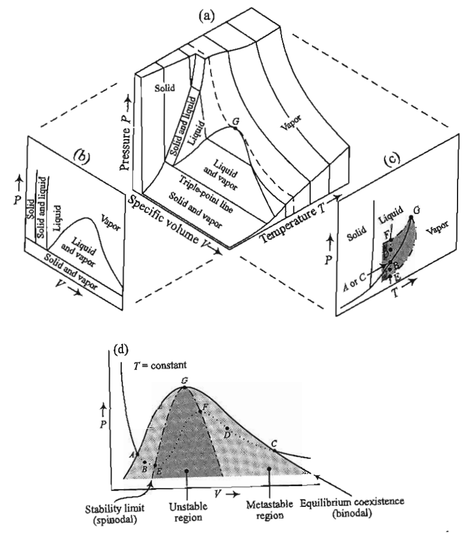

# Phase diagrams

## Additional Readings for the Enthusiast

{cite:ts}`tester_thermodynamics_1997`, 7.1, 7.2, 8.4, 8.5, 15.1-15.2

## Goals for Today's Lecture
- Differentiate stable, metastable, and unstable phases both conceptually and on a PVT diagram
- Use PV isotherms to construct a phase diagram
- Identify and quantify deviations of system behavior from ideality with departure functions

## Stable, metastable, and unstable states

In the [last lecture](Lecture22), we derived two conditions for equilibrium in terms
of the behavior of the entropy with respect to small perturbations in
any of the $n+2$ thermodynamic parameters describing a system:

```{glossary}
equilibrium criterion
    establishes that entropy is at an extremum at equilibrium, $\delta \underline{S} = 0$
    

stability criterion
    establishes that entropy is at a maximum at equilibrium, $\delta^2 \underline{S} < 0$
    
```

Satisfying these two criteria identifies states that are stable with respect to
small perturbations, but does not rule out the possibility that some
states can be sensitive to large perturbations; such states are called
{term}`metastable`. We can thus classify stable, unstable, and metastable
states.

```{glossary}
Stable equilibrium
    states that after *any* perturbation, large or small, will return to
    the same initial equilibrium state. The corresponding thermodynamic
    potential is thus at a global maximum (for the entropy) or global
    minimum (for any other potential). Using notation for the entropy
    representation of the Fundamental Equation, for stable states
    $\delta \underline{S} = 0$ and $\delta^2 \underline{S} < 0$ with
    respect to any perturbation.

Unstable
    any perturbation, large or small, will result in the system reaching a different equilibrium
    state than its initial state. Unstable states have
    $\delta^2 \underline{S} > 0$. Note that it is possible for
    $\delta \underline{S} = 0$ and a state could be unstable; this would
    occur at a local minimum on an entropy landscape, for example.

Metastable
    any small perturbation
    will result in the system returning to the same initial equilibrium
    state, but a sufficiently large perturbation will result in the
    system reaching a new equilibrium state. Therefore, locally
    $\delta \underline{S} = 0$ and $\delta^2 \underline{S} < 0$ with
    respect to small perturbations, but not large ones. Equivalently, I
    could say that metastable states represent local minima on an energy
    landscape while a stable equilibrium state represents the global
    minimum.
```


```{admonition} If we cooled water *very* quickly past its melting point, what kind of state would we be in: stable, metastable, or unstable?
<details><summary>Click for answer</summary>

Such a liquid is **supercooled** and reaches metastable states where there is a
global free energy minimum corresponding to the formation of the ice
that is not reached because a sufficiently large perturbation has not
occurred. Specifically, ice must form a **nucleus** to initiate
continued growth into a large crystal; impurities can act as nucleation
sites, as can large perturbations to the system. We could similarly heat
up a liquid above its boiling point and find that the liquid can be
superheated and maintain metastable states.
</details>
```

Let's now consider metastability for a $PVT$ isotherm
again, which we will describe in terms of the behavior of the Helmholtz
free energy (which is a function of natural variables $NVT$) rather than
the Gibbs free energy, only because of the way in which we plot $PVT$
isotherms as a function of $V$. While we will not prove this in class,
satisfying the criterion of stability only requires that a single
second-order partial derivative of a thermodynamic potential with
respect to one of the $n+2$ indepenently variable parameters is greater
than zero, and thus it is sufficient to only examine this single
second-order partial derivative. In particular, the stability criterion
can be written for the Helmholtz free energy with respect to the
variations in the volume as:

$$\begin{aligned}
\left ( \frac{\partial^2 F}{\partial V^2} \right)_{N,T} > 0 
\end{aligned}$$

```{admonition} Why did the sign flip for our stability criterion?
<details><summary>Click for answer</summary>
The Helmholtz free energy reaches a minimum and hence the
inequality for the stability criterion enforces a local minimum.
</details>
```

We can simplify the stability crtierion slightly using the exact
differential of the Helmholtz free energy to give:

$$\begin{aligned}
dF &= -S dT - P dV + \mu dN \\
\therefore \left ( \frac{\partial^2 F}{\partial V^2} \right)_{N,T} &= -\left ( \frac{\partial P}{\partial V} \right)_{N,T} > 0 \\
\left ( \frac{\partial P}{\partial V} \right)_{N,T} &< 0
\end{aligned}$$

This last relation shows that a single phase is stable if the slope of
the $PVT$ isotherm is negative. We can thus define new behavior on a PVT
isotherm if we were expand or compress the system. We now see that when the slope of the isotherm is negative, the
point on the isotherm is also stable and hence can be observed. If we
were to rapidly increase the pressure of the system from an initial
low-pressure (vapor) state, we would see the volume decrease, as
expected, but if the system were carefully prepared then we would not
see the system form both a liquid and vapor region at the vapor
pressure, as expected. 


The main point is that the system can
access a metastable region where at equilibrium the system would enter a
two-phase region, but prior to equilibrium would be trapped in a
metastable state corresponding to the state of aggregation in which the
system started prior to the expansion/contraction. However, if the
volume is increased/decreased such that the system reaches a limit of
equilibrium, these points would be unstable and the system would
immediately transition to form two states. Based on this analysis, we
can then define the **limit of stability**, or the volume dividing
stable from unstable states, as the points where
$\left ( \frac{\partial P}{\partial V} \right)_{N,T} = 0$.


## Phase diagrams

We presented a single PVT isotherm on the plot above, but we could also
draw a family of isotherms at different temperatures. Each isotherm
would give rise to different dew points (or, alternatively, bubble
points if the system was initially prepared as a liquid) corresponding
to the pressure at which two-phase equilibrium is observed.


Here we see several elements of interest:

```{glossary}

phase envelope
    the locus of dew and bubble points at various temperatures;
    points within the phase envelope correspond to vapor-liquid
    coexistence

[binodal](https://en.wikipedia.org/wiki/Binodal)
    the curve denoting the phase envelope

[spinodal](https://en.wikipedia.org/wiki/Spinodal)
    the locus of points definining limits of stability;
    the region within the spinodal is unstable, and will
    also lead to the observation of two phases, while the
    region in between the binodal and spinodal is metastable and will only
    lead to two phases at equilibrium

```


As the temperature increases, the vapor pressure also increases (we will
discuss the reason in [problem set 6](../problems/ps_6/problem_set_6).
The molar volumes corresponding to
the phases will also begin to approach each other - increasing the
pressure will tend to condense the vapor phase, which is compressible,
while increasing the temperature will tend to expand the liquid phase,
which is largely incompressible and hence not affected strongly by the
pressure. Eventually, the temperature will reach a point where at the
vapor pressure the molar volumes of the liquid and vapor phases are
identical. This is the

```{glossary}
critical point
    the point at which the properties of liquid and vapor phases
    become indistinguishable from each other.
```

A phase transition that passes
through the critical point is then no longer a first-order transition as
there is no longer a discontinuity in the volume. Such a transition is
instead classified as a second-order, or **continuous**, phase
transition. Second-order phase transitions have been studied at length
and give rise to behavior such as the divergence of the heat capacity,
which we saw on the simulation project, but we will not discuss them in
much detail here.

Rather than look at isotherms as above, we can also plot phase diagrams
as a function of $P$ and $T$, which is more typical since these
parameters are controllable in the laboratory. An example is plotted
below:


The $PVT$ isotherm drawn above would represent a vertical line on this
diagram at fixed temperature.

```{glossary}
coexistence curves
    The boundary between two regions then
    representing the conditions of two-phase equilibrium; referring to the stable
    coexistence of two phases.

triple point
    the point on a phase diagram where three phases can be in stable equilibrium.
```

Note that there is a point at which
coexistence curves intersect; at this point, three phases can be in
stable equilibrium, and as a result it is called a {term}`triple point`. On
these diagrams, the critical point represents the end of the
liquid-vapor coexistence curve. If both the temperature and pressure are
in excess of their values at the critical point, we can no longer
distinguish between unique liquid and vapor states, and instead describe
the resulting fluid as **supercritical**.

```{admonition} What would happen if we heated a vapor past the critical point, pressurized it into the supercritical region, then lowered its temperature?
<details><summary>Click for answer</summary>
This pathway would convert a vapor to liquid without
passing through a conventional first-order phase transition, and is
possible because all points on the phase diagram are specified by state
functions so that the path to reach them does not matter.
```

## Departure functions

### Compressibility factor and the virial expansion

In the last lecture and leading into our discussion of phase behavior,
we qualitatively described the $PVT$ behavior of a material in the
liquid/vapor state, and noted that such behavior could be quantified by
a cubic equation of state. Clearly, the $PVT$ behavior could not be
described by an ideal gas equation of state because we need an equation
of state that has multiple stable values of the volume for a single
value of the pressure (at phase coexistence). Therefore, we need an
approach to describe a

```{glossary}
departure function
    A (set of) deviations from ideal behavior for real
    systems.
```

One such function is the

```{glossary}
compressibility factor
    the deviation of the volume
    of a real gas/fluid from that of an ideal gas, and is defined as:

    $$\begin{aligned}
    Z = \frac{PV}{RT}
    \end{aligned}$$
```

$Z=1$ for an ideal gas, while the value is typically much lower for
liquids (approx. 0.01-0.3 depending on the phase state of the fluid).
$Z$ can be determined from an equation of state if given, or from other
approximations. A typical approximation for $Z$ is the [virial
expansion](https://en.wikipedia.org/wiki/Virial_expansion), written as:

$$Z \approx 1 + \frac{B}{V} + \frac{C}{V^2} + \dots$$

This expression is equivalent to a virial equation of state:

$$P \approx \frac{RT}{V} + \frac{BRT}{V^2} + \frac{CRT}{V^3} + \dots$$

The virial expansion accounts for intermolecular interactions in a real
gas through the [virial coefficient](https://en.wikipedia.org/wiki/Virial_coefficient)s $B$, $C$, etc.

```{admonition} What happens when $B=C=\dots=0$?
<details><summary>Click for answer</summary>
The equation reduces to the ideal gas equation of state.
</details>
```

The virial parameter $B$ is called the second virial coefficient and
accounts for interactions between pairs of molecules. $C$ is the third
virial coefficient and accounts for three-body interactions, etc. This
expansion is typically truncated at either second or third order since
interactions between multiple gas molecules are unlikely. Virial
coefficients (which can be predicted from statistical mechanics) are
negative if interactions are attractive and positive if interactions are
positive.

The compressibility factor is our first example of a parameter that
captures the extent to which a system deviates from ideal behavior; in
this case, it describes how a real fluid deviates from the behavior of
an ideal gas. In general, we like to use ideal gases as reference
systems because their behavior is mathematically easy to handle. For
example, we know that the heat capacity of an ideal gas only depends on
the temperature (from the equipartition theorem), while the heat
capacity of a real gas may have a complicated pressure dependence. Since
we need to know the heat capacity of a material (in addition to its
$PVT$ behavior) to calculate the chemical potential, it may be
convenient to calculate the heat capacity (or other parameter) by
defining changes to a reference ideal gas state.

### A general approach to departure functions

Let us consider as an example the variation in some generic property $B$
(where $B\equiv H,G,S,U,$ etc.) of a real gas between two points in the
$T-P$ plane:

$$\begin{aligned}
\Delta B = B(T_2,P_2) - B(T_1,P_1)
\end{aligned}$$

We might have an equation of state or compressibility factor for our
system, but that alone may not be sufficient to tell us all changes in
materials parameters (e.g. heat capacities) as we change both the
temperature and pressure of the real gas. Instead, we can imagine a
three-step pathway between these two points, recognizing that $B$ is a
state function so any paths will yield the same value of $\Delta B$. Our
path will first involve the isothermal change of state from $T_1, P_1$
to an ideal gas reference state at the same temperature, then the change
of the ideal gas reference state to $T_2$, and finally the change from
the ideal gas reference state to the real state at $T_2, P_2$. A key
point to recognize here is that there are no interactions between
molecules in the ideal gas reference state, which can be reached in the
limit that $P\rightarrow 0$ or equivalently $V\rightarrow \infty$ for a
real gas. The ideal gas reference state therefore implies that
$P\rightarrow 0$ at the fixed temperature of interest. We can then write
out the variations in $B$ as:


$$\begin{aligned}
\Delta B &= B_2(T_2, P_2) - B_1(T_1, P_1) \\
&= [B(T_2, P_2)] - B(T_2, 0)+ [B(T_2, 0) - B(T_1, 0)] + [B(T_1, 0)] - B(T_1, P_1)]
\end{aligned}$$

The advantage of this approach is again that temperature variations in
$B$ will generally be easier to calculate in the ideal gas state ($P=0$)
than some other arbitrary state. Let's consider this calculation if $B$
is the entropy, and we assume that we know the equation of state of the
system as a function of volume. We can write for this calculation:

$$\begin{aligned}
\Delta S &= [S(T_2, P_2) - S(T_2, 0)]+ [S(T_2, 0) - S(T_1, 0)] + [S(T_1, 0)] - S(T_1, P_1)] \\
&= \int_0^{P_2} \left ( \frac{\partial S}{\partial P}\right )_T dP + \left [ \int_{T_1}^{T_2} \left ( \frac{\partial S}{\partial T}\right )_P dT \right ]_{\textrm{ideal gas}} + \int^0_{P_1} \left ( \frac{\partial S}{\partial P}\right )_T dP 
\end{aligned}$$

We can use a Maxwell relation from the Gibbs free energy,
$\left ( \frac{\partial S}{\partial P}\right )_T = -\left ( \frac{\partial V}{\partial T}\right )_P$,
to simplify the partial derivatives in the first and third integrals,
and recognize the heat capacity in the second integral:

$$\begin{aligned}
\Delta S &= -\int_0^{P_2} \left ( \frac{\partial V}{\partial T}\right )_P dP + \left [ \int_{T_1}^{T_2} \left ( \frac{C_P}{T}\right ) dT \right ]_{\textrm{ideal gas}} - \int^0_{P_1} \left ( \frac{\partial V}{\partial T}\right )_P dP 
\end{aligned}$$

We can evaluate the temperature derivative given a $PVT$ equation of
state. We can integrate the second term over the temperature range of
interest, but the first and third terms give issues. Specifically, a
singularity will arise as $P\rightarrow 0$ - we can see this if we
consider for example the ideal gas equation of state, for which
$\left ( \frac{\partial V}{\partial T}\right )_P = \frac{R}{P}$.
However, because we know that the system behaves like an ideal gas as
$P\rightarrow 0$, we can add and substract integrals of the ideal gas
equation of state such that as $P\rightarrow 0$ the integrand goes to 0.
Specifically, we can write:

$$\begin{aligned}
\Delta S &= -\int_0^{P_2} \left ( \frac{\partial V}{\partial T}\right )_P dP + \left [ \int_{T_1}^{T_2} \left ( \frac{C_P}{T}\right ) dT \right ]_{\textrm{ideal gas}} - \int^0_{P_1} \left ( \frac{\partial V}{\partial T}\right )_P dP \\
&+ \int_0^{P_2} \frac{R}{P} dP - \int_0^{P_2} \frac{R}{P} dP + \int^0_{P_1} \frac{R}{P} dP - \int^0_{P_1} \frac{R}{P} dP \\
&= -\int_0^{P_2} \left [ \left ( \frac{\partial V}{\partial T}\right )_P - \frac{R}{P} \right ] dP + \left [ \int_{T_1}^{T_2} \left ( \frac{C_P}{T}\right ) dT - \int_{P_1}^{P_2} \frac{R}{P} dP \right ]_{\textrm{ideal gas}} \\ &- \int^0_{P_1} \left [ \left ( \frac{\partial V}{\partial T}\right )_P - \frac{R}{P}\right ] dP \\
&= -\int_0^{P_2} \left [ \left ( \frac{\partial V}{\partial T}\right )_P - \frac{R}{P} \right ] dP + \left [ \int_{T_1}^{T_2} \left ( \frac{C_P}{T}\right ) dT -R \ln \frac{P_2}{P_1}\right ]_{\textrm{ideal gas}} - \int^0_{P_1} \left [ \left ( \frac{\partial V}{\partial T}\right )_P - \frac{R}{P}\right ] dP
\end{aligned}$$

With this last expression, we eliminate the singularities in the first
and third integrals because as $P\rightarrow 0$ the ideal gas value of
the partial derivative will cancel out with the real gas partial
derivative. We now have a closed form method to calculate the change in
$S$ between any two states in the $P-T$ plane if given an appropriate
equation of state and ideal gas heat capacity.

The key to this approach is that we have defined three terms - the first
and third represent the difference in the entropy between a real gas at
pressure $P$ and an ideal gas at pressure $P$, or in other words the
departure of the entropy of a real gas from that of an ideal gas at the
same temperature and pressure. This idea of deviations from ideality is
similar in spirit to the compressibility factors defined above.

```{glossary}
departure functions
    terms which capture of departures from ideality; For some generic property $B$ (where
    $B\equiv H,G,S,U,$ etc.) we can define the departure function for $B$ in
    terms of two equivalent definitions depending on whether we first
    integrated with respect to pressure or temperature:

    $$\begin{aligned}
    B(T,P) - B^0(T,P)\\
    B(T,V) - B^0(T,V) 
    \end{aligned}$$

    Here, $B(T,P)$ and $B(T,V)$ are the values of the property at a given
    temperature as a function of either volume or pressure and $B^{0}$ is
    the corresponding property of an ideal gas at the same conditions; the
    $0$ superscript indicates the ideal reference state.
```

The choice of a
volume-specific or pressure-specific departure function will largely
depend on mathematical convenience, depending on if a system's equation
of state (or compressibility factor) is more easily integrated as a
function of $P$ or $V$. Referencing the same formalism as above, we can
then write the three-step path through phase space in terms of the
departure function as:

$$\begin{aligned}
\Delta B &= B_2(T_2, P_2) - B_1(T_1, P_1) \\
&= [B(T_2, P_2) - B^0(T_2, P_2)] + [B^0(T_2, P_2) - B^0(T_1, P_1)] + [B^0(T_1, P_1) - B(T_1, P_1)]
\end{aligned}$$

The first and third terms represent the departure functions and the
second term represents the variation of the property in an ideal gas
state. Following a similar framework as for the entropy above, we could
then derive departure functions for various properties. Here, we will
present several departure functions as a function of pressure, and are
written in terms of the compressibility factor as is common:

$$\begin{aligned}
S(T,P) - S^0(T,P) &= -\int_0^P \left [ \left ( \frac{\partial V}{\partial T} \right )_P - \frac{R}{P}\right ] dP \\
&= -RT \int_0^P \left ( \frac{\partial Z}{\partial T} \right )_P \frac{dP}{P}  - R \int_0^P (Z-1)\frac{dP}{P} \\
G(T,P) - G^0(T,P) &= RT \int_0^P (Z-1)\frac{dP}{P} \\
H(T,P) - H^0(T,P) &= -RT^2 \int_0^P \left ( \frac{\partial Z}{\partial T} \right )_P  \frac{dP}{P}
\end{aligned}$$

Using departure functions thus provides a mathematically convenient way
to compute property changes between any two points in $PT$ space while
always computing isobaric paths for an ideal gas state for which
materials parameters can be readily tabulated.


## [Link to Shared Notes](https://docs.google.com/document/d/1LeEkOwyeBCT4_s4uP-DlYu7FBgWHVTY_)