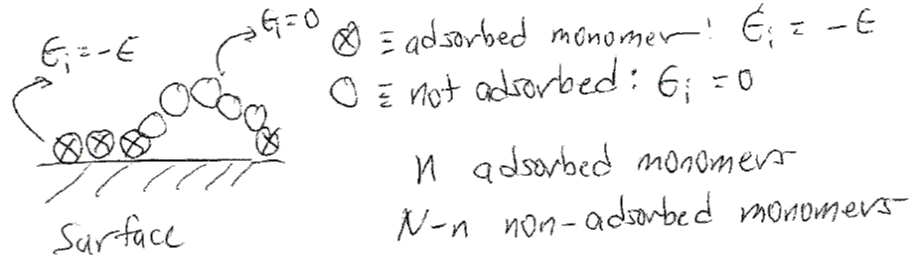
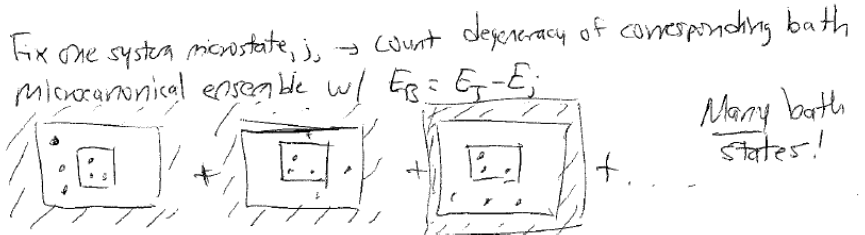

# The Canonical Ensemble

## Additional Readings for the Enthusiast

{cite:ts}`mcquarrie_statistical_2000`, Chapter 1, Chapter 2.1

{cite:ts}`chandler_introduction_1987`, Chapter 3.1-3.4

## Topics in this lecture

-   Example of microcanonical ensemble

-   Stirling's approximation

-   Canonical partition function

## Application of the microcanonical ensemble: two-state system

In the last lecture, we introduced the concept of the microcanonical
ensemble, which we defined as the set of all possible microstates
associated with a macrostate in which the number of particles ($N$), the
volume ($V$), and the energy ($E$) are constant. We then defined several
postulates of statistical mechanics, which we summarize as:

-   $Y_\textrm{obs} = \langle Y \rangle$: the ergodic hypothesis, where
    $\langle Y \rangle = \sum_i^\textrm{states} p_i Y_i$

-   $p_i = \frac{1}{\Omega(N,V,E)}$: the principle of equal a priori
    probabilities, where $\Omega(N,V,E)$ is the degeneracy (or number of
    states) of the microcanonical ensemble

-   $S = k_B \ln \Omega(N,V,E)$: the definition of the Boltzmann
    entropy.

We will now use an example to illustrate how the microcanonical ensemble
can provide information about the thermodynamic properties of a system.
Consider a polymer chain that adsorbs to an attractive surface. The
chain is composed of $N$ monomers that do not interact with each other.
The surface is attractive such that a single monomer adsorbs favorably
with an energy $-\epsilon$. If we assume the energy of the free monomers
is 0 and there are no monomer-monomer interactions, then the total
energy of the system for $n$ adsorbed monomers is:

$$E = \sum_i^N \epsilon_i = -n \epsilon$$

The question we will ask is - how does the energy of the system (or,
equivalently, the number of adsorbed monomers) depend on the
temperature?

{width="100%"}

We know the following relationships:

-   $\left ( \frac{\partial E}{\partial S} \right )_V = T$ from
    thermodynamics

-   $E = -n \epsilon$ from the microscopic description of the system
    given above

-   $S = k_B \ln \Omega (E)$ from the definition of the entropy of the
    microcanonical ensemble using the shorthand version of
    $\Omega(N,V,E)$

Given these relationships, we can use the equations of the
microcanonical ensemble to relate the degeneracy to the entropy and then
identify a relationship between the energy and temperature from
thermodynamics. Thus, we will describe our system as having a constant
energy - that is, we assume that $n$ and $E$ are fixed and then will
derive a temperature dependence based on this assumption. There may be
another ensemble that is more appropriate - for example, we may assume
the temperature is constant, instead, and choose a different ensemble
(e.g. the canonical ensemble) to solve for the temperature dependence.
If we are consistent in our assumptions and mathematical framework, then
any ensemble is fine (as long as the fixed thermodynamic variables in
the ensemble do not violate some feature of the system) and we will
return to this problem with alternative ensembles in future lectures.

We need to start by computing an expression for the degeneracy.
Recalling previous sections, we know that $\Omega(E)$ is defined as the
number of microstates that have the same energy $E = - n\epsilon$. Since
the number of total monomers, $N$, is greater than the number of
adsorbed monomers, $n$, there are many possible ways to choose the the
set of $n$ adsorbed monomers from the total set of $N$ monomers, but any
set of $n$ that we select will have the same energy. Therefore, the
degeneracy of this system is equal to the number of unique ways to
select $n$ monomers that adsorb to the surface out of the possible set
of $N$ - or in other words, the number of unique ways to split the $N$
monomers into two groups (adsorbed and free). Computing this quantity
will motivate a mathematical aside.

### Combinatorics

Imagine that you have $N$ objects. In general, objects can either be
**distinguishable**, such as playing cards, or **indistinguishable**,
such as identical marbles. A common question we will face is how many
ways we can uniquely divide $N$ distinguishable objects into groups. We
can calculate this using playing cards as an example. First, we can
count the number of unique ways to shuffle a deck of $N$ distinguishable
playing cards. We can imagine placing the first card on the top of the
deck; there are $N$ possible choices for the first card. Next, we can
imagine placing the next card on the top of the deck. Since we have
removed 1 card, there are now $N-1$ choices remaining, so there are
$N(N-1)$ unique choices for placing the first two cards, and so on. This
leads to:

$$\begin{aligned}
\text{\# of arrangements} &= N(N-1)(N-2) \dots (2)(1) \nonumber \\
&= N!
\end{aligned}$$

If the playing cards were instead indistinguishable, then there would
instead be only unique 1 arrangement of playing cards since switching
the order of any two cards would not result in an observable change to
the order of the deck. Now, we consider the question how many ways there
are to divide $N$ distinguishable playing cards into two groups, one
containing $n_1$ cards and the second containing $N-n_1$ cards.
Following the same reasoning as above, for the first group we have $N$
options for the first card, $N-1$ for the second, and so on, until for
the last selection we have $N-n_1+1$ choices. The total number of
arrangements for group 1 is thus:

$$\begin{aligned}
N(N-1)(N-2)\dots(N-n_1+1) &= \frac{N(N-1)(N-2)\dots(2)(1)}{(N-n_1)(N-n_1-1)\dots(2)(1)} \nonumber \\ 
&= \frac{N!}{(N-n_1)!}
\end{aligned}$$  The second group has $N-n_1!$ choices for placing the
remaining $N-n_1$ cards, so that in total there are
$\left [ N!/(N-n_1)!\right ] \times (N-n_1)! = N!$ arrangements of the
two groups. However, the question asked for how many ways there are to
**divide** them into two groups; the arrangement of cards within each
group does not matter, as placing the same $n_1$ cards in the group in
any order is still the same division. There are $n_1!$ ways to arrange
the $n_1$ cards in the first group and $(N-n_1)!$ ways to arrange the
cards in the second group, so in total we have overcounted by
$n_1!(N-n_1)!$ since every division into a group of $n_1$ and $N-N_1$
was counted an extra $n_1!(N-n_1)!$ times associated with different
orders of the cards. Thus, the total number of unique ways of dividing
the cards into two groups if the order within each group doesn't matter
is:

$$\text{\# of divisions} = \frac{N!}{n_1!(N-n_1)!}$$

This expression appears in the binomial expansion and is referred to as
the binomial coefficient, and can be expanded to any number of groups
following similar reasoning.

### Stirling's approximation

We have just seen an example of a calculation that uses factorials,
which can become difficult to treat algebraically. Fortunately, there is
an approximation that simplifies the use of factorials. Because $N!$ is
a product, it is easier to deal with $\ln N!$ which is a sum. We can
write:

$$\ln N! = \sum_{m=1}^N \ln m$$

The value of this sum is equal to the total area of a series of
rectangles, each with height $\ln m$ and width $dm = 1$. That is, we can
equate the sum to the integral of $\ln m$ using rectangular integration.
As $N$ increases, the difference between successive terms in the sum
will become very small - if $N \gg 1$, the difference in the terms
becomes:

$$\begin{aligned}
\ln (m+1) - \ln m = \ln \frac{m+1}{m} \approx \ln 1 \approx 0 \quad \text{for $m\gg1$}
\end{aligned}$$

Therefore, for $N\gg1$ we can replace the sum over discrete values of
$m$ with an integral over continuous values of $m$ - effectively
allowing the width of each rectangle ($dm$) to shrink to an
infinitesimal value. The error between the approximation using an
integral and the exact sum over integer values of $m$ is very small once
$N$ is large. The resulting approximation allows us to write:

$$\begin{aligned}
\ln N! &= \sum_{m=1}^N \ln m \nonumber \\
&\approx \int_1^N \ln m dm  \quad \text{if $N \gg 1$} \nonumber\\
&= \boxed{N \ln N - N} \label{stirling}
\end{aligned}$$

Equation [\[stirling\]](#stirling){reference-type="ref"
reference="stirling"} is **Stirling's approximation**, and differs by
less than 1% from $\ln N!$ if $N > 50$. We will make frequent use of
Stirling's approximation, and moreover we will often approximate
summations as integrals, throughout the course. We will return to
solving the example using Stirling's approximation and combinatorics in
the next lecture.

{width="100%"}

### Back to the example

Having defined methods for splitting objects into two groups, we can now
count how many ways there are to separate $N$ monomers into a group of
$n$ that are adsorbed to a surface and $N-n$ that are not which defines
the degeneracy of a microcanonical ensemble with
$\langle E \rangle = n\epsilon$. We thus write an expression for
$\Omega(E)$ and the entropy based on the combinatorics expression above:

$$\begin{aligned}
\Omega(E) &= \frac{N!}{n!(N-n)!} \\
S &= k_B \ln \Omega(E) \nonumber\\
&= k_B \ln \left ( \frac{N!}{n!(N-n)!} \right )
\end{aligned}$$

To simplify the expression for the entropy, we can invoke Stirling's
approximation:

$$\begin{aligned}
S &= k_B \ln \left ( \frac{N!}{n_1!(N-n)!} \right ) \\
&= k_B \left [\ln N! - \ln n! - \ln(N-n)! \right ] \\
&\approx k_B \left ( [ N \ln N - N] - [n \ln n - n] - [(N-n) \ln (N-n) - (N-n)] \right ) \\
&= k_B \left ( N \ln N - n\ln n - (N-n)\ln (N-n) \right ) \label{entropysimple}
\end{aligned}$$

Now we will simplify this expression with some algebra, defining
$n/N \equiv \alpha$ for convenience:

$$\begin{aligned}
S &= k_B \left ( N \ln N - n \ln n - (N-n)(\ln N + \ln (1-\alpha))\right ) \\
&= k_B \left ( N \ln N - n \ln n - N \ln N - N \ln (1 - \alpha) + n \ln N + n \ln (1-\alpha) \right ) \\
&= k_B \left ( (n - N) \ln (1 - \alpha) -n \ln \alpha  \right ) \\
&=- k_B N \left [ (1 - \alpha) \ln (1- \alpha) + \alpha \ln \alpha \right ]
\end{aligned}$$

Recognizing that entropy and energy that we define here are equvalent to
their macroscopic definitions (according to Postulate 1 and 2) we can
use $\left ( \frac{\partial E}{\partial S} \right )_V = T$ and the chain
rule to derive a temperature dependence in terms of the total system
energy, $E = \langle E \rangle = -n \epsilon$.

$$\begin{aligned}
\left ( \frac{\partial E}{\partial S} \right )_V &= T \\
-\left ( \frac{\partial S}{\partial (n \epsilon)} \right )_V &= \frac{1}{T} \\
-\frac{1}{\epsilon} \left (\frac{\partial S}{\partial \alpha} \right )_V \left ( \frac{\partial \alpha}{\partial n} \right )_V &= \frac{1}{T} \\
-\frac{1}{N\epsilon} \left (\frac{\partial S}{\partial \alpha} \right )_V &= \frac{1}{T}  \\
-\frac{k_B }{\epsilon} \left (\ln(1-\alpha) - \ln \alpha \right ) &= \frac{1}{T}  \\
\ln \frac{1-\alpha}{\alpha} &= -\frac{\epsilon}{k_BT}  \\
\frac{1}{\alpha} = 1 +  e^{-\epsilon / k_BT} 
\end{aligned}$$

Finally, we simplify by recognizing that $\alpha = n/N$:

$$\begin{aligned}
\frac{N}{n} &= 1 +  e^{-\epsilon / k_BT} \\
&\boxed{n = \frac{N}{ 1 +  e^{-\epsilon / k_BT}}} \label{twostatemicrofinal}
\end{aligned}$$

Equation
[\[twostatemicrofinal\]](#twostatemicrofinal){reference-type="ref"
reference="twostatemicrofinal"} relates the number of adsorbed monomers
to microscopic features (i.e. the adsorption energy per monomer and
total number of monomers) as a function of the system temperature. As
$T$ goes to 0, we expect the system to be in an energy-minimizing
configuration with all monomers bound - indeed, as $T\rightarrow 0$,
$n\rightarrow N$, indicating that all monomers adsorb. In the opposite
extreme, as $T \rightarrow \infty$, $n\rightarrow N/2$, indicating that
at infinite temperature exactly half of the monomers bind to the
surface. This makes conceptual sense - if we have infinite thermal
energy, the energy for adsorption is negligible so adsorbing or not
adsorbing is equally likely for each monomer (we will revisit this
result in future lectures).

This example illustrates the basic principles of the statistical
mechanics approach: we begin by identifying a set of constant
macroscopic thermodynamic variables for the system ($NVE$), choose an
appropriate statistical ensemble (microcanonical) corresponding to these
variables, calculate the value for a thermodynamic variable (entropy)
from ensemble properties based on our microscopic picture of the system,
then use thermodynamic relations to get additional information about the
system (temperature). Note that our final result seems to contradict our
assumption - we explicitly derive a relationship between the energy and
the temperature, showing that the energy is not, in fact, constant.
Recall, though, that the problem statement itself (i.e. the microscopic
description of the system) does not specific a constant energy - we
**choose** to describe our system in such a way that the energy is held
constant, then apply the equations of the microcanonical ensemble
(consistent with our choice) to derive the temperature dependence. We
also could have derived the same result by assuming that the system is
held at constant temperature and that the energy is allowed to vary, and
achieve the same result (we will do this next lecture). We will find
several variations of this basic approach, and will illustrate that the
correct choice of thermodynamic variables, even for the same system, can
dramatically simplify problem solutions.

## Introduction to the canonical ensemble

In principle, all calculations in statistical mechanics can be performed
using the microcanonical ensemble by deriving relationships based on a
fixed set of constant energy states. In practice, the microcanonical
ensemble is often not convenient because in many cases the energy of the
system is not fixed. For example, most laboratory experiments take place
in environments in which the energy of the system is able to exchange
with the environment; that is, the walls of the system are
**diathermal**. $E$ is therefore no longer a fixed quantity and instead
varies between each microstate. At equilibrium, however, we know from
thermodynamics that the temperature of the system will be equal to the
temperature of the environment. It would therefore be ideal to have
equations describing systems in which the temperature is fixed in each
microstate due to this condition of equilibrium while the energy is
allowed to vary. The ensemble of microstates for a system at constant
temperature (and number and volume) is the canonical ensemble or $NVT$
ensemble. As we will see, choosing the appropriate ensemble to describe
a system of interest is essential in simplifying problem solutions.
However, if we allow the energy to vary between each microstate then the
probability that a system obtains a given state, $p_i$, is no longer a
constant value - that is, Postulate 2 no longer applies. We thus will
derive an expression for the probability of microstate $i$ in order to
calculate ensemble-average quantities for the canonical ensemble.

Let us consider a system of interest that is contact with surroundings
that we will refer to as the **bath**. The bath is significantly larger
than the system of interest, so that the energy and number of particles
in the bath are also much larger than the energy and number of particles
in the system. Thermodynamic parameters associated with the system will
be denoted with the subscript $S$, parameters associated with the bath
will be denoted with the subscript $B$, and parameters associated with
the total combination of system and bath will be denoted with the
subscript $T$. We assume that the walls of the system prevent the
exchange of particles and volume so that $N_S$ and $V_S$ are fixed;
however, the energy, $E_S$, can exchange with the surrounding bath. At
thermal equilibrium, the temperature of the bath and system are
equivalent ($T_S = T_B \equiv T_T$). A physical realization of such a
system would be a sealed box with conducting walls that allows heat to
exchange with the outside environment. Finally, we assume that the
*total* energy, $E_T$, of the bath plus the system is a constant (i.e.,
exchanges of energy between the bath and system obey conservation of
energy):

$$E_T = E_S + E_B = \text{constant}$$

The total combination of system and bath is isolated; this assumption is
generally true of the universe, for example. Microstates of the total
isolated system belong to the microcanonical ensemble, but the energy of
each of these microstates is **partitioned** between the system of
interest and the bath. The canonical ensemble then refers to the
ensemble of microstates describing the system of interest, in which the
energy may vary between microstates in the ensemble.

{width="100%"}

The system is characterized by $N_S$, $V_S$, and $E_S$, and connected to
a bath with $N_B$, $V_B$, and $E_B$. We will now determine the
probability $p_j$ of observing a single microstate of the system, $j$,
which has energy $E_j$ (noting that there can be many possible
microstates with the same energy - in fact, there is a microcanonical
ensemble of microstates with the same energy! We use the subscript $j$
to denote a single specific microstate - that is, a single arrangement
of particles with a specific energy $E_j$ out of the many possible
microstates that would have the same energy). Since the energy of the
system is fixed and equal to $E_j$, the energy of the bath is also fixed
and equal to $E_B=E_T-E_j$. Imagine taking a snapshot of the $N_S$
particles in microstate $j$ and counting the subset of all possible
microstates of the total isolated system for which the system has
exactly the particle positions/energies specified for microstate $j$.
Alternatively, you could imagine fixing the positions/energies of the
$N_S$ particles into microstate $j$ and then counting all possible
combinations of the positions/energies of the $N_B$ remaining particles.
Either approach would yield the number of microstates of the **total
combined system** in which the system of interest is in the particular
microstate $j$. This value is equal to the number of microstates of the
**bath** that are possible for the given microstate of the **system**.
Since the energy of the bath is itself fixed, this number of states is
equal to the degeneracy of a bath microcanonical ensemble with energy
$E_T-E_j$, or $\Omega(N_B,V_B,E_T-E_j)$. We could write a similar
degeneracy for each possible microstate of the system. Since the total
isolated system is a microcanonical ensemble in which all microstates
are equally probable, the probability of observing a single microstate
of the system $j$ is equal to the number of microstates of the total
isolated system in which the system of interest is in microstate $j$
divided by the total number of microstates of the combined isolated
system.

{width="100%"}

From the logic above, we can write the normalized probability of finding
microstate $j$ of the system in terms of the degeneracy of the bath as:

$$\begin{aligned}
p_j &= \frac{\Omega(N_B, V_B, E_T-E_j)}{\sum_j^{\textrm{system microstates}} \Omega(N_B, V_B, E_T-E_j)} \\
&= \frac{\Omega(N_B, V_B, E_T-E_j)}{C_1}
\end{aligned}$$

That is, the probability of finding a particular microstate in the
**canonical ensemble** (of the system) is related to the degeneracy of a
bath described by a **microcanonical ensemble** with energy $E_T-E_j$.
We use the constant $C_1$ to refer to the normalization factor in the
denominator (this quantity will drop out later on in the derivation). We
will proceed from here in the next lecture by relating the degeneracy of
the bath microcanonical ensemble to the entropy (following our previous
approach) and from there obtaining an expression for $p_j$ that does not
depend on any properties of the bath.
