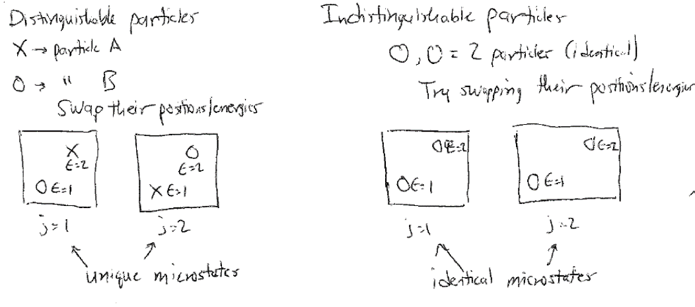

# The Ideal Gas Partition Function 

## Additional Readings for the Enthusiast

-   \- Ch. 4 intro, 4.6, 4.7

## Topics in this lecture

-   Factorization of the partition function

-   The ideal gas partition function

## Announcements

-   Pset 2 due Thursday

## Factorization of the partition function

In the last lecture, we derived expressions for generalized partition
functions and related connections to macroscopic thermodynamic
potentials. We specifically paid attention to four key ensembles: the
microcanonical ensemble (our starting point for all further
derivations), the canonical ensemble, the grand canonical ensemble, and
the isothermal-isobaric ensemble. These are the four most common
ensembles used in statistical mechanics. To date, we have considered
partition functions describing all states for an entire system of
interest. However, often times we will be able to divide the system into
multiple **independent** subsystems (indeed, we did this for the polymer
adsorption example), perhaps even independent particles, suggesting that
we may want a relationship between the properties of an entire system
and the properties of a subsystem. Two subsystems are independent if the
microstate of one subsystem does not depend on the microstate of
another - this requires that the subsystems non-interacting so that
positions and energies are uncorrelated. We will thus introduce a method
for relating a system partition function to subsystem partition
functions.

Consider a system for which we can break the energy into two parts
(i.e., into the energies of two subsystems, for example, or two
different sources of energy) such that we can write in general
$E = \epsilon^{(1)} + \epsilon^{(2)}$. The superscripts in this case
indicate the energies of subsystems 1 and 2, and we partition the total
system energy between them; this is similar to the partitioning of
energy between the system of interest and the bulk reservoir that we
used to derive the canonical partition function in Lecture 3. The energy
of a single configuration, $j$, of the combined system is then
$E_j = \epsilon^{(1)}_n + \epsilon^{(2)}_m$, where the label $j$
identifies a particular configuration of the combined system and $n$ and
$m$ denote specific configurations of the two subsystems. We assume that
$n$ and $m$ are independent of each other since the subsystems
themselves are independent. Rather than enumerating all possible
microstates by summing over all $j$, we can thus instead enumerate all
possible microstates by summing over all possible values of $n$ and $m$
independently. The corresponding canonical partition function for the
combined system is then:

$$\begin{aligned}
Z &= \sum_j e^{-\beta E_j} \\
&= \sum_n \sum_m e^{-\beta \left[\epsilon^{(1)}_n + \epsilon^{(2)}_m \right]} \\
&= \sum_n \sum_m e^{-\beta\epsilon^{(1)}_n} e^{-\beta\epsilon^{(2)}_m}
\end{aligned}$$

If the indices $n$ and $m$ are independent of each other, we can now
further write:

$$\begin{aligned}
Z &= \left ( \sum_n e^{-\beta\epsilon^{(1)}_n} \right ) \left ( \sum_m e^{-\beta\epsilon^{(2)}_m}  \right ) \\
&\equiv Z^{(1)}Z^{(2)}
\end{aligned}$$

Expressing the sum over all possible indices as a product of sums over
single indices is the key to this method - because $E$ can be decomposed
into the **sum** of two **independent** values, the **product** of the
two summations yields all possible values of $E$. You can demonstrate
this manually by assuming a two-state energy system per subsystem, for
example, and counting the possible products. Note that this
factorization is only possible because the two subsystem energies,
$\epsilon^{(1)}$ and $\epsilon^{(2)}$ are independent and uncorrelated -
if either energy were a function of the other (i.e. if $n$ and $m$ were
not independent), then the same factorization would not be possible.
Since each of the independent sums takes the same form as the canonical
partition function, we use $Z^{(1)}$ to refer to the partition function
for subsystem 1, etc. Again, note that we write these as sums over
particular microstates of the system and microstates of the subsystem,
so there could be many possible microstates with the same decomposition
of energies but with different particle configurations.

Extending this result, if we break the system into $N$ independent,
uncorrelated subsystems then the partition function can be written as:

$$Z =  Z^{(1)}Z^{(2)}\dots Z^{(N)}$$

In principle, each of the $N$ partition functions for the subsystems
could be distinct, because each subsystem could represent a collection
of particles giving rise to distinct possible energies. If, however, we
have a system of completely **identical, independent subsystems** (e.g.
each subsystem could represent a single particle), then the partition
function for each subsystem is identical and the partition function of
the combined system becomes:

$$\begin{aligned}
Z &= (Z^{(1)})^N \\
&= z^N \label{factorization}
\end{aligned}$$

To simplify this notation, we will define $Z^{(1)} \equiv z$ as the
single-subsystem partition function. This factorization dramatically
simplifies our calculation of a system partition function - for example,
if we had a system with 100,000 independent molecules (e.g., ideal gas
molecules), and each molecule can exist in three different microstates,
then the total number of states in the entire system is $3^{100,000}$,
which is much too large to calculate. Eq.
[\[factorization\]](#factorization){reference-type="ref"
reference="factorization"} instead says that we only need an expression
for the three-state partition function $z$ which is trivial. Again, we
assume that each subsystem is independent and identical - so this
implies that each subsystem has exactly the same partition function
associated with it (same possible energies, same degeneracy for each
energy, etc.).

In the preceding definition we have applied a distinct label to each of
the $N$ different single-subsystem partition functions, implying that
each molecule is **distinguishable**. As we discussed in the derivation
of the microcanonical ensemble, however, in most systems of independent
particles the particles are instead **indistinguishable**. Identifying
distinguishable vs. indistinguishable subsystems can be confusing, but
the idea here is that particles/subsystems are distinguishable if we can
uniquely identify the subsystem if it were randomly selected. For
example, each monomer in a polymer is distinguishable because we can
identify exactly where in the polymer chain it is (i.e. its if the
first, second, third, etc. monomer), whereas each molecule in an ideal
gas is indistinguishable. Similarly, each site on a lattice is
distinguishable, but if particles are able to move between lattice
points then the particles are indistinguishable.

If each subsystem of a combined system is indistinguishable, then for a
given value of $E$ we can distribute values of
$\epsilon^{(1)},\epsilon^{(2)},\epsilon^{(3)},\dots$ to each subsystem
in many ways that all yield the same value of $E$, but these different
distributions all lead to sets of microstates that are
indistinguishable, and thus each set of configurations should only be
counted once in the system partition function. For example, assume a two
particle system where each particle can have a discrete energy
arbitrarily labeled as 1, 2, 3, or 4. Treating each particle as a
subsystem and assigning an energy of 0 to particle 1 and 4 to particle 2
is equivalent to assigning an energy of 0 to particle 2 and 4 to
particle 1; hence this state should only be counted once in the
partition function. Note that there can still be many different ways of
assigning energies to achieve the same total system energy of 4 - we
could have assigned the values of 0/4, 1/3, or 2/2, and these would all
yield unique states. We just do not want to overcount the redundant
states 4/0 and 3/1 in this example.

{width="100%"}

To avoid overcounting states associated with indistinguishable
subsystems, we recognize from the discussion of the microcanonical
ensemble that there are $N!$ possible ways to assign the energies
$\epsilon_i$, $\epsilon_j$, etc. to the $N$ subsystems. That is, we
choose one of the $N$ subsystems first and assign it a value
$\epsilon_i$, then we choose one of the $N-1$ subsystems second and
assign it a value $\epsilon_j$, etc., such that there $N!$ different
ways of assigning a given set of $\epsilon_i, \epsilon_j, \dots$ to $N$
subsystems, and each of these would have the same energy, so for this
particular value of $E$ we have counted $N!$ states when we should have
counted only 1. If we imagine counting our partition function by summing
over energy levels, then **the degeneracy of each energy level is
overcounted by this amount**. More specifically, each possible way of
assigning these states is the same for indistinguishable subsystems, so
we overcount the degeneracy of each energy level in the combined system
partition function by a factor of $N!$.

Dividing by this factor of $N!$ gives a final expression for the
partition function of a system of $N$ independent, indistinguishable
subsystems as:

$$\begin{aligned}
Z &= \frac{z^N}{N!} \\
z &= \sum_i e^{-\beta \epsilon_i}
%&= \sum_\nu \omega(\epsilon_\nu)e^{-\epsilon_\nu / k_BT}
\end{aligned}$$

Finally, we can note that $\epsilon$ itself may be divided into a series
of individual components - for example, we can imagine a single particle
as having a component of its energy related to its kinetic energy or its
potential energy. Writing
$\epsilon = \epsilon_a + \epsilon_b + \epsilon_c \dots$ allows us to
immediately write for the system partition function:

$$Z = \frac{(z_a z_b z_c \dots)^N}{N!}$$

where $z_a$ are single-subsystem partition functions containing only the
energetic term of the subdivision. The only important point to note here
is that typically the different energetic components of the
single-subsystem energy are distinguishable (i.e. kinetic energy and
potential energy) and thus the factorial in the denominator does not
change.

To summarize, we thus obtain:

$$\begin{aligned}
Z &= \sum_j e^{-\beta E_j} = \sum_{\nu}\Omega(N,V,E_\nu) e^{-\beta E_\nu} \quad \quad\text{Single system with $N$ particles} \\
Z &= z^N \rightarrow z = \sum_j e^{-\beta \epsilon_j } \quad \quad\text{$N$ independent, distinguishable subsystems} \\
Z &= \frac{z^N}{N!} \rightarrow z = \sum_j e^{-\beta \epsilon_j } \quad \quad\text {$N$ independent, indistinguishable subsystems} \\
Z &=  \frac{(z_a z_b z_c\dots)^N}{N!} \quad \quad\text {Eq. 6.14 with multiple energetic components per subsystem}
\end{aligned}$$

## The ideal gas partition function

We will now use these previous relations to now derive the partition
function for a **monatomic ideal gas** with $N$ particles as a exemplary
case of a many-body non-interacting system and show that we can recover
results expected from classical thermodynamics. The basic steps for
identifying thermodynamic properties of the system will be the
following:

-   Determine a single-particle energy and corresponding single-particle
    partition function

-   Write a partition function for the entire system using the
    single-particle partition function

-   Derive thermodynamic quantities via derivatives of the partition
    function

We will start by performing this derivation in the canonical ensemble.
We assume a volume of monatomic gas contained with a cubic box of length
$L$, such that $V=L^3$. Each particle has an associated partition
function $z = \sum_j e^{-\beta \epsilon_j}$. Because the system is ideal
and each molecule is only a single atom (and hence there are no degrees
of freedom associated with molecular vibrations, etc), the energy of
each particle is given from the solution to the quantum "particle in a
box", which is a generalization of a result stated in Lecture 1 (note
that we will not derive where this energy comes from as it is outside
the scope of this class). A quantum particle in a box has a discrete
spectrum of energies corresponding to the possible positions (or, more
accurately, probability distributions associated with specific
positions, which are equivalent to the square of the wavefunction). The
energy is given as:

$$\begin{aligned}
\epsilon_{\nu} &= \frac{h^2(n_x^2 + n_y^2 + n_z^2)}{8mL^2}, \label{partbox3d} \\
n_x, n_y, n_z &= 1, 2, 3 \dots
\end{aligned}$$

Here, $h$ is the Planck constant, $m$ is the mass of the particle, and
$n_x$, $n_y$, and $n_z$ are three unitless quantum numbers that specify
a particular quantum state in a 3D box. Recall that in quantum mechanics
energies are discretized, such that the three quantum numbers above
specify discrete values of the energy, $\epsilon_{\nu}$, and also
contribute to the degeneracy, $\omega(\epsilon_{\nu})$ (written in lower
case to indicate a single-particle degeneracy). Since particle positions
are associated with different energies, the degeneracy of each energy
level is specified only by the number of possible ways of assigning
quantum numbers to yield that energy.

To proceed, we would like to calculate the single particle partition
function. We write the partition function by summing over all possble
values of the energy, $\epsilon_{\nu}$:

$$z =  \sum_{\nu}^\infty w(\epsilon_{\nu})e^{-\beta \epsilon_{\nu}}$$

The prefactor $w(\epsilon_{\nu})$ is the degeneracy of a given energy
level, $\epsilon_{\nu}$. We can start by computing an expression for the
degeneracy by picturing a three-dimensional space of quantum numbers in
a coordinate system defined by $n_x$, $n_y$, and $n_z$, where each point
in this space that has positive values of all three numbers is a single
possible molecular quantum state (i.e., one quantum state per unit
volume) corresponding to some energy value $\epsilon_{\nu}$. The
equation

$$n_x^2 + n_y^2 + n_z^2 = \frac{8mL^2\epsilon_{\nu}}{h^2} = R^2$$

then defines the equation for a sphere of radius $R^2$ in the
$n_xn_yn_z$ space, where the expression for $R$ is from the
rearrangement of Eq. [\[partbox3d\]](#partbox3d){reference-type="ref"
reference="partbox3d"}.

{width="100%"}

We can quantify the number of possible microstates as the volume of the
sphere for which all three quantum numbers are positive, or
$\frac{\pi R^3}{6}$. We can write this phase-space volume as:

$$\begin{aligned}
\Theta(\epsilon_{\nu}) &= \frac{\pi R^3}{6} \\ 
%&= \frac{\pi}{6} \left ( \frac{8mL^2\epsilon_{\nu}}{h^{2}} \right )^{3/2}\\
&= \frac{\pi}{6} \left( \frac{8m\epsilon_{\nu}}{h^2}\right )^{3/2} V
\end{aligned}$$

Note that $V=L^3$ is the volume of the physical system, while $R^3$
defines the volume of the phase space. What we really want is an
expression for the degeneracy of a particular energy level
$\epsilon_{\nu}$ - this can then be approximated as the number of states
with an energy between $\epsilon_{\nu}$ and
$\epsilon_{\nu} + \Delta\epsilon_{\nu}$:

$$\begin{aligned}
\omega(\epsilon_{\nu}) &= \Theta(\epsilon_{\nu} + \Delta\epsilon_{\nu}) - \Theta(\epsilon_{\nu}) \\
&= \frac{\Delta \Theta{\epsilon_{\nu}}}{\Delta \epsilon_{\nu}} \Delta \epsilon_{\nu}
\end{aligned}$$

We now assume the difference in energy $\Delta \epsilon_{\nu}$ is
extremely small, such that
$\Delta \epsilon_{\nu} \rightarrow d\epsilon_{\nu}$. This approximation
then gives us the volume of an extremely thin shell of phase space, and
therefore is a reasonable approximation for the number of states on the
surface of our sphere. We can thus approximate the degeneracy as:

$$\begin{aligned}
\omega(\epsilon_{\nu}) &\approx \frac{d\Theta{\epsilon_{\nu}}}{d\epsilon_{\nu}}  d\epsilon_{\nu} \\
&= \frac{d}{d\epsilon_{\nu}} \left( \frac{\pi}{6} \left( \frac{8m\epsilon_{\nu}}{h^2}\right )^{3/2} V \right )  d\epsilon_{\nu}\\
&= \frac{\pi}{4}  \left( \frac{8m}{h^2}\right )^{3/2} V \epsilon_{\nu}^{1/2} d\epsilon_{\nu} \label{eq6.20}
\end{aligned}$$

Substituting this expression into our partition function gives:

$$\begin{aligned}
z &=  \sum_{\nu}^\infty\frac{\pi}{4}  \left( \frac{8m}{h^2}\right )^{3/2} V \epsilon_{\nu}^{1/2}   e^{-\beta \epsilon_{\nu}} d\epsilon_{\nu} \\
&= \frac{\pi}{4}  \left( \frac{8m}{h^2}\right )^{3/2} V  \sum_{\nu}^\infty \epsilon_{\nu}^{1/2}   e^{-\beta\epsilon_{\nu} } d\epsilon_{\nu}
\end{aligned}$$

## Ideal gas partition function in the classical limit

The previous expression has now assumed that the quantum numbers are
effectively continuous in space. To simplify this expression further, we
further assume that the sum over all energies can be converted to an
integral because the differences in the energy between states,
$\Delta \epsilon$, is much smaller than $k_BT$, such that the energy
states are also effectively continuous (which is consistent with the
assumption that quantum numbers are continuous). Converting a sum to an
integral is equivalent to what we did when discussing Stirling's
approximation - we can think of the sum over energies as performing
rectangular integration of the energy vs. $\nu$, and as the difference
between consecutive terms in the sum becomes small, rectangular
integration can be well-approximated using a continuous integral. The
assumption that energies are continuous is reasonable in a macroscopic
system where incrementing the quantum numbers by one leads to a very
small change in the energy ($\approx 10^{-9} k_B T$). This assumption is
referred to as the **classical limit**, and indeed, writing a partition
function in terms of an integral over phase space is a hallmark of
**classical statistical mechanics** (to date, everything we have done is
in the quantum limit by writing energy levels as discrete). In the
classical limit the partition function becomes:

$$z = \frac{\pi}{4}  \left( \frac{8m}{h^2}\right )^{3/2} V \int_0^\infty   \epsilon_{\nu}^{1/2}  e^{-\beta \epsilon_{\nu} } d\epsilon_{\nu}$$

We can analytically solve this expression by defining
$u = \beta\epsilon_{\nu}$ and recognizing the standard integral
$\int_0^\infty u^{1/2}e^{-u} du = \sqrt{\pi}/2$. Simplifying yields our
final expression for the single-particle partition function for the
ideal gas:

$$\begin{aligned}
z &= \frac{\pi}{4}  \left( \frac{8m}{h^2}\right )^{3/2} V \int_0^\infty   \epsilon_{\nu}^{1/2}  e^{-\beta\epsilon_{\nu} } d\epsilon_{\nu} \\
&=  \frac{\pi}{4}  \left( \frac{8m}{h^2}\right )^{3/2} V (k_BT)^{3/2} \int_0^\infty u^{1/2} e^{-u} du \\
&= \frac{\pi}{4}  \left( \frac{8 m k_BT}{h^2}\right )^{3/2} V \left ( \frac{\pi^{1/2}}{2} \right ) \\
&= \left( \frac{2\pi m k_BT}{h^2}\right )^{3/2} V
\end{aligned}$$

Finally, we write the full partition function of the system, remembering
that the particles are indistinguishable, as:

$$\begin{aligned}
Z &= \frac{z^N}{N!} \\ 
&= \frac{1}{N!} \left( \frac{2\pi m k_BT}{h^2}\right )^{3N/2} V^N \\
&= \frac{1}{N!} \left ( \frac{V}{\lambda^3} \right )^N
\end{aligned}$$

In the last line, we define:

$$\lambda = \sqrt{\frac{h^2}{2\pi m k_BT}}$$

where $\lambda$ is the **thermal de Broglie wavelength** which has units
of length and is a function of $T$; this simplifies our notation and
defines a characteristic length scale for treating a gas classically -
if $V \gg \lambda^3$, which we will generally assume to be the case,
then the classical limit is reasonable. With this partition function, we
can proceed to derive thermodynamic relationships as will be discussed
in the next lecture.
