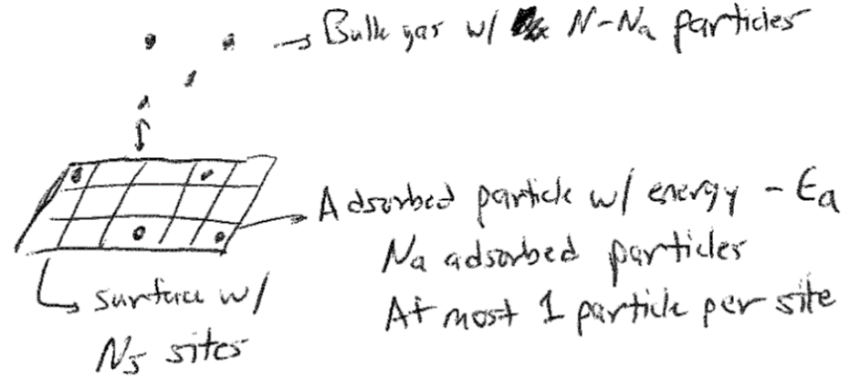

# The Langmuir Isotherm and Ising Model 

## Additional Readings for the Enthusiast

-   \- Ch. 4.6, 4.7, 5.1

## Topics in this lecture

-   The ideal gas partition function in the classical limit

-   The Langmuir adsorption isotherm

-   The Ising model

## Announcements

-   Pset 2 due today

-   Pset 3 assigned, due next Thursday

-   Exam 1 on Thursday, October 10

## Ideal gas partition function in the classical limit

In the last lecture, we described the factorization of the partition
function for independent, identical subsystems, and defined the
following approach for studying these systems:

-   Determine a single-particle energy and corresponding single-particle
    partition function

-   Write a partition function for the entire system using the
    single-particle partition function

-   Derive thermodynamic quantities via derivatives of the partition
    function

We then used this approach to start analyzing the behavior of a
monatomic ideal gas. Starting from the expression for the energy of a
quantum particle in a box and then assuming that energies were
continuous to solve for the degeneracy for each state, we arrived at the
following single-particle partition function:

$$\begin{aligned}
z &= \frac{\pi}{4}  \left( \frac{8m}{h^2}\right )^{3/2} V  \sum_{\nu}^\infty \epsilon_{\nu}^{1/2}   e^{-\beta\epsilon_{\nu} } d\epsilon_{\nu}
\end{aligned}$$

Here, recall that $h$ is Planck's constant, $V$ is the physical volume
of the system, and $m$ is the mass of the particle. We then made an
important assumption: if the difference between consecutive terms in the
sum is small (*i.e.*, energy levels are nearly the same), then we can
accurately approximate the sum by a continuous integral. This assumption
is equivalent to the method for deriving Stirling's approximation, and
transforms a sum over discrete states to an integral over a continuum of
states. This assumption is also referred to as assuming that the system
is at the **classical limit**: quantum mechanics is defined by discrete
states whereas the classical limit is defined by continuous states
because the difference in energy between states is extremely small. In
the classical limit, the ideal gas partition function becomes:

$$z = \frac{\pi}{4}  \left( \frac{8m}{h^2}\right )^{3/2} V \int_0^\infty   \epsilon_{\nu}^{1/2}  e^{-\beta \epsilon_{\nu} } d\epsilon_{\nu}$$

We can analytically solve this expression by defining
$u = \beta\epsilon_{\nu}$ and recognizing the standard integral
$\int_0^\infty u^{1/2}e^{-u} du = \sqrt{\pi}/2$. Simplifying yields our
final expression for the single-particle partition function for the
ideal gas:

$$\begin{aligned}
z &= \frac{\pi}{4}  \left( \frac{8m}{h^2}\right )^{3/2} V \int_0^\infty   \epsilon_{\nu}^{1/2}  e^{-\beta\epsilon_{\nu} } d\epsilon_{\nu} \\
&=  \frac{\pi}{4}  \left( \frac{8m}{h^2}\right )^{3/2} V (k_BT)^{3/2} \int_0^\infty u^{1/2} e^{-u} du \\
&= \frac{\pi}{4}  \left( \frac{8 m k_BT}{h^2}\right )^{3/2} V \left ( \frac{\pi^{1/2}}{2} \right ) \\
&= \left( \frac{2\pi m k_BT}{h^2}\right )^{3/2} V
\end{aligned}$$

We can then write the full partition function of the system, remembering
that the particles are indistinguishable, using the result for the
factorization of the partition function:

$$\begin{aligned}
Z &= \frac{z^N}{N!} \\ 
&= \frac{1}{N!} \left( \frac{2\pi m k_BT}{h^2}\right )^{3N/2} V^N \\
&= \frac{1}{N!} \left ( \frac{V}{\lambda^3} \right )^N
\end{aligned}$$

In the last line, we define:

$$\lambda = \sqrt{\frac{h^2}{2\pi m k_BT}}$$

where $\lambda$ is the **thermal de Broglie wavelength** which has units
of length and is a function of $T$; this simplifies our notation and
defines a characteristic length scale for treating a gas classically -
if $V \gg \lambda^3$, which we will generally assume to be the case,
then the classical limit is reasonable.

We have now performed the first two steps in our approach by identifying
an expression for the energy of a microstate of our system and
calculating the corresponding partition function (in the classical
limit) from the single-particle partition function. We can next derive
thermodynamic relationships using the connection between the canonical
partition function and the Helmholtz free energy. Let us first calculate
the ensemble-average pressure of an ideal gas:

$$\begin{aligned}
\langle P \rangle &= P = -\left ( \frac{\partial F }{\partial V}\right )_{N,T} \\
&= k_B T \left ( \frac{\partial \ln Z }{\partial V}\right )_{N,T} \\
\ln Z &=  N\ln V + \ln \left [ \frac{1}{N!} \left( \frac{2\pi m k_BT}{h^2}\right )^{3N/2} \right ] \\
P &= N k_B T   \frac{1}{V} \\
\therefore PV &= N k_B T
\end{aligned}$$

This expression for the pressure is the familiar ideal gas equation of
state, derived **solely** from statistical mechanics. Note that $R$, the
ideal gas constant, is related to $k_B$ by a constant factor of
Avogadro's constant, $N_A$, or $R = N_A k_B$. Basically, this is just a
unit conversion. The only input to obtain this relationship is an energy
function from quantum mechanics - therefore this is entirely a
first-principles derivation that does not rely on empirical
measurements. In the third line we divided the partition function into a
term that is a function of $V$ and one that is not; the second term does
not contribute to the expression for $P$.

We can next calculate the average energy of an ideal gas. Recall that we
can relate the energy to the canonical partition function (from a
previous lecture) via:

$$\begin{aligned}
E &= - \left ( \frac{\partial \ln Z}{\partial \beta}\right )_{N,V} \\
&= k_B T^2 \left ( \frac{\partial \ln Z}{\partial T}\right)_{N,V}
\end{aligned}$$

We apply this definition by writing out the partition function and
separate into the temperature-dependent and temperature-independent
terms:

$$\begin{aligned}
\ln Z &=  \ln \left [ \frac{1}{N!} \left( \frac{2\pi m k_BT}{h^2}\right )^{3N/2} V^N \right ] \\
&= \frac{3N}{2} \ln T + \ln \left [ \frac{1}{N!} \left( \frac{2\pi m k_B}{h^2}\right )^{3N/2} V^N \right ]
\end{aligned}$$

Taking the derivative gives:

$$\begin{aligned}
E &= k_B T^2 \frac{3N}{2T} \\
&= \frac{3 N k_BT}{2}
\end{aligned}$$

This again is a familiar expression - the internal energy of an ideal
gas depends only on the temperature, and we obtain the same prefactors
as in thermodynamics. We can now easily also calculate the heat capacity
at constant volume, $C_V$:

$$\begin{aligned}
C_V &= \left ( \frac{\partial  E  }{\partial T}\right )_{N,V} \\
&= \frac{3 }{2}N k_B
\end{aligned}$$

These last two results are manifestations of the **equipartition
theorem**, which states that any degree of freedom that appears
quadratically in the energy of a system contributes $1/2 k_BT$ to the
internal energy and contributes $1/2 k_B$ to the heat capacity in the
classical limit. Here, there are 3 translational degrees of freedom
corresponding to the three quantum numbers that each contribute a
quadratic energy term (the kinetic energy) for each of the $N$ atoms,
leading to $3/2 N k_B$ for the heat capacity as we found.

Finally, we can compute the chemical potential of an ideal gas using the
ideal gas partition function:

$$\begin{aligned}
\mu &= \left ( \frac{\partial F }{\partial N}\right )_{T,V} \\
&= -k_B T \left ( \frac{\partial \ln Z }{\partial N}\right )_{T,V} \\
\ln Z &= \ln \left ( \frac{z^N}{N!}\right ) \\
&= N \ln z - \ln N! \\
&= N \ln  \left [\left( \frac{2\pi m k_BT}{h^2}\right )^{3/2} V \right ] - N \ln N + N \\
\mu &= -k_B T \left [ \ln \left( \frac{2\pi m k_BT}{h^2}\right )^{3/2} V  - \ln N  \right ] \\
&= -k_B T \ln \left( \frac{2\pi m k_BT}{h^2}\right )^{3/2} + k_B T \ln \frac{N}{V} \\
&= \mu_0(T) + k_B T \ln \rho
\end{aligned}$$

The last formula expresses the chemical potential in terms of a first
term, which is temperature dependent but concentration ($\rho$)
independent, and then a second concentration-dependent term. This form
for the chemical potential is again exactly what is observed for ideal
gases in classical thermodynamics.

## The Langmuir adsorption isotherm

The previous approach shows that statistical mechanics can reproduce
classical thermodynamic relationships from first-principles. We will now
test a second example of the three-step approach for studying
independent particles by deriving the **Langmuir adsorption isotherm**.

Consider a system of $N$ ideal gas particles that can adsorb onto a
surface. Physically, this system could represent the adsorption of
reactants onto a catalytic surface, for example. We define the number of
adsorbed particles as $N_a$ and the remaining number of free gas
particles as $N-N_a$. Particles adsorb favorably with an energy of
$-\epsilon_a$ per particle. To simplify our treatment, we assume all
particles adsorb onto a lattice of discrete with $N_s$ possible binding
sites, of which $N_a$ are occupied assuming that only a single particle
can bind to each site (with $N_s > N_a$, allowing for all particles to
adsorb). All binding sites are assumed to be independent; that is, the
arrangement of particles does not affect the energy of the system. The
quantity we will determine is the fraction of the surface that is
occupied as a function of the pressure of the surrounding gas, $f_a(P)$.

{width="60%"}

We next have to consider what ensemble to use to solve this problem. We
can think of particles adsorbed to the surface and particles free in the
bulk as two distinct sets of particles such that particles are free to
exchange between the surface and bulk. The number of particles adsorbed
to the surface, $N_a$, is thus allowed to vary. $\langle N_A \rangle$
will be determined at equilibrium which is reached when each particle
adsorbed to the surface has a constant chemical potential, $\mu_a$, that
is equal to the chemical potential of each particle in the bulk,
$\mu_b$. Since the number of particles can vary on the surface, the
natural ensemble to consider is the grand canonical ensemble because the
natural variables of the ensemble, $\mu V T$, are the same variables
that are constant at equilibrium. We thus treat the surface as the
system.

The surface has $N_s$ potential binding sites; each binding site is
either occupied or not, with the number of occupied sites ($N_a$)
fluctuating. We aim to find an expression for $f_a = \frac{N_a}{N_s}$.
Since $N_a$ can vary, we really seek the ensemble average value of
$N_a$, so that $f_a = \frac{\langle N_a \rangle}{N_s}$. Since each
binding site is independent and identical, we can factorize the
partition function by treating each site as a subsystem that is either
occupied or unoccupied, meaning that a single particle is adsorbed to
the site or not. Since the sites are spatially distinct, each subsystem
is distinguishable. We then write the grand canonical ensemble partition
function for the whole surface as:

$$\Xi_s = \xi_s^{N_s}$$

where $\xi_s$ is the single-site grand canonical partition function
given as:

$$\begin{aligned}
\xi_s = \sum_{j}e^{-E_j \beta}e^{\mu_a N_j \beta}
\end{aligned}$$

For a single site, there are only two possible values of $N_j$: either
the site is occupied, for which $N_j = 1$, or the site is unoccupied,
for which $N_j = 0$. Similarly, there are only two possible energies: if
$N_j = 1$, $E_j = -\epsilon_a$, and if $N_j = 0$, $E_j = 0$. Therefore
the single-site partition function is:

$$\begin{aligned}
\xi_s &= e^{0 \beta}e^{0 \beta} + e^{-\epsilon_a \beta}e^{\mu_a \beta} \\
&= 1 + e^{\epsilon_a \beta}e^{\mu_a \beta} \\
\Xi_s &= \xi_s^{N_s}\\
&= \left ( 1 + e^{\epsilon_a \beta}e^{\mu_a \beta} \right )^{N_s}
\end{aligned}$$

Note that we do not include a factor of $1/N_s!$ for the partition
function, because here we write the partition function for lattice
*sites*, which themselves are distinguishable (as opposed to the
particles adsorbing onto them). Next, we write an expression for the
grand potential:

$$\begin{aligned}
\Sigma_G &= - k_B T \ln \Xi_s \\
&= - N_s k_B T \ln \left ( 1 + e^{\epsilon_a \beta}e^{\mu_a \beta} \right )
\end{aligned}$$

We need to relate this thermodynamic potential to the quantity of
interest, $\langle N_a \rangle$. Recall that we can write an expression
for $\Sigma_G$, which is a function of the natural variables
$\mu_a V T$, as:

$$\begin{aligned}
\Sigma_G (\mu_a, V, T) &= E(N, V, S) - TS - \mu_a N_a \\
d\Sigma_G &= dE - TdS - SdT - \mu_a d N_a - N_a d \mu_a \\
&= TdS - PdV + \mu_a dN_a - TdS - SdT - \mu_a d N_a - N_a d \mu_a \\
&= -S dT - PdV - N_a d \mu_a
\end{aligned}$$

Therefore, we recognize that
$\left ( \frac{\partial \Sigma_G}{\partial \mu_a} \right )_{V,T} = - N_a$,
so:

$$\begin{aligned}
N_a  &= -\left ( \frac{\partial \Sigma_G}{\partial \mu_a} \right )_{V,T} \\
&= \frac{ N_s e^{\epsilon_a \beta}e^{\mu_a \beta}}{ 1 + e^{\epsilon_a \beta}e^{\mu_a \beta} }\\
f_a &= \frac{ N_a }{N_s} \\
&= \frac{ e^{\epsilon_a \beta}e^{\mu_a \beta}}{ 1 + e^{\epsilon_a \beta}e^{\mu_a \beta}}
\end{aligned}$$

We now have an expression in terms of the chemical potential of the
particles adsorbed to the bulk, but we'd like an expression in terms of
the pressure of the bulk gas. At equilibrium, we know that
$\mu_a = \mu_b$, so we can calculate the chemical potential for
particles in the bulk and relate this to the pressure. Since the gas
molecules are ideal, non-interacting particles, these particles are
described as an ideal gas. As a result, we can substitute in the
expression for the chemical potential derived from the ideal gas
(canonical) partition function defined earlier and use this for the
chemical potential of particles in the bulk:

$$\begin{aligned}
\mu_b &=  -k_B T \ln \left( \frac{2\pi m k_BT}{h^2}\right )^{3/2} + k_B T \ln \frac{N-N_a}{V} \\
&= -k_B T \ln \left [ \frac{V}{(N-N_a)\lambda^3}\right ]
\end{aligned}$$

Note that we use $\lambda$ (the thermal de Broglie wavelength) to
simplify the notation. We use the ideal gas equation of state
($V = \frac{(N-N_a) k_B T}{P}$) to obtain a pressure dependence:

$$\begin{aligned}
\mu_b &= -k_B T \ln \left [ \frac{(N-N_a)k_B T}{P(N-N_a)\lambda^3}\right ] \\
&= k_B T \ln \left ( \frac{P\lambda^3}{k_B T}\right )
\end{aligned}$$

Finally, we now require the condition $\mu_a = \mu_b$ to find an
expression for $f_a$. Substituting in the expression for $\mu_b$ to our
prior expression for $f_a$ yields:

$$\begin{aligned}
f_a &=  \frac{ \left ( \frac{P\lambda^3}{k_BT}\right )e^{\epsilon_a \beta}}{1 +  \left ( \frac{P\lambda^3}{k_BT}\right ) e^{\epsilon_a \beta}} \\
&= \frac{P / P_0}{1 +  P / P_0}
\end{aligned}$$

Here, we define
$P_0 = \left ( \frac{k_B T}{\lambda^3}\right )e^{-\epsilon_a / k_BT}$ as
a constant (equal to the pressure for which $f_a = 0.5$) that does not
depend on $f_a$ or on $P$. This expression is our goal - we relate the
pressure to the fraction of occupied sites, $f_a$. We can rearrange this
to equivalently write:

$$f_a = \frac{P}{P + P_0}$$

This last expression is referred to as the **Langmuir adsorption
isotherm**. It shows that as the pressure of the system increases, the
surface coverage increases until eventually plateauing. Similar isotherm
behavior is observed in a number of experimental systems. Note also that
by solving for the value $P_0$, which is equivalent to the pressure
where the surface is half-occupied, we can find a value for $\epsilon_a$
or the binding energy if the thermal de Broglie wavelength is known.
Thus, statistical mechanics provides a valuable connection between
microscopic and macroscopic observables relevant to surface occupancy.

{width="50%"}
