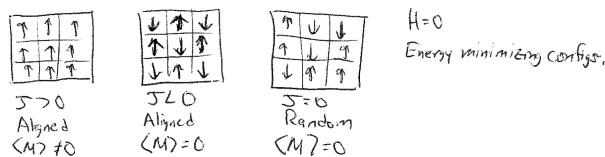

# The Ising Model and Mean-Field Theory

## Additional Readings for the Enthusiast

-   \- 5.1, 5.4

## Topics in this lecture

-   The Ising model

-   Mean-field theory

## Announcements

-   Pset 3 due Tuesday, 10/8

-   Exam 1 on Thursday, 10/10 from 6-7:30 PM in EH 3024. Students in CBE
    540 will take it from 1-2:30 PM in EH 3239.

## The Ising model

In the last lecture, we finished our derivation of the ideal gas
partition function and used it to derive well-known thermodynamic
expressions (such as the ideal gas of equation of state). We also
derived a Langmuir adsorption isotherm following a similar procedure. In
both of these cases, we neglected *interactions* between molecules. The
approximation that molecules do not interact is severely limiting and
makes it impossible to analyze most condensed phase systems, such as
liquids, or examine phase transitions, which fundamentally depend on the
strength of intermolecular interactions. In general, studying particles
with interactions is very challenging, leading to very few problems for
which exact analytical solutions exist. This difficulty emerges because
interactions between particles lead to *correlations* between particle
configurations; the partition function can no longer be factorized into
independent single-particle partition functions because the energy of
one particle depends on the configuration of the others. In this
lecture, we will focus on a simple type of lattice model - resembling
lattice models we have treated previously - to illustrate how
interactions affect many-body systems and to introduce a common
approximation for studying these systems.

The system we will consider consists of a set of $N$ magnetic spins
placed on a lattice, to represent a magnetic system. The lattice can be
of various dimensions and geometries (e.g. 2D square or hexagonal). Each
spin can either be up or down; we denote the value of spin $i$ as
$s_i = 1$ for spin up and $s_i = -1$ for spin down. The lattice may also
be in the presence of magnetic field, $H$, that tends to align spins
with the field. The energy of a single configuration of this system is:

```{math}
:label: eq8.2
E_\nu = -\sum_i^N \mu H s_i + (\text{energy due to interactions between spins})
```

$\mu$ is the magnetic moment (not to be confused with the chemical
potential). Each microstate of the system refers to a particular set of
spins - that is a set of values of $s_1=\pm 1, s_2=\pm 1\dots$, which we
will denote as $\{s_i\}$. In Problem Sets 1 and 2, we already looked at
the behavior of a system of *non-interacting* spins in which the latter
term in Eq. {eq}`eq8.2` is ignored. Here, we will consider what happens when we incorporate
these interactions.

{width="80%"}

A simple model for the interaction energy is to assume that only
nearest-neighbor spins on the lattice interact, and that this
interaction can be described by a coupling constant $J$. A **pair** of
spins contributes energy $-J$ to the system if they are aligned, and a
pair of spins contributes energy $J$ to the system if they are
oppositely aligned. The total energy of the system is then:

$$E_\nu = -\sum_i^N \mu H s_i - \frac{J}{2} \sum_{i}^N \sum_j^\prime s_i s_j\label{eq8.3}$$

Here, $\sum_i$ runs over all spins, while $\sum_j^\prime$ is only over
the nearest-neighbor spins of spin $i$, indicated by the $\prime$
symbol. The negative sign in front of the $J$ is because the product of
$s_i s_j$ is positive for aligned spins, but the energy between aligned
spins is negative. Because the outer sum runs over all spins while the
inner sum runs over all neighbors, the interaction between spin $i$ and
$j$ will be counted twice - once when considering the neighbors of spin
$i$, and once when considering the neighbors of spin $j$. We divide by 2
to remove this overcounting of interactions (this is often a confusing
point that is neglected by some authors in their treatment of this
model). The **total magnetization** is:

$$M_\nu  = \sum_i^N \mu s_i$$

This expression for the energy of a set of spins on a lattice is
referred to as the **Ising model**. A particular quantity of interest
for magnetic systems is the ensemble-average magnetization,
$\langle M \rangle$. In the problem sets, we studied $\langle M \rangle$
as a function of the external field, $H$, but a system can also exhibit
**spontaneous magnetization** if $\langle M \rangle \ne 0$ in the
absence of a field ($H = 0$). The spontaneous magnetization of the Ising
model is determined by the value of the coupling constant, $J$. If
$J > 0$, then at equilibrium the lowest-energy configuration would lead
to the alignment of all spins and there would be a finite magnetization
in the absence of a field. We call this system **ferromagnetic**.
Conversely, if $J < 0$ and spins align in alternating orientations, the
spins would be ordered but there would be no net magnetization. We call
this system **antiferromagnetic**. Finally, if $J=0$ and spins are
randomly oriented in the absence of a field, we call the system
**paramagnetic**. This case is the non-interacting case studied in the
problem sets.

{width="100%"}

Note that aligning spins reduces the **entropy** of the system. For
example, consider a case when $J \gg 0$ and all spins are in the same
direction. The system can only have two possible microstates - all spins
are up, or all spins are down. In contrast, a disordered alignment of
spins would have many more possible configurations. There is thus a
trade-off between entropy and energy in systems for which $J\ne 0$.
Consider a ferromagnetic system ($J>0$) at constant $NVT$, with $H=0$
and finite $T$. At equilibrium, the Helmholtz free energy of this system
must be at a minimum. Writing $F=E-TS$, the system can switch between a
low energy state, in which spins align due to the positive value of $J$,
or a high entropy state, where spins are randomly aligned. Therefore,
there should be a temperature at which there is an **order-disorder
transition** and the magnetization changes from zero (at high
temperature) to a non-zero value (at low temperature) due to the
energetic interactions between spins. We call the temperature at which
this order-disorder transition occurs the **Curie temperature**, $T_C$,
for this magnetic system, and will now study its origin. However, it is
important to note that while we are strictly deriving this
order-disorder transition temperature for a magnetic system, this
transition is analogous to phase transitions in other systems, such as
the liquid-gas phase transition. For example, instead of treating a
series of spins that are up or down, we could use the Ising model to
represent a series of particles that are of one type or another (*e.g.*,
to represent the mixing of two types of liquid-phase molecules; this is
called the lattice gas model) which would lead to similar behavior.

{width="100%"}

To determine the Curie temperature, we need to relate the
ensemble-average magnetization of the system to the temperature. As our
system can be described by the canonical ensemble (if we include the
magnetic work term as part of the energy function, as done above), our
first step will be write an expression for the canonical partition
function. Using the expression for the energy, the canonical partition
function for the Ising model is:

$$\begin{aligned}
Z &= \sum_{\nu} \exp\left (-\beta E_\nu \right )\\
&= \sum_{\nu}\exp \left (\beta \sum_i^N \mu H s_i + \beta \frac{J}{2}  \sum_{i}^N \sum_j^\prime s_i s_j \right ) \\
&= \sum_{s_1=\pm 1} \sum_{s_2=\pm 1} \dots \sum_{s_N =\pm 1}\exp \left (\beta \sum_i^N \mu H s_i + \beta \frac{J}{2}  \sum_{i}^N \sum_j^\prime s_i s_j \right )
\end{aligned}$$

The last expression explicitly sums over all possible configurations of
the $\{s_i\}$, where for each set of spins the energy is defined by
summing over that set. This partition function is much more complex than
the versions we've seen to date since we cannot factorize it in any
obvious way due to interactions between spins. It should thus be
apparent why systems with interactions are challenging to solve
analytically.

## Mean-field theory

Analytically solving the Ising model partition function to obtain a
simple expression for the Helmholtz free energy that can be
differentiated to obtain the magnetization is possible in a
one-dimensional system (Problem Set 3!), possible in a two-dimensional
system with significant difficulty (first solved by a Nobel laureate),
and impossible in higher dimensions. Thus, we will instead simplify the
partition function and introduce an approximation that is commonly used
in the study of phase behavior - the **mean-field approximation**, or
the approximation used in mean-field theory. The idea of mean-field
theory is to examine a particular particle (for the Ising model, a
single spin) and assume that the surrounding medium (in this case the
other spins) exerts an **average field** which interacts with the tagged
spin of interest. That is, instead of examining interactions with the
specific configuration of neighbors local to that spin, the interactions
are assumed to be equivalent to that of the average configuration of the
medium. The approach thus neglects fluctuations of the medium that are
long-ranged and reduces the many-body problem to an essentially one-body
problem focused on the particle of interest. We will illustrate the
essence of mean-field theory by using it to analytically solve the Ising
model.

{width="100%"}

Consider again the energy of a single configuration of the Ising model:

$$\begin{aligned}
E_\nu &= -\sum_i^N \mu H s_i - \frac{J}{2} \sum_{i}^N \sum_j^\prime s_i s_j \\
&= -\sum_i^N s_i \left ( \mu H + \frac{J}{2} \sum_j^\prime s_j \right )
\end{aligned}$$

This expression is for the energy of the entire lattice. If, instead, we
consider the energy of a single spin $i$, we could write:

$$\begin{aligned}
\epsilon_i &= -\mu H s_i - Js_i \sum_j^\prime  s_j \\
&= -\mu s_i \left ( H + \frac{J}{\mu} \sum_j^\prime s_j \right )
\end{aligned}$$

Note that the factor of 1/2 is removed from in front of the sum, since
we are considering the total energy of the single spin in the system,
including all interactions with neighbors (again, often a point of
confusion). We would need to divide the neighbor interaction energy by 2
if summing over the entire lattice. The form of this energy suggests
that we can think of the term $\frac{J}{\mu} \sum_j^\prime s_j$ as a
perturbation to the actual magnetic field, $H$, acting on the spin; we
therefore define $H^\textrm{eff}_i$ as the effective magnetic field that
does work on spin $i$ including this perturbation:

$$\begin{aligned}
H_i^\textrm{eff} &\equiv H + \frac{J}{\mu} \sum_j^\prime s_j
\end{aligned}$$ The single-spin energy is then written as:

$$\begin{aligned}
\epsilon_i &= -\mu  H^\textrm{eff}_i s_i
\end{aligned}$$

We can now see that the interaction energy with neighboring spins
contributes to the effective field that acts on spin $i$. We can rewrite
the expression for the effective field in terms of the average spin of
the nearest-neighbors to remove the sum:

$$\begin{aligned}
H_i^\textrm{eff}  &= H + \frac{J}{\mu} n \langle s \rangle^\prime_i 
\end{aligned}$$

Here, we define $n$ as the number of nearest-neighbors (i.e. 2 in 1D, 4
in a 2D square lattice, etc.) and $\langle s \rangle ^\prime_i$ is the
average value of the spin of the nearest-neighbors of $s_i$, hence the
$^\prime$. So far, these expressions are all exact.

We now make the mean field assumption, and assume that
$\langle s \rangle ^\prime_i = \langle s \rangle$ - that is, the average
value of the **local** spins (nearest-neighbors) of spin $i$ is equal to
the average value of spins in the **entire** system. The effective field
then becomes:

$$\begin{aligned}
H_i^\textrm{eff}  &= H + \frac{J}{\mu} n \langle s \rangle \equiv H^\textrm{eff}\\
\epsilon_i &= -\mu  H^\textrm{eff} s_i
\end{aligned}$$

These expressions are the essence of mean-field theory - the specific
accounting of interactions with nearest-neighbor spins has been replaced
with an average (mean) interaction, $H^\textrm{eff}$, so that spins are
now **independent**. The mean field is identical for each spin and does
not depend on $s_i$. Correlations between spins are completely captured
in the ensemble-average spin term, which is a property of the state of
the lattice and not a property of a specific spin. We can then use this
expression for the energy of a single spin to solve for the
magnetization. Indeed, we have already done just that on Problem Sets 1
and 2, where we solved for the magnetization of a paramagnet in a field
$H$. We can use the exact same formalism but replace $H$ with the
effective field $H^\textrm{eff}$:

$$\begin{aligned}
Z &= z^N \\
z &= \sum_i e^{-\beta \epsilon_i} \\
&= e^{\beta \mu H^\textrm{eff}} + e^{-\beta \mu H^\textrm{eff}} \\
&= 2 \cosh(\beta \mu H^\textrm{eff}) \\
Z &= \left [2 \cosh(\beta \mu H^\textrm{eff})\right] ^N
\end{aligned}$$

We have simply replaced the field $H$ with the effective field
$H^\textrm{eff}$ in these steps. The rest of the derivation proceeds the
same as in the problem sets, allowing us to skip to:

$$\begin{aligned}
\langle M \rangle &= N \mu \tanh( \beta \mu H^\textrm{eff}  ) \\
&= N \mu \tanh( \beta \mu H + \beta J n \langle s \rangle  )
\end{aligned}$$

This is the **mean-field approximation** for the total magnetization of
the lattice, $M$, and allows us to determine the magnetization for a set
of **interacting** spins without knowing exact configurations of spins
on the lattice. We can simplify this expression by replacing the
ensemble-average magnetization with the ensemble-average spin via
$\langle s \rangle =\langle M \rangle / N\mu$ to finally get:

$$\begin{aligned}
\langle s \rangle &= \tanh( \beta \mu H +  \beta J n \langle s \rangle )
\end{aligned}$$

This equation has $\langle s \rangle$ on both the left hand side and in
the $\tanh$ function. We refer to this type of expression as a
**self-consistent** mean field theory, because the mean field which
influences the average value of the magnetization then itself depends on
the average value of the magnetization. This expression now has the
magnetization (i.e., average spin) as a function of the temperature,
external field, lattice (through $n$), and coupling parameter, so we can
solve as a function of temperature to determine the temperature at which
the system transitions from a non-zero to zero magnetization. For this
type of expression, we can solve for the solution graphically by finding
the intersection between $\langle s \rangle$ and
$\tanh( \beta \mu H +  \beta J n \langle s \rangle )$ if both are
plotted as a function of $\langle s \rangle$. In other techniques, such
as the self-consistent field theory of polymers, similar equations are
solved iteratively by converging onto a result.

{width="100%"}

Performing this graphical solution method shows the following behavior
in the zero-field ($H=0$) limit. For small values of $\beta J n$, the
only solution is the trivial solution
$\langle s \rangle = \tanh( \beta J n \langle s \rangle ) = 0$. Since
$\beta J n$ is temperature dependent through the $\beta$ parameter, we
recognize that this solution, in which there is no spontaneous
magnetization, is the disordered state. Since $\beta = 1/k_B T$ this
corresponds to a high-temperature state, consistent with our
understanding of the entropically favored disordered state being
preferred at high temperatures. For large values of $\beta J n$, there
are three solutions for $\langle s \rangle$; the trivial solution, and
two symmetric solutions for finite values of $\langle s \rangle$. The
two possible finite values correspond to the ordered, low-temperature
alignment of spins characteristic of a ferromagnetic, with two solutions
possible due to the symmetry of the system. Calculating the free
energies of these solutions would show that the finite solutions are
lower free energy than the trivial solution, confirming that at low
temperatures the system aligns spins. Finally, the crossover between the
low-temperature and high-temperature state occurs at a temperature:

$$T_C = \frac{nJ}{k_B}$$

Thus, the mean field theory predicts an order-disorder transition.
However, it should be noted that this solution is not identical to the
exact solutions - for example, on a 2D square lattice, the analytical
solution predicts $T_C \approx 2.3J/k_B$ which is distinct from the
value of $T_C$ in the mean field model. This error decreases as we go to
higher dimensions, but reflects the approximations within mean-field
theory. More advanced techniques are possible, including "tagging"
multiple spins for simultaneous analysis, but that is beyond the scope
of this class.
